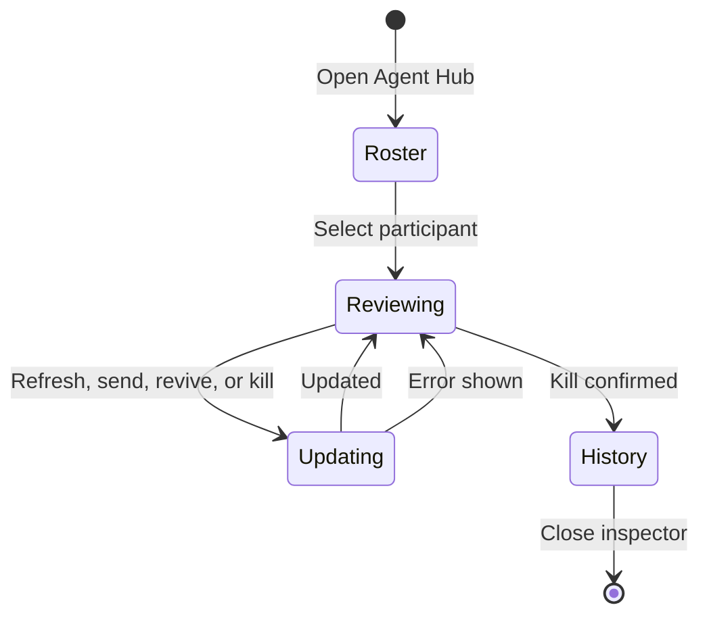

# Agent Hub

## Summary

**Status: drafted.** Agent Hub is the chat-scoped inspector for retained agents and advisors. It presents a roster, current lifecycle and activity, unread state, bounded retained transcripts, usage metrics, and the actions allowed for the selected participant. Agent Hub does not replace the conversation transcript: delegated work belongs to the originating chat session, while each retained agent's detailed transcript remains in the inspector.

## The simple case

The user opens **Agent Hub** from the active chat. The roster lists retained participants with `running`, `idle`, `parked`, or `aborted` state, activity, model, and available token, context, request, tool, cost, and duration metrics. Selecting a participant clears that participant's unread marker and opens its retained transcript. A writable agent can receive a focused message; sending to a parked agent also revives it. The user can refresh the transcript, revive a parked agent, or kill an active agent after confirmation. Advisors and aborted agent history remain reviewable but read only.

## The interaction, event by event

### Starting

Opening Agent Hub selects the inspector for the current chat session, clears the chat's Agent Hub unread set, and restores that chat's selected participant when still available. If there is no retained participant, the inspector says **No retained agents** and explains that agent and advisor transcripts will appear when available. Selecting a roster entry immediately marks that participant read and starts loading its retained transcript when available.

### Ending at once

The interaction can end without a lifecycle change: closing the inspector or pressing Escape returns focus to the Agent Hub header control; cancelling the native kill confirmation leaves the participant unchanged; an empty or whitespace-only message is not sent. A participant with no retained transcript shows **No transcript** instead of a message composer failure.

### Becoming extended

The review becomes extended when transcript loading, refresh, message delivery, revive, or kill waits for the local OMP runtime. The inspector announces **Updating…**, disables conflicting controls, and keeps the roster and selected participant visible. Transcript loading has its own progress state. An error appears in the transcript region and does not silently convert the requested action into success.

### While extended

Agent lifecycle and progress updates refresh roster state, activity, model, metrics, and transcript availability. Activity for a participant not currently selected in the open Agent Hub marks that participant unread; the Agent Hub header badge counts unread participants. Retained messages are displayed as bounded role-and-text entries so unusually large or deeply nested payloads do not overwhelm the inspector. **Refresh transcript** requests retained messages from the current transcript position; ordinary pages append, while a runtime reset response replaces the loaded messages.

### Finishing

A successful message clears the Agent Hub draft, refreshes roster state, and reloads the selected transcript. Sending to a parked agent revives it as part of message delivery. A successful revive moves a parked agent back to an active lifecycle state. A successful kill follows native confirmation, changes the participant to `aborted`, removes lifecycle and messaging actions, labels it **History**, and retains its transcript for review.

## Modifiers

| Modifier | Effect at start | Effect when changed mid-interaction |
| --- | --- | --- |
| Participant state | `running` and `idle` participants can be messaged or killed; `parked` participants can be revived or messaged; `aborted` participants open as **History**. | A pushed lifecycle update immediately changes the status and available controls. An abort makes the existing transcript read only. |
| Advisor kind | An advisor is labelled **Advisor · read only** and exposes transcript review without message, revive, or kill actions. | If a refreshed roster identifies the participant as an advisor, mutating controls disappear while the transcript remains reviewable. |
| Read-only flag | A read-only retained agent has review access only. | A newly read-only participant loses message and lifecycle actions on refresh; no in-progress action is documented as being rolled back. |
| Transcript availability | Available transcripts can load and refresh; unavailable transcripts show **No transcript**. | When availability appears after work begins, refreshing or reselecting can load it; when it disappears, the inspector shows the unavailable state. |
| Unread state | Unread dots and the header count identify activity not yet reviewed. Opening Agent Hub clears the chat-level unread set; selecting a participant clears that participant. | New activity marks the participant unread unless that participant is selected in the open Agent Hub. |
| Chat session | The inspector reads the selected chat's retained roster, selected participant, transcript, and unread set. | Switching chats replaces the inspector state with the destination chat's state; updates remain owned by their originating chat. |

## Cancel and interrupt

| Interrupt | Outcome and visible consequence |
| --- | --- |
| explicit abort | Closing Agent Hub or pressing Escape closes the inspector and restores focus to its header control. Cancelling the native **Kill agent** confirmation leaves the agent and transcript unchanged. |
| doing something else mid-way | Switching chats changes the inspector owner to the destination chat. A late response is guarded by chat and participant identity so it does not replace the new selection. |
| clean-completion event | A successful load, refresh, send, revive, or kill refreshes Agent Hub state. Kill completes into read-only **History**; the other actions return to the selected participant. |
| environment failure | A runtime or action rejection leaves the selected participant visible and surfaces a transcript/action error. No offline queue or automatic remote retry is established. |
| page/process exit | Agent Hub selection and unread intent are renderer-local. Retained agent state and transcripts can be requested again while the OMP session survives, but relaunch durability was not exercised. |
| target changed elsewhere | Incoming lifecycle/progress changes replace stale roster details. If the selected participant disappears, the first available participant is selected; if none remains, the inspector resets to empty. |
| input-channel change | No second-device or alternate-input synchronization exists. Keyboard and pointer use the same controls; native confirmation owns the kill decision while open. |

## Interactions with other systems

| Concern | Consequence |
| --- | --- |
| permissions | Agent Hub needs no Electron site permission prompt. Lifecycle and message actions are limited by advisor, read-only, and aborted state and by the local OMP runtime. |
| history or undo | Killing retains **aborted agent history**, but kill, revive, and message have no undo command. The retained transcript is separate from conversation history. |
| containers or parents | Every roster, unread set, selection, transcript request, and lifecycle action belongs to one chat session. The selected chat is the visible parent. |
| locked or read-only state | Advisors, agents flagged read only, and aborted agents can be reviewed but cannot be messaged, revived, or killed. **History** means aborted read-only transcript, not a workspace or credential lock. |
| offline behavior | There is no offline queue. Existing retained material may remain visible in renderer state, but refresh and actions require the local OMP runtime; failure surfaces an error. |
| collaboration or multi-device behavior | Agent Hub represents local OMP agents and advisors, not remote human presence or multi-device collaboration. IRC and delegated-work summaries may appear in the conversation transcript. |
| notifications | Activity outside the selected Agent Hub participant creates unread dots and a header count. Agent Hub does not create operating-system notifications or a notification history. |
| configuration and preferences | No Agent Hub-specific preference is exposed. Transcript-detail application settings govern the main conversation transcript, not a separate Agent Hub display mode. |

> Technical note: Agent lifecycle and progress frames are intercepted into Agent Hub rather than appended as ordinary conversation transcript entries. The main transcript can still contain a Hub tool entry or semantic dispatch/completion summary, so those summaries should not be read as the retained agent's full transcript.

## Edge cases

- A roster with no participants renders an explicit empty state rather than an empty list.
- Selecting an agent whose transcript is not retained shows **No transcript**; an available but not-yet-populated transcript shows **No messages yet**.
- Retained message text is bounded to 2,400 characters, 24 lines, and a limited traversal of nested message-like fields; ellipses disclose truncation.
- Message drafts are trimmed, capped at 4,000 characters, and cannot be sent while another Agent Hub action is busy.
- If transcript loading fails, the transcript region shows **Transcript unavailable** and the error; the user may refresh.
- A message sent to a parked agent states that sending revives it.
- Activity received while another chat is selected remains associated with the originating chat session rather than appearing as the selected chat's retained work.

## Open questions and verification

### Source revision

- Working tree anchored at `c125341133ff90a29fe266e1b166bac0183338c8`.
- Evidence date: 2026-08-25.
- Boundary: relevant desktop sources and tests may be modified or untracked, so this describes the working tree anchored at that commit, not a clean checkout.

### Runtime evidence

**Observed:** `packages/desktop/e2e/desktop.spec.ts` passed 24/24 on macOS arm64. Its journey **“opens Agent Hub and Files inspectors with fixture lifecycle and activity controls”** opened and closed Agent Hub, reviewed a retained transcript, revived and messaged an agent, confirmed kill into aborted history, and verified advisor read-only behavior. The journey also checked Escape focus return, modal accessibility, and no serious or critical Axe violations in the inspected surface.

### Test evidence

**Tested:** `packages/desktop/e2e/desktop.spec.ts:1513-1607`, **“opens Agent Hub and Files inspectors with fixture lifecycle and activity controls,”** passed as part of the 24-test Electron run. It is fixture-backed mounted Electron evidence, not a real external-agent concurrency test.

### Code evidence

**Code-established:** roster states, read-only rules, transcript bounds, confirmation copy, and action availability are established by `packages/desktop/src/renderer/ui/organisms/AgentHubPanel.svelte:38-166,170-323`. Per-chat unread, selection, guarded loading, refresh, message, kill, and revive transitions are established by `packages/desktop/src/renderer/ui/pages/OmpChat.svelte:1998-2165`. Agent Hub contracts and retained transcript paging are established by `packages/desktop/src/shared/contracts.ts:329-381`; lifecycle/progress interception is established by `packages/desktop/src/main/desktop-host.ts:1380-1394,1461-1502`.

### Open questions

- **Open question:** The mounted journey does not verify unread-dot/count behavior across multiple simultaneous agents or across a renderer reload.
- **Open question:** Relaunch durability of Agent Hub selection, unread state, and a partially loaded retained transcript is untested.
- **Open question:** Real agent action failures, concurrent lifecycle updates, and large transcript pagination have not been exercised in the mounted Electron surface.
- **Inference:** Retained backend transcripts can be loaded again after renderer recreation while the owning OMP session remains available; no runtime restart journey establishes the exact recovery boundary.
