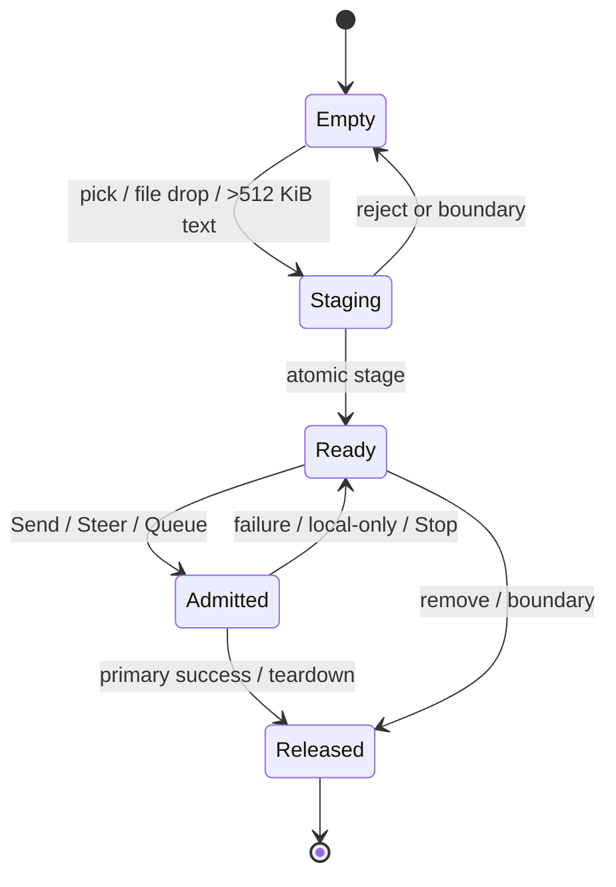

# Attachments

## Summary

**Status: Drafted.** OMP Chat lets a user stage local files through the picker or file drag/drop, review them as removable chips, and submit text, attachments, or attachments alone. It also spills composed plain text larger than **512 KiB** into a removable **PROMPT** attachment instead of embedding that text in the inline request. Staged content is temporary and belongs to the currently selected chat session, but current draft and attachment ownership diverge at chat and workspace boundaries; that product decision is tracked in [CHAT-006](../bug-triage.md#chat-006--draft-and-attachment-ownership-diverge-on-chat-switch). Successful **Steer** and **Queue for next turn** retention is tracked separately in [CHAT-007](../bug-triage.md#chat-007--successful-steer-and-queue-attachments-remain-retained).

**Tested:** the executed Electron `desktop.spec.ts` journey passed as part of the reported 24/24 run on macOS arm64, covering picker staging, file drag/drop, attachment-only send, oversized-text spill, rejection atomicity, removal, rollback, chat/workspace boundaries, Steer, Queue, and teardown. **Code-established:** clipboard image/file paste is not handled; only `text/plain` paste receives attachment-specific processing. **Open question:** whether clipboard images/files should be supported or their absence should be disclosed.

### Exact limits
The ceilings are **512 KiB inline text**, **16 MiB spilled prompt**, **25 MiB file**, **20 MiB image**, **32 MiB batch**, **12 items**, and **64 MiB retained store**.

| Limit | User-visible rule | Evidence status |
|---|---|---|
| Inline text | Up to **512 KiB** of composed UTF-8 text remains inline. Text larger than this is staged as **PROMPT** before it can be sent. | Code-established in `packages/desktop/src/shared/contracts.ts:8-13` and `packages/desktop/src/renderer/ui/pages/OmpChat.svelte:1010-1057`; the over-limit path is Tested in `packages/desktop/e2e/desktop.spec.ts:1058-1103`. |
| Spilled prompt | A spilled prompt can be at most **16 MiB**. | Code-established in `packages/desktop/src/shared/contracts.ts:8-13` and `packages/desktop/src/main/prompt-attachments.ts:78-97`; the exact upper boundary is not runtime-verified. |
| Generic file | Each non-image file can be at most **25 MiB** and cannot be empty. | Code-established in `packages/desktop/src/main/prompt-attachments.ts:181-211`; rejection above 25 MiB is Tested in `packages/desktop/e2e/desktop.spec.ts:1119-1121`. |
| Image | A file recognized as an image can be at most **20 MiB**. | Code-established in `packages/desktop/src/main/prompt-attachments.ts:40-75`; rejection above 20 MiB is Tested in `packages/desktop/e2e/desktop.spec.ts:1125-1128`. |
| Staged batch | All currently staged items together can be at most **32 MiB**. | Code-established in `packages/desktop/src/shared/contracts.ts:8-13` and `packages/desktop/src/main/prompt-attachments.ts:100-135`; over-limit batches are Tested in `packages/desktop/e2e/desktop.spec.ts:1122-1141`. |
| Item count | At most **12 items**, including a **PROMPT** spill, may be staged. | Tested at 12 accepted and 13 rejected in `packages/desktop/e2e/desktop.spec.ts:1115-1118,1135-1141`. |
| Retained store | The chat session's temporary attachment store can retain at most **64 MiB** before new staging is rejected. | Code-established in `packages/desktop/src/main/prompt-attachments.ts:19-20,34-75,175-178`; runtime verification and final Steer/Queue release policy remain open in [CHAT-007](../bug-triage.md#chat-007--successful-steer-and-queue-attachments-remain-retained). |

## The simple case

1. The user selects one or more files with **Attach** or drops files on the composer.
2. OMP Chat announces staging, then shows one chip per admitted item in **Attached files**. Each chip shows a visible kind—**FILE**, **IMG**, or **PROMPT**—its display name and size, plus a keyboard-operable **Remove _name_** button.
3. The user may keep typing, remove a chip, or send with text or with attachments alone.
4. On a primary send, chips clear immediately. Generic **FILE** items reach OMP as trusted temporary-file references, **IMG** items use the image input path, and a **PROMPT** item is described as the complete user request. Picker-declared MIME type and filename extension do not force image routing; image content is recognized from its bytes.
5. On successful primary admission/completion, temporary attachments are released. On delivery failure, a clean local-only completion, or Stop reconciliation, attachments are restored for recovery rather than silently lost.

> Technical note: staging copies the selected bytes into a private temporary file with owner-only permissions. The submitted attachment is therefore a snapshot of the selected bytes, not a live link that follows later edits to the original file (`packages/desktop/src/main/prompt-attachments.ts:40-75,78-97`).

## The interaction, event by event

### Starting

- **Picker:** activating **Attach** opens a multiple-file chooser. Choosing files starts one batch; canceling the native chooser does not produce a staged batch, although picker-cancel behavior has not been exercised in the mounted Electron journey.
- **Drag/drop:** only a drag advertising `Files` activates the **Drop files to attach** overlay. A non-file drag is ignored. Leaving or ending the drag removes the overlay; dropping files starts the same staging path as the picker (`packages/desktop/src/renderer/ui/pages/OmpChat.svelte:946-994,1059-1086`).
- **Plain-text spill:** ordinary text stays in the composer. If a `text/plain` paste would make the composed UTF-8 value larger than 512 KiB, the paste is intercepted and the whole composed value is staged as one **PROMPT** named **Pasted prompt**. Submitting an oversized programmatic draft also stages it and stops; the user must submit again after the chip is ready (`packages/desktop/src/renderer/ui/pages/OmpChat.svelte:1010-1057,1109-1116`).
- **Clipboard limitation:** clipboard files and images are not inspected or staged. There is no paste-specific status for those channels.
- **Admission:** empty trimmed text with no chip does nothing. One or more chips are sufficient for an attachment-only primary send, Steer, or Queue. Staging or spill in progress blocks admission through the composer-busy guard.

### Ending at once

- A selection with no files ends without changing chips.
- A preflight failure—too many items, a zero-byte or over-25-MiB file, or a batch over 32 MiB—announces an error and adds none of the selected batch.
- If byte inspection later finds an image above 20 MiB or storage staging fails, the store removes anything it created for that batch before returning the error; existing chips remain.
- Removing a chip clears it immediately and releases its temporary bytes. If release fails while the same chat remains selected, the chip is restored and the failure is announced (`packages/desktop/src/renderer/ui/pages/OmpChat.svelte:996-1007`).
- A first submit of text larger than 512 KiB ends after staging **Pasted prompt**; it does not also dispatch a turn.

### Becoming extended

- Staging announces **Staging N attachment(s)…** in a polite live status. When complete it announces **N attachment(s) ready.** A spill announces **Staging oversized prompt…** and then **Pasted prompt is ready as an attachment.** (`packages/desktop/src/renderer/ui/pages/OmpChat.svelte:950-1043`; `packages/desktop/src/renderer/ui/organisms/Composer.svelte:231-266`).
- A successful batch is appended to existing chips in selection order. Validation is atomic for the incoming batch; a rejected batch does not partially add chips or displace a previously admitted chip.
- Primary **Send**, **Steer**, and **Queue for next turn** take the entire visible chip batch at admission time. The chips clear together and the temporary identifiers travel with that one action (`packages/desktop/src/renderer/ui/pages/OmpChat.svelte:1093-1224`).
- During an active turn, Enter uses **Steer current turn**. **Queue for next turn** is available under **More actions**. Both routes accept text, attachments, or attachments alone.

### While extended

- The user can type a newer draft and stage newer files after primary submission while the admitted primary batch remains associated with its pending turn.
- **FILE** routing adds a quoted absolute temporary-file reference and asks OMP to read the file as needed. **IMG** routing adds a text envelope and native image content. **PROMPT** routing adds an absolute reference and tells OMP to read it as the complete request (`packages/desktop/src/main/prompt-attachments.ts:100-135`).
- Image classification uses supported image signatures—PNG, JPEG, GIF, or WebP—not the selected filename or supplied MIME label (`packages/desktop/src/shared/contracts.ts:28-32`; `packages/desktop/src/main/prompt-attachments.ts:40-75,114-129`).
- Existing chips count toward 12 items and 32 MiB. All retained temporary bytes count toward the 64 MiB store quota even when no chip is visible.
- Switching chat sessions while staging invalidates the result. If the late staging operation finishes, OMP Chat releases it instead of displaying it in the destination chat (`packages/desktop/src/renderer/ui/pages/OmpChat.svelte:950-994`).
- Accessibility states are explicit: the drop overlay and staging/error text use polite live status; the hidden picker is labeled **Choose files to attach**; the visible trigger is labeled **Attach files**; the chip group is labeled **Attached files**; and every removal control is a native button labeled **Remove _display name_** (`packages/desktop/src/renderer/ui/organisms/Composer.svelte:200-201,231-266`; `packages/desktop/src/renderer/ui/molecules/AttachmentChip.svelte:13-18`). The attachment trigger is disabled when the composer cannot target a ready chat or while file staging is active (`packages/desktop/src/renderer/ui/pages/OmpChat.svelte:550-555,2691-2711`).

### Finishing

| Route or outcome | Visible input after admission | Temporary-byte lifetime |
|---|---|---|
| Primary success | Submitted draft and chips stay cleared; canonical transcript replaces optimistic state. | Released when the correlated successful primary result is reconciled (`packages/desktop/src/renderer/ui/pages/OmpChat.svelte:1289-1318`). Tested cleanup: `packages/desktop/e2e/desktop.spec.ts:975-1019`. |
| Primary immediate or delayed failure | Submitted text is restored before a newer draft, separated by a blank line; submitted chips are restored before newer chips. Retry resends the resulting order. | Retained for Retry, then released on successful primary completion. Tested: `packages/desktop/e2e/desktop.spec.ts:1148-1208`. |
| Primary clean local-only result (`agentInvoked:false`) | Original draft and chips are restored; local command output may remain in the transcript. | Retained while restored, then removable, reusable, or boundary-released (`packages/desktop/src/renderer/ui/pages/OmpChat.svelte:1301-1311`). Tested for `/status`: `packages/desktop/e2e/desktop.spec.ts:1210-1244`. |
| Stop | Submitted user entry remains; pending assistant placeholder is removed; admitted primary attachments return to the active composer; a **Turn stopped** notice appears after abort acceptance. | Restored in the current chat, or released if that chat is no longer current (`packages/desktop/src/renderer/ui/pages/OmpChat.svelte:1226-1266`). This mounted Stop reconciliation is not Tested. |
| Steer success | Steer draft and chips stay cleared; success notice says **Steering message sent**. | Code and the passing journey retain bytes after admission. The safe release point is unresolved in [CHAT-007](../bug-triage.md#chat-007--successful-steer-and-queue-attachments-remain-retained). |
| Steer failure | Failed Steer text is restored before newer text and its chips before newer chips when still in the origin chat; otherwise bytes are released. | Retained for retry in the origin chat. Tested: `packages/desktop/e2e/desktop.spec.ts:1270-1301`. |
| Queue success | Queued draft and chips stay cleared; the user sees **Queued for the next turn**. | Code and the passing journey retain bytes until resident runtime teardown. The final consumption/release contract is unresolved in [CHAT-007](../bug-triage.md#chat-007--successful-steer-and-queue-attachments-remain-retained). |
| Queue failure | Failed queued text and chips are restored for retry. | Retained for retry. Tested: `packages/desktop/e2e/desktop.spec.ts:1303-1342`. |
| Chat/workspace boundary or component teardown | Visible chips are discarded rather than restored when returning. | Visible and late-staging bytes are released; host shutdown closes every store and removes its temporary directory (`packages/desktop/src/renderer/ui/pages/OmpChat.svelte:626-656,840-860`; `packages/desktop/src/main/desktop-host.ts:1036-1043`). |

## Modifiers

| Modifier | Effect when present at start | Effect if it changes mid-interaction |
|---|---|---|
| Active turn | Enter and the primary action route the batch to **Steer current turn**; **Queue for next turn** becomes available. | A batch is bound to the selected route and chat at admission. A primary already pending keeps its own batch while a newer batch may be prepared. |
| Shift+Enter | Inserts a line break rather than admitting text or attachments. | Releasing Shift before a later Enter uses the then-current Send/Steer route; it does not alter staged chips. |
| IME composition | Enter remains text input and does not admit the batch. | Admission becomes available after composition ends; staged chips remain unchanged. |
| File versus non-file drag | A file drag shows the drop status; a non-file drag is ignored. | If the drag ceases to advertise files or leaves the composer, the overlay closes and nothing stages until a file drop occurs. |
| Plain-text size | A composed value at or below 512 KiB remains inline; a larger value starts PROMPT spill. | Crossing the limit through `text/plain` paste or submitting an oversized draft moves the complete composed text into **Pasted prompt**; dropping below it before submission remains inline. |
| Existing chips | Their count and bytes reduce the remaining 12-item and 32-MiB batch allowance. | A rejected incoming batch leaves existing chips intact; removing a chip returns its allowance after release. |
| Reduced motion / compact density | Presentation is compact and the drop/chip surface does not animate. | Changing presentation must not change attachment ownership or admission; the passing drag journey verifies compact reduced-motion behavior, not a mid-staging settings change. |
| Chat/workspace target | Staging and admission bind to the selected chat session. | A successful target boundary discards visible chips and releases late results; a canceled workspace chooser preserves them. This diverges from the carried draft and remains under [CHAT-006](../bug-triage.md#chat-006--draft-and-attachment-ownership-diverge-on-chat-switch). |

## Cancel and interrupt

| Interruption | User-visible consequence | Attachment consequence | Evidence |
|---|---|---|---|
| explicit abort | **Stop** retains the submitted user entry, removes the pending assistant placeholder, restores chips, and announces **Turn stopped** after acceptance; rejection shows an error. | Primary batch returns in the active origin chat, otherwise it is released. | Code-established at `packages/desktop/src/renderer/ui/pages/OmpChat.svelte:1226-1266`; mounted behavior remains unverified. |
| doing something else mid-way | The user may type and stage a newer request during a pending primary turn, or switch to another chat. | Newer chips remain distinct. Switching discards visible origin chips; successful background completion stays with its origin chat. | Tested at `packages/desktop/e2e/desktop.spec.ts:1175-1208,1210-1268,1702-1706`. |
| clean-completion event | A local-only completion restores the submitted input because no agent turn began. | Chips return to the composer and may be removed or reused. | Code-established at `packages/desktop/src/renderer/ui/pages/OmpChat.svelte:1301-1311`; `/status` behavior Tested at `packages/desktop/e2e/desktop.spec.ts:1210-1244`. |
| environment failure | Immediate or delayed delivery failure shows recovery feedback and restores input in deterministic original-before-new order. | Original chips restore before newer chips; Retry reuses exact staged bytes. | Tested at `packages/desktop/e2e/desktop.spec.ts:1148-1208`. Offline, disk-full, and permission failures are not separately Tested. |
| page/process exit | The page disappears; draft persistence is not provided. | Component teardown releases visible chips; host close clears each retained store and removes temporary files. | Code-established at `packages/desktop/src/renderer/ui/pages/OmpChat.svelte:626-644` and `packages/desktop/src/main/prompt-attachments.ts:138-178`; Queue teardown Tested at `packages/desktop/e2e/desktop.spec.ts:1303-1342`. |
| target changed elsewhere | A completed session/workspace boundary prevents the old result from appearing as a destination chip. | Visible origin chips and late staging results are released; returning does not restore them. | Tested at `packages/desktop/e2e/desktop.spec.ts:1210-1268,1343-1383`; intended ownership is tracked in [CHAT-006](../bug-triage.md#chat-006--draft-and-attachment-ownership-diverge-on-chat-switch). |
| input-channel change | Picker and file drop share staging; oversized `text/plain` paste uses PROMPT spill; IME/Shift+Enter remain text entry. | Clipboard images/files are not staged. Extension/programmatic oversized text can spill on submission. | Code-established at `packages/desktop/src/renderer/ui/pages/OmpChat.svelte:1010-1086,1725-1780`; text spill and file drag are Tested at `packages/desktop/e2e/desktop.spec.ts:1021-1103`. |

## Interactions with other systems

### Permissions

The native picker and file drop supply bytes to the sandboxed renderer; OMP Chat then creates owner-only (`0600`) temporary copies. There is no attachment-specific permission prompt or recovery flow. Picker cancellation, unreadable source files, temporary-directory denial, and disk-full errors have no mounted verification; failures should remain atomic and appear in the attachment live status.

### History or undo

Staged chips are not transcript history and are not durable undo entries. Removal has no separate Undo action; a failed release restores the chip automatically. Primary failure, local-only completion, and Stop provide targeted rollback. Successful send clears the chips, and session switching currently discards them permanently rather than preserving per-chat undo state.

### Containers or parents

A staged item is owned by the selected chat session's resident runtime attachment store. It is not shared with a workspace sibling chat. A successful chat or workspace boundary clears the visible batch and returning does not restore it. The draft currently follows a different boundary, so the intended combined composer model remains filed in [CHAT-006](../bug-triage.md#chat-006--draft-and-attachment-ownership-diverge-on-chat-switch).

### Locked or read-only state

No attachment-specific locked or read-only mode exists. The composer and attachment trigger are unavailable while no current chat can compose, including loading, starting, stopping, or error states. Source inspection identifies a broader Send/admission guard risk in [CHAT-005](../bug-triage.md#chat-005--send-can-remain-actionable-while-the-chat-cannot-compose). Advisors and other read-only surfaces do not receive composer attachment controls.

### Offline behavior

There is no offline attachment queue. Local staging may finish before delivery, but an unavailable OMP process or RPC failure follows the normal recovery path: restore primary input if ownership is still current, show error/recovery feedback, and retain bytes for Retry. Mounted reconnect and offline journeys are absent.

### Collaboration or multi-device behavior

Attachments are local temporary copies for one desktop runtime. There is no remote-human co-editing, multi-device attachment synchronization, shared upload progress, or remote retention contract. A collaborator should not assume a staged chip exists anywhere except this local chat surface.

### Notifications

Attachment feedback is in-app: polite live status for drag, staging, ready, and error states; recovery cards or error toasts for delivery failures; Steer/Queue notices after admission. There is no operating-system attachment notification or notification-center record.

### Configuration and preferences

The 512 KiB, 16 MiB, 25 MiB, 20 MiB, 32 MiB, 12-item, and 64 MiB limits are fixed, not user-configurable. Interface density and reduced-motion settings alter presentation only. The passing narrow reduced-motion journey confirms no serious/critical Axe violations, no document overflow, keyboard chip removal, and no composer animation (`packages/desktop/e2e/desktop.spec.ts:1021-1056`).

## Edge cases

- **Attachment-only admission:** empty composer text plus one chip is valid and routes through the primary prompt; this is Tested with one FILE and one IMG (`packages/desktop/e2e/desktop.spec.ts:975-1019`).
- **Name and MIME mismatch:** a PNG signature in a `.dat` file declared `text/plain` becomes **IMG**; extension and declared MIME do not downgrade it to **FILE**.
- **Zero bytes:** empty files are rejected. The current renderer wording uses the 25-MiB error even for zero bytes; exact zero-byte copy remains a product-copy question.
- **Multibyte text:** every text limit is UTF-8 bytes, not characters. A 512-KiB character count can exceed the inline limit when characters use multiple bytes.
- **Composed prompt envelope:** even if base text is within 512 KiB, added FILE/IMG/PROMPT descriptions must leave the final inline envelope within 512 KiB; otherwise resolution rejects it (`packages/desktop/src/main/prompt-attachments.ts:100-135`).
- **Spill versus batch:** a PROMPT counts as one item and contributes its full bytes to the 32-MiB visible batch and 64-MiB retained store.
- **Twelve existing chips:** trying to spill oversized text keeps the draft and reports the 12-item limit; existing chips remain.
- **Concurrent boundary:** a slow picker/drop result completing after chat switch is released and never flashes in either composer; this is Tested (`packages/desktop/e2e/desktop.spec.ts:1246-1268`).
- **Long names and narrow width:** chips wrap without page overflow, display-name removal remains keyboard-operable, and reduced motion removes composer animation in the passing journey (`packages/desktop/e2e/desktop.spec.ts:1021-1056`).
- **Clipboard image/file paste:** no staging occurs because the paste handler reads only `text/plain`. This is Code-established, not Tested.
- **Steer/Queue quota pressure:** successful actions can hide chips while their bytes still count against 64 MiB until teardown. That unresolved lifecycle is [CHAT-007](../bug-triage.md#chat-007--successful-steer-and-queue-attachments-remain-retained).

## Open questions and verification

See the itemized checklist in [attachment verification](../verification/attachments.md). The feature remains **Drafted** because clipboard-image/file absence and several exact acceptance boundaries have no passing mounted journey, while ownership and retained-lifetime decisions remain filed in triage.

### Source revision

Evidence date: **2026-08-25**. Sources describe the working tree anchored at revision `c125341133ff90a29fe266e1b166bac0183338c8`; relevant desktop sources are modified or untracked, so this document does not claim the anchor commit alone contains the described behavior.

### Runtime evidence

**Tested:** `packages/desktop/e2e/desktop.spec.ts` completed **24/24 passed** on macOS arm64. The attachment journeys at `:975-1383` are therefore passing mounted Electron evidence. `omp-selection.spec.ts` completed 8/8 and `real.spec.ts` completed 1/1, but neither adds attachment-specific coverage. **Observed:** no separate manual attachment reproduction is claimed.

### Test evidence

**Test-specified, not passing evidence:** direct store assertions in `packages/desktop/test/prompt-attachments.test.ts:19-92`, host routing assertions in `packages/desktop/test/desktop-host.test.ts:328-371`, and renderer-model assertions in `packages/desktop/test/chat-progress-feedback.test.ts:289-716`. The last suite duplicates the optimistic model rather than mounting production UI. The package-wide `bun run test` did not complete and is tracked in [CHAT-010](../bug-triage.md#chat-010--the-desktop-unit-test-command-does-not-complete).

### Code evidence

**Code-established:** limits and kind contracts are in `packages/desktop/src/shared/contracts.ts:8-32`; staging, content-based image recognition, FILE/IMG/PROMPT routing, release, teardown, and 64-MiB retention are in `packages/desktop/src/main/prompt-attachments.ts:19-228`; renderer staging, spill, atomic restoration, Send/Steer/Queue/Stop lifetimes, and session boundaries are in `packages/desktop/src/renderer/ui/pages/OmpChat.svelte:625-730,840-860,921-1318`; accessible chips and statuses are in `packages/desktop/src/renderer/ui/organisms/Composer.svelte:200-318` and `packages/desktop/src/renderer/ui/molecules/AttachmentChip.svelte:13-18`.

### Open questions

- Should drafts and staged attachments both be per-chat, both be intentionally global, or both be explicitly discarded at boundaries? See [CHAT-006](../bug-triage.md#chat-006--draft-and-attachment-ownership-diverge-on-chat-switch).
- What exact acknowledgement permits successful Steer and Queue temporary bytes to be released without racing OMP consumption? See [CHAT-007](../bug-triage.md#chat-007--successful-steer-and-queue-attachments-remain-retained).
- Should clipboard images and files stage like picker/drop input, or should the composer explicitly state that only plain-text paste is supported?
- Should Attach be visibly unavailable during oversized-prompt spill rather than accepting a choice that the renderer then ignores?
- What user-facing recovery is required for picker permission denial, unreadable source files, temporary-directory denial, disk full, or retained-store quota exhaustion?
- Should zero-byte rejection have distinct copy rather than saying the file exceeds 25 MiB?
- Should Stop restore submitted text as well as attachments, or is retaining only the submitted transcript entry the intended recovery model?
