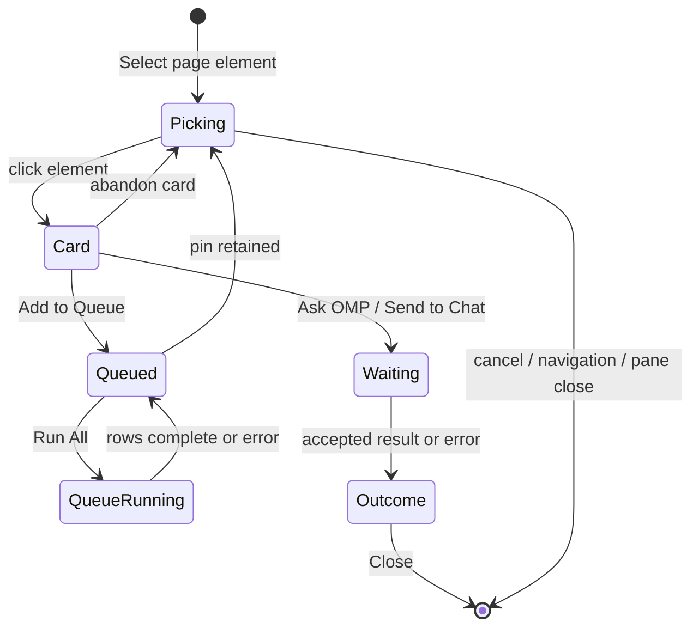

# Browser selection to chat

## Summary

Browser selection lets a user point at an element in a browser pane, attach a bounded DOM snapshot or screenshot, give OMP an instruction, and choose where the result should appear. **Ask OMP** keeps the result in the BrowserView card, **Send to Chat** admits the request to an explicitly selected target chat, and **Add to Queue** retains several captured elements for ordered execution. One inspector is active across all browser panes at a time. The toolbar, selected outline, queued pins, and queue rows use the target agent's swatch so ownership stays visible. Result and error cards remain where selection began until the user chooses **Close**. Status: **verified** for the executed P1/P2 checklist; the filed workspace-failure gap and P3 ownership/lifecycle questions remain explicit.

## The simple case

In an active browser pane, the user first chooses a deliverable workspace agent from **Target workspace agent**. Its swatch appears beside the picker. The user chooses **Select page element for agent**, moves the crosshair over the page, and clicks one element. The click selects rather than activates the page control: a highlighted outline and a non-modal card show the element tag and selector.

A fresh card starts with the `task` subagent role, **DOM** capture, and **Ask OMP**. The user enters an instruction, optionally changes the subagent role or capture mode, and submits. **Ask OMP** displays the completed response in the card. Choosing **Send to Chat** instead delivers the same captured context to the chat session owned by the selected workspace agent. The browser card reports delivery only after OMP accepts the prompt. In both paths, a final response or delivery error remains visible until **Close** acknowledges it.

For several elements, the user chooses **Add to Queue**. Each accepted capture becomes a numbered pin and a row in **Selection queue** with target agent and swatch, selector, instruction, capture mode, subagent role, and status. The inspector immediately returns to picking. **Run All** processes pending items in order; each row moves through pending, running, and completed or error and retains its output or error. **Clear** removes the rows and pins after the run is no longer active.

## The interaction, event by event

### Starting

The unit is one browser-selection delivery lifecycle. It starts when the user activates **Select page element for agent** for a browser pane that has a deliverable target agent. The target is not “whichever chat happens to be open later”: the selected workspace agent is resolved to an active chat session, and its identifier, display name, and deterministic swatch are bound to the selection. If another pane already owns the inspector, starting here cancels that inspector first. Restarting on the same pane also tears down the previous inspector before creating a fresh one (`App.svelte:312-367`; `desktop-host.ts:616-750`; `workspace-host.ts:2086-2128`).

While picking, pointer actions are intercepted, the cursor becomes a themed crosshair, and the element under the pointer receives a tag-and-size outline. Clicking a connected element captures its selector, text, attributes, bounded HTML, hierarchy, and geometry, then opens the instruction card without following the element's normal click action (`workspace-host.ts:208-353,365-388,514-537`).

### Ending at once

The user can end before submitting by choosing the toolbar's **Cancel element selection**, pressing Escape while picking, or choosing **Cancel** or the card's close control. The inspector root, highlight, listeners, and cursor are removed. Escape from an unfinished instruction card is intentionally different: it abandons that selected element and returns to picking rather than ending the whole selection (`workspace-host.ts:390-399,499-505,538-576`). An empty instruction cannot submit.

Starting a selection in a second browser pane ends the first and leaves exactly one active inspector. Changing the target agent while selection is active cancels and restarts the inspector with the newly selected owner. The 8/8 Electron journey established both the cross-pane single-inspector rule and clean restart behavior.

### Becoming extended

Submitting **Ask OMP** or **Send to Chat** disables the instruction and submit controls and changes the card and outline to a working state. **DOM** uses the bounded metadata captured from the selected element. **Screenshot** temporarily hides the inspector UI, captures a padded rectangle around the target, applies size limits, and encodes one JPEG before restoring the inspector (`workspace-host.ts:468-497,1821-1870,2166-2205`).

**Add to Queue** captures the task at that moment—including URL, selector, DOM, optional screenshot, target agent, swatch, instruction, capture mode, and subagent role—then numbers and pins it. The selection itself continues so another element can be added. Opening the first queue item automatically docks **Selection queue and output** beside the browser surface (`workspace-host.ts:1944-2055`; `BrowserPane.svelte:64-75,101-122`).

> Technical note: **Delivered to OMP Chat** means the target OMP prompt was accepted, not that the assistant's whole turn has finished. The host awaits prompt admission before publishing delivery success; the resulting conversation turn continues under the target chat's normal lifecycle (`desktop-host.ts:519-528`; `workspace-host.ts:2307-2368`).

### While extended

For inline work, the card says that OMP is running. For chat delivery, it says that it is sending to OMP Chat. A late result from a canceled, restarted, navigated, or closed selection is ignored by generation and selection identity rather than reopening a stale card (`workspace-host.ts:2086-2223,2381-2417`).

A queue row exposes its stable number, target agent and swatch, status, selector, instruction, capture mode, and role. **Run All** disables itself and **Clear**, marks the queue busy, and processes the pending rows sequentially. Each row becomes running, then completed with retained **Output**, or error with retained error text. One failed row does not prevent later pending rows from running (`SelectionQueuePane.svelte:17-70`; `workspace-host.ts:2428-2567`). Closing the queue dock only hides it; the toolbar count can reopen it. It does not discard tasks.

The queue owns copies of the capture. A later element pick can change the subagent role or capture choice without rewriting earlier rows. The mounted Electron journey established numbered multi-element Screenshot picks, retained per-row capture metadata, queue progress, terminal outputs/errors, and stable BrowserView bounds while the dock opens and closes. DOM queue capture is Code-established but was not separately executed.

### Finishing

An inline success leaves **OMP result**, response text, **Copy**, and **Close** in the browser card. A chat success leaves a delivered status and a card response indicating OMP Chat. A delivery or inline failure leaves an error state in the same card. None of these terminal states disappears merely because the async request settles; **Close** is the acknowledgement that removes the inspector (`workspace-host.ts:645-680,2237-2378`). The passing Electron journey exercised both inline success and forced delivery failure and confirmed that each remained until **Close**.

A queue finishes when every pending row is completed or errored. Results remain in their rows. **Clear** is the destructive acknowledgement for the queue: it removes rows and pins, resets numbering, hides the empty dock, and lets the native browser surface reclaim its prior bounds. A pane close destroys its BrowserView and invalidates its queue (`workspace-host.ts:1919-1943,2539-2573,1293-1303`).

## Modifiers

| Modifier | Effect at start | Effect when changed mid-interaction |
| --- | --- | --- |
| Target workspace agent | Determines the explicit target chat session and the swatch used by the picker, outline, pin, and queue row. With no deliverable target, the selection control is disabled. | Changing it during active selection cancels and restarts the inspector. Existing queued rows retain their captured target agent and swatch; a queued run revalidates that target before execution. |
| Subagent role | A fresh inspector defaults to `task`; the selected role is included in the work instruction. | A change affects the current submission and later picks, not rows already captured. The queue journey retained a changed role across repeated picks and recorded the role per row. |
| Capture mode | A fresh inspector defaults to **DOM**, a bounded snapshot of selector, text, attributes, HTML, hierarchy, and geometry. | Selecting **Screenshot** changes the current and subsequent captured item to a JPEG image plus selection metadata. Existing queued items keep their original mode and bytes. |
| Action | A fresh card presents **Ask OMP**. The dropdown also offers **Send to Chat** and **Add to Queue**. | The latest choice at submission decides whether the browser card awaits inline output, the target chat accepts a turn, or a numbered queue row is created. It does not rewrite earlier queue rows. |
| Instruction chips | Local pages offer edit-oriented prompts; external pages offer explain/debug/spec prompts. | Choosing a chip appends text to the draft and keeps focus in the instruction. The user can still edit it before submission. |
| Theme | The inspector resolves the current dark or light application theme while keeping the target agent's swatch. | A live theme change recolors the crosshair, card, selection states, queue, and focus treatment without replacing the target or queued pins. This passed in the Electron theme journey. |
| Browser zoom and bounds | The native browser surface and selected geometry determine card placement and screenshot clipping. | Screenshot capture scales clipping for zoom; opening a queue dock changes available width but does not replace the BrowserView. The 1.25× screenshot journey preserved BrowserView identity and bounds. |

## Cancel and interrupt

| Interruption | Effect | What the user sees | Evidence |
| --- | --- | --- | --- |
| Explicit abort | **Cancel element selection** or Escape while picking ends the inspector. **Cancel** or the card close control also ends it. Escape inside an unfinished card returns to picking; **Close** on an outcome acknowledges and ends it. | Highlight, card, and crosshair disappear, or the card closes back to picking as described. Queued rows are not the same as the active draft and remain until **Clear**. | Observed/Tested in `omp-selection.spec.ts:792-825`; Code-established in `workspace-host.ts:499-576,2058-2084`. |
| Doing something else mid-way | Starting selection in another pane cancels the first. Changing the target agent cancels and restarts on the same pane. Merely running OMP through **Send to Chat** is not a cancellation. | At most one page contains an inspector root; the new pane or target receives the active crosshair/card. | Observed/Tested in `omp-selection.spec.ts:652-670`; Code-established in `App.svelte:312-367` and `workspace-host.ts:2086-2098`. |
| Clean-completion event | There is no unrelated event that silently commits a selection. **Add to Queue** cleanly completes one capture but returns to picking; prompt acceptance changes the card to an outcome but still requires **Close**. | A numbered pin/row appears, or a persistent completed/delivered card appears. | Observed/Tested in `omp-selection.spec.ts:672-790`; Code-established in `workspace-host.ts:645-680,1944-2055`. |
| Environment failure | Inline and delivery failures become a persistent error card; a queued failure becomes an error row and later rows continue. Loss of the outer workspace-runtime connection has incomplete visible shell feedback. | Error text remains available for acknowledgement, except the reconnect/retry-exhaustion shell gap filed as [`CHAT-002`](../bug-triage.md#chat-002--workspace-reconnect-and-outer-shell-errors-are-not-rendered). | Observed/Tested forced prompt failure in `omp-selection.spec.ts:765-790`; Code-established queue handling in `workspace-host.ts:2428-2537`. |
| Page/process exit | Main-frame navigation and in-page navigation end the active inspector. Closing the browser pane destroys the inspector and its pane-owned queue. App exit during accepted inline/chat work is not verified. | Navigation left no stale inspector root in the Electron journey. Active-inspector pane close and app exit remain unobserved. | Observed/Tested navigation and an ordinary pane close in `omp-selection.spec.ts:792-825`; Code-established active pane-close cleanup in `workspace-host.ts:1293-1303,2663-2695`. |
| Target changed elsewhere | If the selected element disconnects before queue admission, the card reports that it is no longer available. If a queued target agent is no longer deliverable at run time, that row becomes an error. Previously captured DOM/screenshot bytes are not silently rewritten. | A queue-add error remains in the card, or the affected queue row shows error while other rows can continue. | Code-established in `workspace-host.ts:474-490,669-680,1944-1978,2428-2455`; not forced in the Electron journey. |
| Input-channel change | Selection captures page pointer/click input and keyboard Escape; card submission also accepts Cmd/Ctrl+Enter, and Cmd/Ctrl+Shift+Enter selects queue submission. Touch cancellation, assistive-technology virtual clicks, and a second device are unverified. | The normal page click does not fire during picking; keyboard commands change or end the selection as described. | Code-established in `workspace-host.ts:365-388,499-544`; pointer interception was exercised by the Electron fixture click helper. |

## Interactions with other systems

### Permissions

The baseline is a local user with a normal writable workspace. Browser selection has no separate permission dialog. The selector requires a deliverable workspace agent and a valid browser-pane authority route; otherwise the toolbar is disabled or the operation errors. Browser permission requests are denied by default at the Electron boundary, as described in [`../foundations/experience-model.md`](../foundations/experience-model.md#cross-system-boundaries). Screenshot capture is performed by the native browser surface and does not ask for operating-system screen-recording permission.

### History or undo

There is no browser-selection undo stack. **Clear** permanently removes the current queue; closing the dock does not. **Send to Chat** enters the target chat's normal OMP conversation lifecycle and history. The card and queue are acknowledgement surfaces, not an immutable audit log. Whether inline execution also appears in the conversation transcript is an open verification question because it uses the target chat runtime but the mounted inline journey asserted only the BrowserView card.

### Containers or parents

The floating card and highlight live inside the selected browser pane's native BrowserView. A queue belongs to that browser pane. The target workspace agent resolves to one active chat session, which owns the admitted OMP work. Only one live inspector exists across panes, but separate pane queues can exist in host-owned state. Generic browser splitting and navigation are outside scope except where a second pane, navigation, or pane close interrupts selection.

### Locked or read-only state

There is no selection-specific read-only mode. Stopped, failed, exited, errored, wrong-workspace, non-deliverable, or sessionless agents cannot be chosen as delivery targets (`App.svelte:69-93`; `desktop-host.ts:682-713`). OAuth routing lock is not a read-only workspace state. A provider/account preflight failure can surface as a persistent selection error, but that account-specific wording was not exercised in this journey.

### Offline behavior

Picking and DOM capture are local. Network pages require their own connectivity, and Ask OMP, Send to Chat, and queue execution require the target OMP runtime and any provider it needs. There is no offline delivery queue, offline badge, or promise that pending selection work resumes after process exit. A queue is host-owned live state, not established durable state.

### Collaboration or multi-device behavior

The surface distinguishes local workspace agents with names and deterministic swatches. This is routing among local OMP agents and chats, not remote-human collaboration. There is no multi-device synchronization, remote pointer, shared selection card, or conflict resolution.

### Notifications

Progress and outcomes appear in the BrowserView card, selected outline/pill, or **Selection queue and output**. These are persistent until **Close** or **Clear** as applicable. Browser selection does not produce an operating-system notification or notification-center entry. Shell-level browser action and workspace reconnect feedback remains subject to [`CHAT-002`](../bug-triage.md#chat-002--workspace-reconnect-and-outer-shell-errors-are-not-rendered).

### Configuration and preferences

The machine-local application theme changes the inspector and queue live. The target agent is a per-browser-pane renderer choice, while subagent role, capture mode, and action are interaction choices rather than application settings. No preference establishes a permanent default for DOM versus Screenshot, Ask OMP versus Send to Chat, or a subagent role. Theme persistence follows the application-settings contract.

## Edge cases

- With no deliverable target agent, **Target workspace agent** shows no target and **Select page element for agent** is disabled (`BrowserToolbar.svelte:56-74,86-113`).
- Clicking a zero-size, disconnected, or otherwise unavailable element does not create a valid capture. A disconnected element at queue admission produces an error rather than a stale task.
- The selector favors a unique ID, then common test attributes, then a unique class combination, then a bounded element path. The card exposes the generated selector so the user can recognize the captured target (`workspace-host.ts:275-312`).
- DOM text and HTML are bounded. Queue length and per-request storage are bounded; over-limit queue admission remains in the card as an error instead of partially adding a row (`workspace-host.ts:1899-1916,1979-2016`).
- Screenshot capture hides the inspector so its own card and highlight are not baked into the image. It clips around the target, downsizes oversized dimensions, and retries JPEG encoding at lower quality before rejecting an oversized image (`workspace-host.ts:1801-1870`).
- Queue execution is sequential and failure-isolated. A failed row does not roll back completed rows or prevent later pending rows from running.
- **Clear** is disabled while the queue is running; the host also rejects a concurrent clear. A second **Run All** while already running is rejected (`SelectionQueuePane.svelte:29-34`; `workspace-host.ts:1919-1925,2555-2567`).
- Restarting selection rehydrates pins from the pane queue when selectors still resolve. Theme changes preserve the selected target and pins rather than recreating the BrowserView.
- Navigation cancels the active inspector, but production code does not clear existing queued captures on navigation. Queued rows retain their captured URL and DOM/screenshot; whether retaining and running them after a different page loads is desirable remains open.

> Technical note: page navigation increments the BrowserView document epoch and ends the active selection, while queue invalidation occurs when the BrowserView is destroyed, not on navigation (`workspace-host.ts:1938-1943,2663-2695`). This means “navigation canceled my card” must not be read as “navigation cleared my queue.”

## Open questions and verification

### Verification status

**Verified with scoped gaps.** Every P1 item passed. The only blocked P2 item is the filed shell reconnect/error gap in [`CHAT-002`](../bug-triage.md#chat-002--workspace-reconnect-and-outer-shell-errors-are-not-rendered). P3 questions do not change this feature status. See [`../verification/browser-selection-to-chat.md`](../verification/browser-selection-to-chat.md).

### Source revision

- Revision anchor: `c125341133ff90a29fe266e1b166bac0183338c8`
- Evidence date: 2026-08-25
- Workstation: macOS arm64
- Boundary: this describes the working tree anchored at that commit. Relevant desktop renderer, main-process, test, and E2E sources may be modified or untracked; this is not a claim about a clean checkout of the anchor.

### Runtime evidence

- **Observed:** `bunx playwright test e2e/omp-selection.spec.ts` drove the actual Electron shell, renderer, and BrowserViews with isolated fixture state; **8/8 passed** on macOS arm64.
- **Observed:** the journeys exercised a fresh inspector, single-inspector cross-pane behavior, repeated queued captures and progress, accepted Send to Chat, inline success and forced failure retention, cancel/restart/navigation, an ordinary pane close, live theme changes, and JPEG screenshot delivery.
- **Not observed:** active-inspector pane close, queued DOM execution as a distinct capture-mode case, real external-provider latency/failure wording, workspace-runtime disconnect recovery, app exit during work, multiple simultaneous target chats, remote devices, or assistive-technology announcement quality.

### Test evidence

- **Tested:** `packages/desktop/e2e/omp-selection.spec.ts:625-650`, **“opens a fresh BrowserView card with independent defaults and stable native surface.”**
- **Tested:** `packages/desktop/e2e/omp-selection.spec.ts:652-670`, **“starting a second pane cancels the first card and leaves one active card.”**
- **Tested:** `packages/desktop/e2e/omp-selection.spec.ts:672-741`, **“repeated queued picks retain role, capture, selector, URL and report statuses.”**
- **Tested:** `packages/desktop/e2e/omp-selection.spec.ts:743-763`, **“Send to Chat reports only after fixture acceptance and closes cleanly.”**
- **Tested:** `packages/desktop/e2e/omp-selection.spec.ts:765-790`, **“inline result and delivery error stay in the card until Close.”**
- **Tested:** `packages/desktop/e2e/omp-selection.spec.ts:792-825`, **“cancel, restart, navigate and close leave no stale inspector root.”**
- **Tested:** `packages/desktop/e2e/omp-selection.spec.ts:827-872`, **“theme changes preserve target and queued pins.”**
- **Tested:** `packages/desktop/e2e/omp-selection.spec.ts:874-904`, **“screenshot mode sends one valid JPEG while BrowserView identity and bounds stay fixed.”**
- `bun run test` did not complete; no unit-only selection assertion is counted as passing evidence.

### Code evidence

- **Code-established:** card, pointer interception, action choice, persistent outcome, queue pins, and theme application: `packages/desktop/src/main/workspace-host.ts:149-693`.
- **Code-established:** queue capture, target/swatch retention, bounded requests, clear, single active inspector, generation guards, inline/chat delivery, sequential queue progress, and state publication: `packages/desktop/src/main/workspace-host.ts:1873-2613`.
- **Code-established:** screenshot clipping and JPEG encoding: `packages/desktop/src/main/workspace-host.ts:1801-1870`.
- **Code-established:** explicit target agent-to-session ownership: `packages/desktop/src/main/desktop-host.ts:519-615,616-750` and `packages/desktop/src/renderer/ui/pages/App.svelte:69-110,312-383`.
- **Code-established:** target picker/swatches and queue presentation: `packages/desktop/src/renderer/ui/molecules/BrowserToolbar.svelte:56-123`, `packages/desktop/src/renderer/ui/organisms/BrowserPane.svelte:64-122`, and `packages/desktop/src/renderer/ui/organisms/SelectionQueuePane.svelte:17-70`.
- **Code-established release context:** `packages/desktop/CHANGELOG.md:9-34,49-79` records awaited delivery, host-owned queue routing, retained captures/output, cleanup, and theme fixes.

### Open questions

- **Open question:** With two or more deliverable agents backed by different chat sessions, does every card, queue row, transcript entry, and background completion stay with the explicitly selected owner after the user switches the visible chat?
- **Open question:** Does inline execution also create reviewable entries in the target conversation transcript, or is the BrowserView card intended to be its only user-facing history?
- **Open question:** Should queued captures survive navigation and run against their captured URL/DOM, or should navigation clear or visibly mark them stale?
- **Open question:** What should survive renderer reload or full app exit: active inspector, pending inline/chat acceptance, queued captures, retained outputs, and acknowledgement cards?
- **Open question:** How should target-agent loss during an already accepted chat turn be represented in the browser card versus the target chat transcript?
- **Open question:** Are deterministic swatches sufficiently distinct for multiple agents in every theme, enhanced contrast, and color-vision condition? The current journey used one fixture target.
