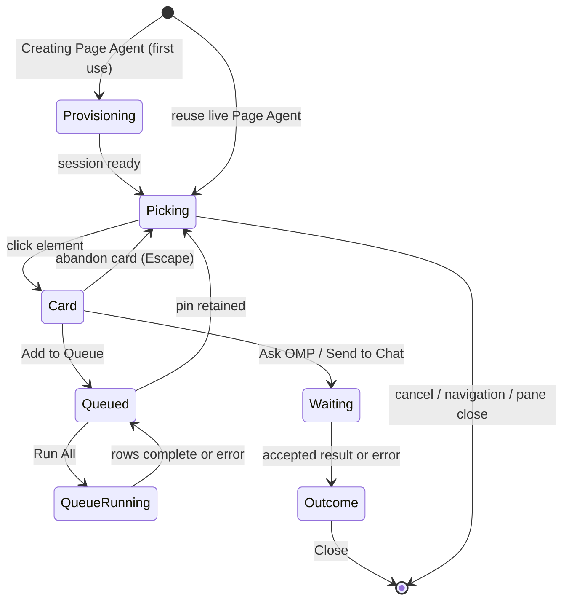

# Element targeting and Page Agent delivery

## Summary

**Status: drafted.** Element targeting lets a user point at an element in a browser pane, capture a selector reference or a screenshot, give OMP an instruction, and choose where the result appears. The work runs through a **Page Agent**: a hidden OMP session that Gradivus provisions automatically the first time the user selects an element, visible in the browser pane's Agent Hub panel but never in the chat rail. **Ask OMP** runs the instruction on the Page Agent's hidden session and keeps the result in the browser card; it never enters a visible chat. **Send to Chat** delivers the captured context to a visible chat resolved by workspace path and starts a turn immediately. **Add to Queue** captures several elements as numbered pins for ordered execution. One inspector is active across all browser panes at a time. Result and error cards remain where selection began until the user chooses **Close**.

## The simple case

In an active browser pane, the user activates **Select page element with Page Agent** (or presses Ctrl+Shift+C). The first use briefly shows **Creating Page Agent** while the hidden session starts; later uses reuse the live Page Agent. The cursor becomes a crosshair labeled with the Page Agent's name and swatch color. Moving over the page outlines the element under the pointer with a tag-and-size pill; clicking selects it instead of activating it, and a non-modal card opens showing the element's tag, generated selector, and a locality badge (**Local · Edit** or **External · Debug**).

A fresh card starts with the `task` subagent role, **DOM** capture, and the **Ask OMP** action. The user enters an instruction — optional chips offer edit-oriented prompts on local pages and explain/debug/spec prompts on external pages — and submits. **Ask OMP** displays the completed response in the card. **Send to Chat** instead delivers the captured context to a visible chat for the same workspace and reports **Delivered to OMP Chat.** once OMP accepts the prompt. In both paths, the final response or error remains visible until **Close** acknowledges it.

For several elements, the user chooses **Add to Queue**. Each accepted capture becomes a numbered pin on the element and a row in **Selection queue** with status, selector, instruction, capture mode, and role. The inspector immediately returns to picking. **Run All** processes pending rows in order; **Clear** removes rows and pins once the run is no longer active.

## The interaction, event by event

### Starting

The unit is one element-targeting delivery lifecycle. It starts when the user activates **Select page element with Page Agent** on a browser pane, or presses Ctrl+Shift+C while a browser pane is active. Gradivus reuses a live Page Agent for that workspace; otherwise it creates a hidden session titled **Page Agent** and starts it. If the chat workspace location is not local, selection refuses with **Page agents currently require a local workspace location**. While the session is being created, the toolbar button reads **Creating Page Agent** and is disabled.

Only one inspector exists across the whole app at a time. Starting selection in a second pane cancels the first inspector first (status **Switching selection to another pane**); starting again on the same pane restarts it (**Restarting selection on this pane**). Pressing Ctrl+Shift+C on the active pane toggles selection off.

While picking, pointer events are intercepted, the page cursor is replaced by a themed crosshair with the Page Agent's name, and the element under the pointer receives an outline and a `<tag> W × H` pill. Clicking a connected, non-zero-size element captures its generated selector, tag, bounds, and page URL, then opens the instruction card without following the element's normal click action.

### Ending at once

The user can end before submitting by choosing the toolbar's **Cancel element selection**, pressing Escape while picking, or choosing **Cancel** or the card's close control (**Cancel selection**). The inspector root, highlight, listeners, and cursor are removed, and ordinary page interaction resumes. Escape from an unfinished instruction card is intentionally different: it abandons that selected element and returns to picking rather than ending the whole selection. An empty instruction cannot submit.

### Becoming extended

Submitting **Ask OMP** or **Send to Chat** disables the instruction and submit controls and changes the card to a working state (**Analyzing element with AI...** or **Delivering to chat...**). **DOM** capture sends only the selector, tag, bounds, and page URL with the instruction — it does not serialize or transmit element HTML, text, or hierarchy. **Screenshot** temporarily hides the inspector UI, captures a padded rectangle around the target (scaled for page zoom), downsizes oversized dimensions, and encodes one JPEG within the size limit before restoring the inspector.

**Add to Queue** freezes the capture at that moment — including URL, selector, instruction, capture mode, role, and any screenshot bytes — then numbers and pins it and returns to picking. Adding the first item docks the **Selection queue and output** pane beside the browser surface.

> Technical note: **Delivered to OMP Chat** means the target OMP prompt was accepted, not that the assistant's whole turn has finished. The host awaits prompt admission before publishing delivery success; the resulting conversation turn continues under the target chat's normal lifecycle.

### While extended

For inline work, the card says OMP is analyzing. For chat delivery, it says it is delivering. A late result from a canceled, restarted, navigated, or closed selection is ignored by generation and selection identity rather than reopening a stale card.

A queue row exposes its stable number, status, selector, instruction, capture mode, and role. **Run All** disables itself and **Clear** and processes the pending rows sequentially on the Page Agent's hidden session; each row becomes running, then completed with retained **Output**, or error with retained error text. One failed row does not prevent later pending rows from running. Closing the queue dock only hides it; the toolbar's **Queue N** button can reopen it while items remain, and it does not discard tasks.

The queue owns copies of the capture. A later element pick can change the subagent role or capture choice without rewriting earlier rows. The subagent role and capture mode persist across picks within one inspector; the action choice always resets to **Ask OMP** on a fresh card.

### Finishing

An inline success leaves **OMP result**, response text, **Copy**, and **Close** in the browser card. A chat success leaves a delivered status in the card. A delivery or inline failure leaves an error state in the same card. None of these terminal states disappears merely because the async request settles; **Close** is the acknowledgement that removes the inspector.

A queue finishes when every pending row is completed or errored. Results remain in their rows. **Clear** is the destructive acknowledgement for the queue: it removes rows and pins, resets numbering, hides the empty dock, and lets the native browser surface reclaim its prior bounds. Closing the browser pane destroys the inspector and invalidates that pane's queue.

## Modifiers

| Modifier | Effect at start | Effect when changed mid-interaction |
| --- | --- | --- |
| Page Agent session | The first selection provisions a hidden Page Agent for the workspace; its name and deterministic swatch label the crosshair, outline, pins, and queue rows. | A live Page Agent is reused; the browser pane's Agent Hub panel tracks how many Page Agents exist for the workspace. |
| Page locality | Local pages (`localhost`, loopback, and local-development host suffixes) show **Local · Edit** and edit-oriented chips; `file://`, `about:blank`, and other pages show **External · Debug** and explain-oriented chips. | Navigating to a different locality ends the active selection and the next selection uses the new locality. |
| Subagent role | A fresh inspector defaults to `task`; the selected role is included in the work instruction. | Persists across picks within the inspector. A change affects the current submission and later picks, not rows already captured. |
| Capture mode | A fresh inspector defaults to **DOM** (selector, tag, bounds, URL — no DOM bytes). | Persists across picks. **Screenshot** changes the current and subsequent captured item to a JPEG plus metadata. Existing queued items keep their original mode and bytes. |
| Action | A fresh card presents **Ask OMP**. The dropdown also offers **Send to Chat** and **Add to Queue**. | Resets to **Ask OMP** on each new card. The latest choice at submission decides whether the card awaits inline output, a chat accepts a turn, or a numbered queue row is created. |
| Target chat resolution | **Send to Chat** resolves a visible chat whose workspace path matches the Page Agent's — the active chat for that path if one is open, otherwise the most recent. If none exists, delivery fails with **Open a chat for this workspace before sending a Page Agent task to chat**. | The resolved chat is fixed per submission; switching chats afterward does not retarget an accepted delivery. |
| Theme | The inspector resolves the current dark or light application theme while keeping the Page Agent swatch. | A live theme change recolors the crosshair, card, selection states, queue, and pins without replacing the target or queued pins. |
| Browser zoom and bounds | The native browser surface and selected geometry determine card placement and screenshot clipping. | Screenshot capture scales clipping for zoom; opening the queue dock changes available width but does not replace the BrowserView. |

## Cancel and interrupt

| Interruption | Effect | What the user sees | Evidence |
| --- | --- | --- | --- |
| Explicit abort | **Cancel element selection** or Escape while picking ends the inspector. **Cancel** or the card close control also ends it. Escape inside an unfinished card returns to picking; **Close** on an outcome acknowledges and ends it. Ctrl+Shift+C toggles selection off. | Highlight, card, and crosshair disappear, or the card closes back to picking as described. Queued rows remain until **Clear**. | Observed/Tested in `omp-selection.spec.ts`; Code-established in `workspace-host.ts:499-576,2058-2084`. |
| Doing something else mid-way | Starting selection in another pane cancels the first. Switching browser tabs keeps both the active selection and the pane's queue, because panes stay mounted. Merely running OMP through **Send to Chat** is not a cancellation. | At most one page contains an inspector root; the new pane receives the active crosshair/card; the old pane's queue rows remain. | Observed/Tested cross-pane in `omp-selection.spec.ts`; queue tab-switch survival is Code-established. |
| Clean-completion event | **Add to Queue** cleanly completes one capture but returns to picking; prompt acceptance changes the card to an outcome but still requires **Close**. | A numbered pin/row appears, or a persistent completed/delivered card appears. | Observed/Tested in `omp-selection.spec.ts`. |
| Environment failure | Inline and delivery failures become a persistent error card; a queued failure becomes an error row and later rows continue. Prompt rejection is reported in the card, not silently dropped. | Error text remains available for acknowledgement. | Observed/Tested forced prompt failure in `omp-selection.spec.ts`; Code-established queue handling in `workspace-host.ts:2428-2537`. |
| Page/process exit | Main-frame and in-page navigation end the active inspector (status **Page navigated** / **In-page navigation**), but the queue is retained. Closing the browser pane destroys the inspector and invalidates its queue. App exit during accepted work is not verified. | Navigation left no stale inspector root in the Electron journey; queued rows survive navigation. | Observed/Tested navigation in `omp-selection.spec.ts`; Code-established in `workspace-host.ts:1291-1298,2692-2705`. |
| Target changed elsewhere | If the selected element disconnects before queue admission, the card reports **Selected element is no longer available** or **Could not add this element to the queue.** Late results after cancel/restart/navigate are dropped by generation guards. | A queue-add error remains in the card; stale results never reopen a card. | Code-established in `workspace-host.ts`; not forced in the Electron journey. |
| Input-channel change | Selection captures page pointer/click input and keyboard Escape; card submission also accepts Cmd/Ctrl+Enter, and Cmd/Ctrl+Shift+Enter submits to the queue. Touch cancellation, assistive-technology virtual clicks, and a second device are unverified. | The normal page click does not fire during picking; keyboard commands change or end the selection as described. | Code-established in `workspace-host.ts:365-388,499-544`; pointer interception was exercised by the Electron fixture click helper. |

## Interactions with other systems

### Permissions

The baseline is a local user with a normal writable workspace. Element targeting has no separate permission dialog, but it requires a local workspace location; non-local locations are refused with an explicit message. Browser permission requests are denied by default at the Electron boundary. Screenshot capture is performed by the native browser surface and does not ask for operating-system screen-recording permission.

### History or undo

There is no element-targeting undo stack. **Clear** permanently removes the current queue; closing the dock does not. **Send to Chat** enters the target chat's normal OMP conversation lifecycle and history. **Ask OMP** and queued tasks run on the hidden Page Agent session, so their results exist only in the card and queue rows — they do not create entries in any visible chat's transcript.

### Containers or parents

The floating card and highlight live inside the selected browser pane's native BrowserView. A queue belongs to that browser pane and is host-owned live state. The Page Agent's hidden session is filtered out of the chat rail and chat Agent Hub; the browser pane's Agent Hub panel is where Page Agents are visible. Only one live inspector exists across panes, but separate pane queues can exist in host-owned state.

### Locked or read-only state

There is no selection-specific read-only mode. Stopped, failed, or sessionless Page Agent states can prevent selection until the agent is usable again. OAuth routing lock is not a read-only workspace state.

### Offline behavior

Picking and capture are local. Network pages require their own connectivity, and Ask OMP, Send to Chat, and queue execution require the target OMP runtime and any provider it needs. There is no offline delivery queue, offline badge, or promise that pending selection work resumes after process exit.

### Collaboration or multi-device behavior

Page Agents are local OMP agents with names and deterministic swatches. This is routing among local agents and chats, not remote-human collaboration. There is no multi-device synchronization, remote pointer, shared selection card, or conflict resolution.

### Notifications

Progress and outcomes appear in the browser card, selected outline/pill, queue rows, and the browser Agent Hub panel. These are persistent until **Close** or **Clear** as applicable. Element targeting does not produce an operating-system notification or notification-center entry.

### Configuration and preferences

The machine-local application theme changes the inspector and queue live. Subagent role, capture mode, and action are interaction choices rather than application settings, and no preference establishes a permanent default for them. Theme persistence follows the application-settings contract.

## Edge cases

- **DOM capture sends no DOM content.** The captured reference is the selector, tag, bounds, and URL; the instruction is the user's description. This is an intentional privacy boundary recorded in the desktop changelog, not a truncation bug.
- Inline and queued tasks run on the Page Agent's hidden session, so a chat for the workspace never sees them; only **Send to Chat** reaches a visible chat, and it starts a turn immediately rather than staging anything in the composer.
- The first selection per workspace pays the **Creating Page Agent** cost; subsequent selections reuse the live session.
- The browser pane's Agent Hub panel lists Page Agents created by element targeting, with a targeting status, and the chat Agent Hub excludes them.
- The queue holds at most 128 tasks; adding beyond the cap returns **Selection queue is full (128 tasks)**. Per-request storage is bounded (256 KiB), images are bounded (150 KiB), and over-limit admission fails atomically in the card.
- The selector favors a unique ID, then common test attributes, then a unique class combination, then a bounded `nth-of-type` path. The card exposes the generated selector so the user can recognize the captured target.
- Clicking a zero-size, disconnected, or otherwise unavailable element does not create a valid capture.
- Screenshot capture hides the inspector so its own card and highlight are not baked into the image. It clips a padded rectangle around the target, downsizes oversized dimensions, and retries JPEG encoding at lower quality before rejecting an oversized image.
- Queue execution is sequential and failure-isolated. **Clear** is disabled while the queue is running, and the host also rejects a concurrent clear or a second concurrent **Run All**.
- The queue survives page navigation and browser-tab switches, but not pane closure or app relaunch.
- Restarting selection rehydrates pins from the pane queue when selectors still resolve. Theme changes preserve the selected target and pins rather than recreating the BrowserView.
- `file://` and `about:blank` pages are selectable and are treated as **External · Debug**.
- Elements inside cross-origin iframes are likely not individually selectable: the inspector's listeners live in the top frame, and element resolution returns the iframe element itself. This is inference, not an executed observation.

> Technical note: page navigation increments the BrowserView document epoch and ends the active selection, while queue invalidation occurs when the BrowserView is destroyed, not on navigation. This means “navigation canceled my card” must not be read as “navigation cleared my queue.”

## Open questions and verification

### Verification status

**Drafted.** The eight selection journeys passed on Windows x64 in this pass, covering the fresh card, cross-pane cancellation, queue picks and Run All, Send to Chat acceptance, inline success and forced failure, cancel/restart/navigation, live theme, and screenshot delivery. Newly changed behavior — the Page Agent provisioning flow, the hidden-session inline execution, cwd-based chat resolution, and the browser Agent Hub panel — is code-established with e2e coverage of its outward effects but without a dedicated checklist pass since the cutover.

### Source revision

- Working tree anchored at `ac5f533bb245ef7f911dfc165c7c39356a2ac639` with the cross-platform terminal-renderer cutover applied.
- Evidence date: 2026-08-28.
- Workstation: Windows x64 for this pass; the 2026-08-25 macOS arm64 evidence predates the Page Agent cutover.
- Boundary: relevant desktop sources and tests may be modified or untracked; this describes the working tree anchored at that commit, not a clean checkout.

### Runtime evidence

- **Observed:** `bunx playwright test e2e/omp-selection.spec.ts` drove the actual Electron shell, renderer, and BrowserViews with isolated fixture state; **8/8 passed** on Windows x64, including the fresh card with stable native surface, single-inspector cross-pane behavior, repeated queued captures and progress, accepted Send to Chat, inline success and forced failure retention, cancel/restart/navigation, live theme changes, and JPEG screenshot delivery.
- **Not observed:** active-inspector pane close, queued DOM execution as a distinct capture-mode case, the **Creating Page Agent** first-use state, the no-chat-for-workspace delivery failure, Page Agent provisioning on a non-local workspace, real external-provider latency/failure wording, workspace-runtime disconnect recovery, and app exit during work.

### Test evidence

- **Tested:** `packages/desktop/e2e/omp-selection.spec.ts:551-637`, **“opens a fresh BrowserView card with independent defaults and stable native surface”** — fresh card defaults, Agent Hub Page Agent count, crosshair label and swatch, Axe accessibility, chat Agent Hub exclusion.
- **Tested:** `:642-660`, **“starting a second pane cancels the first card and leaves one active card.”**
- **Tested:** `:662-731`, **“repeated queued picks retain role, capture, selector, URL and report statuses”** — including Run All and Clear restoring dock bounds and pins.
- **Tested:** `:733-753`, **“Send to Chat reports only after fixture acceptance and closes cleanly.”**
- **Tested:** `:755-780`, **“inline result and delivery error stay in the card until Close.”**
- **Tested:** `:782-815`, **“cancel, restart, navigate and close leave no stale inspector root.”**
- **Tested:** `:817-862`, **“theme changes preserve target and queued pins.”**
- **Tested:** `:864-904`, **“screenshot mode sends one valid JPEG while BrowserView identity and bounds stay fixed.”**
- **Test-specified:** `packages/desktop/test/selection-flow.test.ts` (scope and card lifecycle; inline holds analyzing; chat holds working; no serialized DOM in the captured request) and `packages/desktop/test/workspace-host-selection.test.ts` (picking pending, stale-callback ignoring, live-selector delivery, close-rejection retry) were not run as a unit suite in this pass.

### Code evidence

- **Code-established:** toolbar entry, selection toggle, and Ctrl+Shift+C routing: `packages/desktop/src/renderer/ui/molecules/BrowserToolbar.svelte:65-75`, `packages/desktop/src/renderer/ui/pages/App.svelte:279-308,586-601`.
- **Code-established:** Page Agent provisioning, hidden session, and profile registration: `packages/desktop/src/main/workspace-host.ts:2058-2118`, `packages/desktop/src/main/desktop-host.ts:405-411`, `packages/desktop/src/shared/selection-agent.ts`.
- **Code-established:** in-page inspector script, pointer interception, selector generation, card, and keyboard handling: `packages/desktop/src/main/workspace-host.ts:142-690`.
- **Code-established:** DOM capture without DOM bytes, screenshot capture and limits, delivery, and stale guards: `packages/desktop/src/main/workspace-host.ts:1801-2417`; limits in `packages/workspace-runtime/src/selection.ts:19-36`.
- **Code-established:** queue capture, Run All, Clear, and single-flight execution: `packages/desktop/src/main/workspace-host.ts:1915-2028,2442-2580`.
- **Code-established:** chat resolution by workspace path: `packages/desktop/src/main/desktop-host.ts:1335-1356`.
- **Code-established:** queue pane presentation and auto-docking: `packages/desktop/src/renderer/ui/organisms/SelectionQueuePane.svelte`, `packages/desktop/src/renderer/ui/organisms/BrowserPane.svelte:64-71`.
- **Code-established:** browser Agent Hub panel for Page Agents: `packages/desktop/src/renderer/ui/organisms/BrowserPane.svelte:171-217`.

### Open questions

- **Open question:** Should queued captures survive navigation and run against their captured URL and frozen screenshot, or should navigation clear or visibly mark them stale?
- **Open question:** Should **Ask OMP** inline results be reviewable anywhere besides the browser card — for example, a Page Agent transcript surface — given the hidden session is filtered from the chat rail?
- **Open question:** Should **Send to Chat** target the active chat for the workspace path automatically, or require an explicit choice when several chats share the path?
- **Open question:** What should survive renderer reload or full app exit: active inspector, pending acceptance, queued captures, retained outputs, and acknowledgement cards?
- **Open question:** Are deterministic swatches sufficiently distinct for multiple agents in every theme, enhanced contrast, and color-vision condition?
- **Open question:** Element selection inside cross-origin iframes is inferred to be unavailable; is that the intended boundary?
