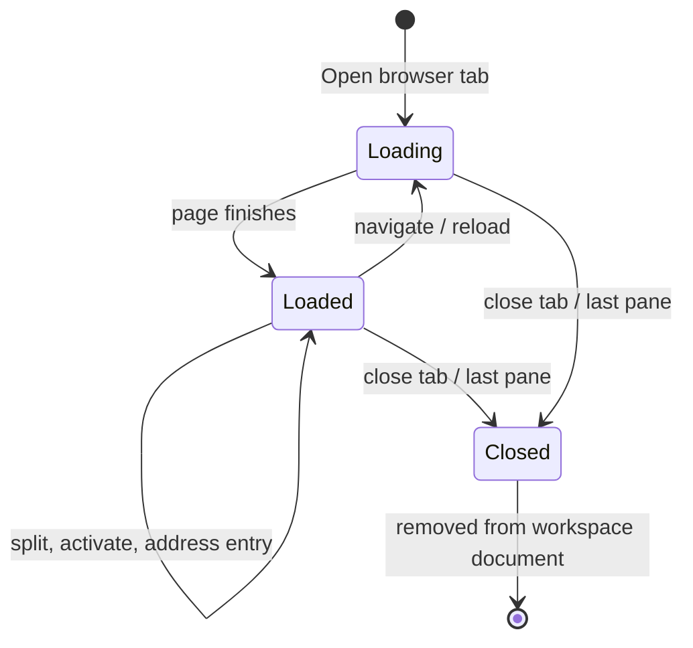

# Browser workspace

## Summary

**Status: drafted.** The **browser workspace** is the browser-tab area beside the fixed chat tab. Each browser tab holds one to four **browser panes** — sandboxed native web views — with a per-pane address bar and a shared toolbar. The user navigates by typing an address or search, follows links, splits panes into columns, rows, or a 2×2 grid, and closes panes or whole tabs. Tabs, panes, layout, and current URLs are durable: they survive app relaunch. Back/forward history, page titles, and scroll positions are not. Pages are limited to HTTP and HTTPS; popups become new Gradivus browser tabs.

## The simple case

The user opens a browser tab with **Open browser tab** or Ctrl+T. The new tab activates, shows one pane, and loads the default home page. The user types an address in the pane's address bar and presses Enter: a bare domain gets `https://` added, several words become a web search, and anything that is not HTTP or HTTPS is refused. **Back** and **Forward** step through the pane's history; **Reload** refreshes the page and becomes **Stop loading** while a page loads. To see two pages at once, the user splits the pane with **Split browser right** or **Split browser below**; two panes divide the tab as columns or rows, and three or four panes arrange as a grid. Clicking a pane activates it; the focused pane is outlined. Closing the last pane closes the tab.

## The interaction, event by event

### Starting

A browser tab starts from **Open browser tab** (disabled until the workspace hydrates), Ctrl+T, or a popup/`window.open` attempt in an existing page, which Gradivus converts into a new tab instead of opening a native popup window. The new tab is named **Browser** (later tabs **Browser 2**, **Browser 3**, …), activates immediately, and loads the default home page. Creating a tab before hydration shows **Workspace is still loading**; a create failure falls back to the chat tab with an error toast.

Each pane shows its own address bar (labeled **Address**) and a toolbar: **Back**, **Forward**, **Reload**, the element-targeting control, the browser Agent Hub button, split controls, and **Close browser pane**.

### Ending at once

Closing a browser tab — the tab's close glyph, Ctrl+W, or closing its last pane — ends the interaction. With the default close confirmation on, Gradivus first asks **Close tab “Browser”?**. The active tab closed, selection falls back to the chat tab. Closed tabs are removed from the durable workspace document; they do not return on relaunch.

### Becoming extended

The interaction becomes extended as the user navigates and splits. Typed input resolves by rule: an empty address loads the default home page; a value with a URL scheme is used as-is unless it is not HTTP(S), which is refused with **Only HTTP and HTTPS addresses can open here**; a value without a scheme and without a dot (or containing whitespace) becomes a search using the configured search-engine template; a bare domain gets `https://` prefixed. Navigation failures roll the address bar back to the authoritative URL and surface **Failed to navigate browser: …**.

Splits come from **Split browser right** (columns) or **Split browser below** (rows), capped at four panes; the split buttons disable at the cap. The third and fourth splits change the tab's layout to a 2×2 grid automatically. Splitting never preserves unequal sizes: panes divide evenly and cannot be dragged.

### While extended

While extended, the active pane is indicated by a focus outline, and clicking or focusing any pane activates both it and its tab. Only the active tab's panes are attached as visible web views; panes of background tabs stay alive but detached. Opening Settings detaches all browser views and makes the stages inert; closing Settings reattaches them with their identity and bounds preserved.

Link clicks and redirects update the address bar and persist the current URL durably. Page titles, however, are never shown: the tab strip keeps the durable **Browser** names, the window title follows the active tab name, and there are no favicons. Loading state is shown only by the toolbar's **Stop loading** button replacing **Reload**; there is no address-bar progress bar. Navigation failures (DNS, refused connections) show the browser engine's own error page.

### Finishing

A browser tab finishes when it is closed (confirmation applies) or when its last pane is closed. Individual panes finish via **Close browser pane**: with multiple panes, closing the active pane passes focus to the first remaining pane, and a grid of two or fewer panes returns to the columns layout. The durable workspace document records tab names, layout, pane list, and the last URL of each pane for the next launch; back/forward history, scroll positions, and live page titles are not retained.

## Modifiers

| Modifier | Effect at start | Effect when changed mid-interaction |
| --- | --- | --- |
| Default home page | New tabs and empty address submissions load the application's default home page URL. | Changing the setting changes future loads, not the current page. |
| Search engine template | Address-bar searches use the configured template's `%s` placeholder. | Changing the setting changes future searches. |
| Close confirmation | With the default on, closing a tab asks first. | Can be disabled in Settings; closing panes never asks. |
| Layout | One pane fills the tab; two panes split columns or rows. | The third and fourth splits force the 2×2 grid; reducing panes back to two returns to columns. Panes always divide evenly. |
| Active pane | The pane under pointer focus is active and outlined. | Clicking another pane activates it; the toolbar, address bar, and element targeting act on the active pane. |
| Settings open | Browser views are attached. | While Settings is open, all browser views detach and stages go inert; closing Settings restores the same views. |
| Element targeting | The toolbar's Page Agent control acts on the active pane. | Selection state is per-pane; see [Element targeting and Page Agent delivery](./browser-selection-to-chat.md). |

## Cancel and interrupt

| Interrupt | Outcome and visible consequence |
| --- | --- |
| explicit abort | **Stop loading** cancels an in-flight page load; **Close browser pane**/**Close tab** and Ctrl+W end panes or tabs (with confirmation when enabled). There is no navigation-level undo beyond **Back**. |
| doing something else mid-way | Switching to the chat tab or another browser tab hides a tab's stages without closing them; background panes keep loading detached. Opening Settings detaches all views but preserves them. |
| clean-completion event | A page finishing load is ordinary completion; the toolbar returns **Reload**. A popup attempt completes as a new browser tab. |
| environment failure | DNS and connection failures render the browser engine's error page in the pane; the app's own error state for the pane is not surfaced in the toolbar. A rejected navigation rolls the address bar back and toasts the failure. |
| page or process exit | Closing a pane destroys its view; closing the last pane closes the tab. A renderer-process crash shows a stopped-content state in the pane. App quit persists tabs, panes, and URLs; it does not persist history, titles, or scroll. |
| target changed elsewhere | The workspace runtime owns the tab/pane records; agents can create or remove terminal-kind records that never appear as browser tabs. If the active tab's record disappears, selection falls back to the chat tab. |
| input-channel change | Address entry accepts keyboard only; pages receive their own pointer and keyboard events once loaded. There is no second-device input. |

## Interactions with other systems

| Concern | Consequence |
| --- | --- |
| permissions | Panes deny web permission requests by default, have Node integration disabled, and accept only HTTP/HTTPS navigation. DevTools bind to loopback only. |
| history or undo | Each pane has session back/forward history that is not persisted. Tab/pane layout and current URLs are durable workspace history. No undo for closes. |
| containers or parents | Browser tabs belong to the workspace shell's tab strip; panes belong to a tab; the durable record belongs to the workspace runtime. The chat stage is a sibling, not a parent. |
| locked or read-only state | No read-only browser mode. Split and close actions can be disabled at structural caps (four panes). |
| offline behavior | Local servers and previously loaded pages remain usable; remote pages fail with the engine's error page. No offline cache UI. |
| collaboration or multi-device behavior | One local user; no shared browsing, sync, or remote tabs. |
| notifications | No page notifications are surfaced; loading state is the toolbar button change only. |
| configuration and preferences | Settings cover the default home page URL, the search-engine template, and tab-close confirmation. No zoom, download, or per-site preference surface exists. |

## Edge cases

- Right-clicking a browser pane opens a native menu with **Split Right**, **Split Down**, and **Close Pane**, but the menu items currently do nothing; the toolbar buttons are the working path. This is filed as [`CHAT-013`](../bug-triage.md#chat-013--browser-pane-right-click-menu-items-do-nothing).
- Page titles are never displayed anywhere in the shell; tab names are durable **Browser** names and the pane's own page shows its title.
- There are no favicons; tabs show a static globe icon.
- The tab close glyph is mouse-only; keyboard users close with Ctrl+W.
- Typing `localhost:3000` is rejected as a non-HTTP scheme (`localhost:` parses as the scheme); typing bare `localhost` becomes a web search.
- An empty address submission loads the home page rather than erroring.
- Panes cannot be resized by dragging; layouts are always even splits.
- `target="_blank"` and `window.open` never open OS popups; they open Gradivus browser tabs.
- There is no download handling: downloads are not surfaced, saved, or blocked with UI.
- Closing the last pane of a tab closes the whole tab, confirmation included.
- Background tabs keep their panes alive and loading while detached; their pages are not frozen.
- Only up to 32 browser views attach at once across tabs; the active tab's panes take priority.

## Open questions and verification

### Source revision

- Working tree anchored at `ac5f533bb245ef7f911dfc165c7c39356a2ac639` with the cross-platform terminal-renderer cutover applied.
- Evidence date: 2026-08-28.
- Boundary: relevant desktop sources and tests may be modified or untracked, so this describes the working tree anchored at that commit, not a clean checkout.

### Runtime evidence

**Observed:** the fixture-backed Electron journeys exercise the browser workspace: `packages/desktop/e2e/desktop.spec.ts:1618-1672` opens a browser tab, navigates by address-bar entry, detaches and reattaches the native view while Settings opens and closes, and reactivates the tab; `:1734-1932` asserts the exact **Browser** tab name and that switching to a browser tab hides the chat modal; `packages/desktop/e2e/omp-selection.spec.ts:782-815` navigates by address, splits with **Split browser right**, and closes a pane with **Close browser pane**. The full-run results are recorded in [`../foundations/scope-and-evidence.md`](../foundations/scope-and-evidence.md).

### Test evidence

**Test-specified:** `packages/desktop/test/workspace-host-browser-navigation.test.ts` (pending-navigation staleness, rejected-navigation rollback), `test/workspace-host-browser.test.ts` (zoom-scaled bounds, reattachment, theme backgrounds), and `test/workspace-host-pane-menu.test.ts` (menu labels and enabled state at the cap) were not run as a unit suite in this pass; their assertions are main-process-level.

### Code evidence

**Code-established:** address-bar semantics and navigation persistence are established by `packages/desktop/src/main/workspace-host.ts:722-741,1150-1181,2636-2707`. Toolbar controls, split caps, and pane activation are established by `packages/desktop/src/renderer/ui/molecules/BrowserToolbar.svelte`, `packages/desktop/src/renderer/ui/pages/App.svelte:372-469,649-701`, and `packages/desktop/src/renderer/ui/organisms/BrowserPane.svelte`. Native view attachment, bounds synchronization, and error capture are established by `packages/desktop/src/renderer/ui/atoms/BrowserSurface.svelte` and `workspace-host.ts:1019-1230,2713-2759`. Durable layout invariants (four-pane cap, grid for three and four panes, even ratio bounds) are established by `packages/workspace-runtime/src/reducer.ts`.

### Open questions

- **Open question:** Should the right-click pane menu work (routing to the same actions as the toolbar) or be removed? Filed as [`CHAT-013`](../bug-triage.md#chat-013--browser-pane-right-click-menu-items-do-nothing).
- **Open question:** Should panes support drag-resizing within the runtime's 20–80 ratio bounds, or stay even splits?
- **Open question:** Should page titles or favicons surface anywhere (tab strip, window title), or is the durable-name model final?
- **Open question:** Downloads, find-in-page, zoom controls, and certificate-error interstitials have no product surface; whether they should is undecided.
