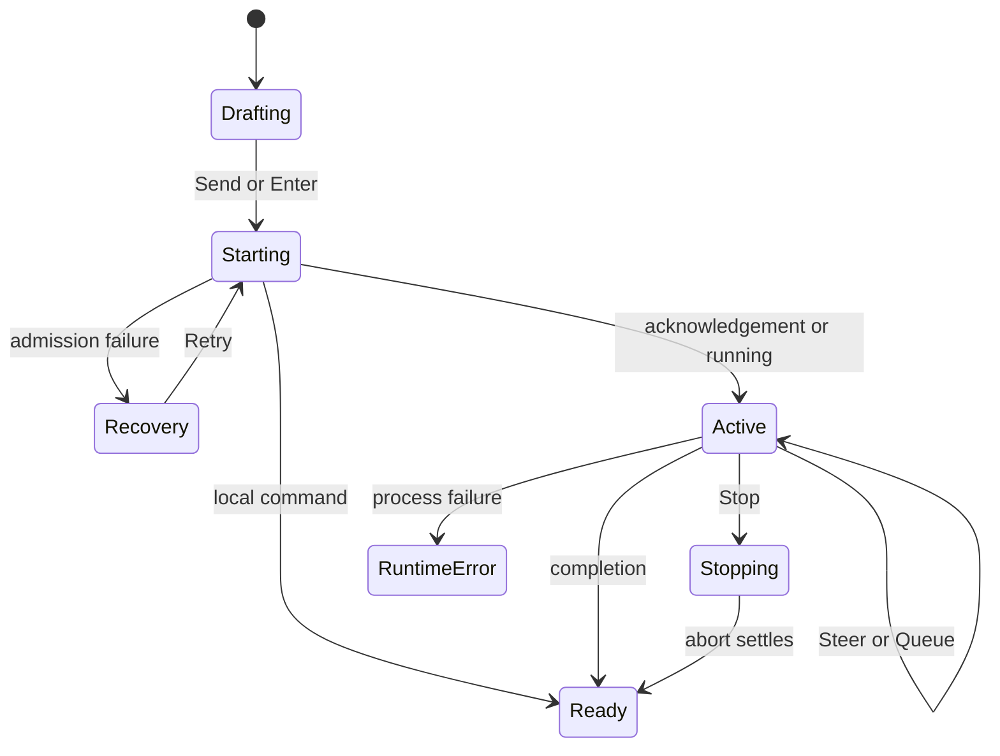

# Composing and controlling turns

## Summary

**Status: drafted.** OMP Chat lets the user prepare a renderer-local **draft**, submit a **primary message** with **Send**, and follow its admission, live work, completion, or recovery in the **conversation transcript**. During an **active turn**, the same composer admits a **steering message** through **Steer** or an explicit **queued follow-up** through **Queue for next turn**. The live banner reports current activity, elapsed time, optional generation throughput, and **Stop**.

The successful Send, local-command, recovery, active-turn, steering, queued-follow-up, and background-completion paths have fixture-backed Electron evidence. The full mounted Stop reconciliation path and composer enablement at non-composable boundaries do not; these gaps keep this feature drafted.

## The simple case

1. In a ready chat session, the user types a request. **Enter** or **Send** submits it; **Shift+Enter** adds a line break.
2. The draft clears immediately. One **optimistic user entry** and one **optimistic reasoning placeholder** appear, the rail marks the chat running, and the active-turn banner appears.
3. OMP acknowledges the prompt. The canonical backend user entry replaces the optimistic copy rather than adding a duplicate.
4. Reasoning, tool activity, and assistant output update the transcript. The banner shows the highest-priority current activity, elapsed time, and throughput when available.
5. Completion removes the live controls and leaves canonical transcript entries in the originating chat session.

Observed and Tested in `packages/desktop/e2e/desktop.spec.ts:179-227` by **“runs current OMP Chat feedback, recovery, local command, folder creation, settings, and Axe journeys”**; the optimistic and canonical reconciliation is Code-established in `packages/desktop/src/renderer/ui/pages/OmpChat.svelte:1109-1180,1289-1317,2388-2409`.

## The interaction, event by event

### Starting

- The composer accepts text and staged attachments. Empty input with no attachment does not submit. Draft text is renderer-local and is not durable across process exit.
- **Enter** submits; **Shift+Enter** inserts a line break; an IME composition event bypasses these shortcuts (`OmpChat.svelte:1736-1773`).
- Typing `/` opens the slash-command combobox when commands are available. Up/Down wraps through matches, Escape dismisses the menu without clearing the draft, Tab inserts the selected command, and Enter inserts a non-exact match or submits an exact selected command (`OmpChat.svelte:1736-1779`). Mounted evidence covers menu ARIA and Escape, but not every selection key.
- An idle submission is a **primary message**. The current provider, model, thinking level, plan mode, context state, chat identity, draft, and staged attachment identifiers form the admission context.
- Submission immediately clears the draft and staged chips, creates an optimistic user entry plus **Reasoning & preparing response…**, marks the chat running, begins elapsed-time tracking, and requests prompt admission (`OmpChat.svelte:1109-1179`).

> Technical note: a returned prompt request identifier is an acknowledgement, not proof that agent work started. A correlated asynchronous **prompt result** can still report local completion or a preflight failure (`packages/desktop/src/main/rpc-client.ts:39-73`; `packages/desktop/src/shared/contracts.ts:612-638`; `docs/rpc.md:105-150`).

### Ending at once

- Empty Enter prevents a newline but starts no turn.
- A **local command** such as `/status` can produce transcript output with `agentInvoked:false`, without invoking the agent. The optimistic rows are removed and the submitted draft and attachments are restored for the user (`OmpChat.svelte:1301-1311`). The mounted Electron journey in `desktop.spec.ts:179-227` executed this path.
- Provider/account/model preflight failure, immediate request failure, or a correlated prompt-result error rolls back the optimistic rows, restores the original input before any newer draft, returns staged attachments, marks the rail error state, shows an **Action failed** notification, and presents **Prompt could not start** with **Open provider accounts** and **Retry** (`OmpChat.svelte:1178-1180,1268-1286,1297-1299,2669-2677`).
- A normal provider error after agent work has begun is not the same as admission failure: it remains a transcript outcome with **Provider error** details rather than restoring the request as if it never started (`packages/desktop/src/main/transcript-presentation.ts:127-155`; `packages/desktop/src/main/transcript-store.ts:271-282`).

### Becoming extended

- A pending primary submission or runtime running state makes the turn active (`OmpChat.svelte:527-554`).
- **Send** becomes **Steer**. The composer hint explains that Enter steers the current turn and Queue sends afterward; **Queue for next turn** is available from More actions (`packages/desktop/src/renderer/ui/organisms/Composer.svelte:286-335`; `OmpChat.svelte:2691-2734`).
- The live banner is a polite status region. It shows current tool activity first, then running reasoning, then streaming assistant output, then a generic preparing/generating state. It also shows elapsed time, optional `tok/s`, and **Stop** (`OmpChat.svelte:438-470,2624-2667`).
- Mounted Electron evidence in `desktop.spec.ts:1707-1747`, **“routes Enter to steering while a turn is active”**, establishes that the action changes to Steer, Stop and Queue are exposed, and Enter sends steering input.

### While extended

- The user can type a new draft without ending the active turn. Enter admits it as a **steering message** and immediately appends an optimistic user entry. Success shows **Steering message sent**; failure removes that entry and restores its text and attachments (`OmpChat.svelte:1183-1203`).
- The user can choose **Queue for next turn** to defer the current draft explicitly. Success shows **Queued for the next turn** and refreshes queue metrics; failure restores the draft and attachments (`OmpChat.svelte:1205-1223`).
- Mounted Electron tests **“steers with exact attachments, rolls back once, and retains the admitted files”** and **“queues exact follow-up attachments and cleans retained files on teardown”** (`desktop.spec.ts:1270-1342`) establish admission, error recovery, and exact attachment transport. The retained-file lifetime is separately tracked in [`../bug-triage.md#chat-007--successful-steer-and-queue-attachments-remain-retained`](../bug-triage.md#chat-007--successful-steer-and-queue-attachments-remain-retained).
- Canonical transcript entries update by stable identifier. A canonical user entry replaces the primary optimistic user entry; repeated activity updates do not create a second row with the same identifier (`OmpChat.svelte:2388-2409`).
- Switching to another chat does not stop the turn. The pending turn and rail state remain owned by the originating chat; returning loads its completion. The executed Electron test **“keeps background completion attached to its originating chat”** covers this ownership (`desktop.spec.ts:1702-1706`).
- The user can review history, inspectors, browser tabs, or the Local terminal drawer without those actions automatically stopping the turn. No mounted evidence establishes native notifications or an inactive-chat completion toast.

### Finishing

- Successful completion removes the optimistic reasoning placeholder, releases primary-turn attachments, ends the pending-turn state, and leaves the submitted user entry plus authoritative reasoning/tool/assistant output (`OmpChat.svelte:1289-1317`). Runtime ready state removes the banner and restores **Send**.
- A background completion remains in the chat session where it began; it does not move to whichever chat is selected at completion.
- **Retry** resubmits the restored draft and attachment identifiers after a start failure. Executed Electron tests **“restores and retries an attachment-only prompt after immediate failure”** and **“preserves newer draft and newly staged files across delayed prompt failure”** cover exact recovery (`desktop.spec.ts:1148-1209`).
- Runtime/process failure shows **Runtime stopped unexpectedly** and a **Reconnect** path (`OmpChat.svelte:2314-2340,2594`). This state is Code-established; no passing mounted Electron journey forced a disconnect and completed Reconnect.
- **Stop** requests abort. Code restores pending attachments, retains the submitted user entry, removes the optimistic reasoning placeholder, and shows **Turn stopped** on success; an abort rejection shows an error and leaves the turn active (`OmpChat.svelte:1226-1260`). This reconciliation is not claimed as mounted coverage.

## Modifiers

| Modifier | Effect at start | If changed mid-interaction |
| --- | --- | --- |
| Provider | Selects the provider route shown for the next admission. Provider access can block admission before agent work. | The selector can remain available during an active turn, but available evidence does not settle whether a change affects the in-flight turn, only later admitted input. |
| Model | Selects the model and contributes the context-window summary used at admission. | The visible runtime summary and context limit can update; effect on already-running work is an Open question. |
| Thinking level | Sets reasoning effort; the transcript labels the disclosure **Reasoning**. | The control can update while a turn is active; whether OMP applies it to the active turn or the next admitted message is not established. |
| Plan mode | **PLAN MODE** changes composer guidance without creating another chat container. | Toggling calls the current chat session setting and updates the badge; effect on work already underway is not established (`OmpChat.svelte:2435-2442`). |
| Context meter | Shows used, remaining, and total context tokens, active model, and throughput when available; it does not itself alter the request. | Metrics can change as work consumes context. Opening or closing the disclosure does not interrupt the turn. |
| Slash command | An exact slash command can complete locally rather than start agent work. | A draft entered while active is routed through Steer unless the runtime treats it as local; the precise active-turn local-command policy is an Open question. |
| Queue choice | A normal idle submission starts immediately. | **Steer** admits into the active turn; **Queue for next turn** defers explicitly. Changing the draft before choosing either changes the text captured by that action. |
| Chat selection | The selected chat session owns the submission and pending correlation. | Switching chats leaves the turn with its origin. Current draft and attachment ownership diverges on the boundary; see [`../bug-triage.md#chat-006--draft-and-attachment-ownership-diverge-on-chat-switches`](../bug-triage.md#chat-006--draft-and-attachment-ownership-diverge-on-chat-switches). |

## Cancel and interrupt

| Interruption | User-visible result |
| --- | --- |
| explicit abort | **Stop** requests abort. Code-established success retains the user entry, removes the optimistic reasoning placeholder, restores pending attachments, and shows **Turn stopped**; rejection shows **Action failed** and leaves the active state. Mounted Stop reconciliation remains unverified and is listed in this feature's verification checklist. |
| doing something else mid-way | Typing another message leads to Steer or Queue rather than a second primary turn. Switching chats, opening an inspector, visiting a browser tab, scrolling history, or using the Local terminal does not automatically stop the origin turn. |
| clean-completion event | A normal completion ends live controls and leaves canonical transcript history. A local command can finish with `agentInvoked:false`, remove optimistic turn rows, restore its draft/attachments, and leave command output in the transcript. |
| environment failure | Admission/preflight failure restores input and shows **Prompt could not start** plus Retry. Provider failure after invocation remains a transcript error. Runtime failure shows **Runtime stopped unexpectedly** and Reconnect; mounted Reconnect coverage is absent. |
| page/process exit | Draft text and live controls are renderer-local. Visible staged attachments are released on teardown and host close removes attachment stores. Resume can reconstruct OMP history, but pending-turn, local-command, Stop, and live-notification behavior across a crash or exit is not established. |
| target changed elsewhere | Canonical timeline and session events replace or update stable records. Late responses from a stale chat selection are rejected by selection ownership, while inactive-chat status remains rail-scoped until reopened. External transcript or workspace mutation during admission is untested. |
| input-channel change | IME composition bypasses Enter shortcuts. Keyboard, file picker, drag/drop, plain-text paste, and extension-provided editor text have separate paths. Clipboard file/image paste, touch composition, voice input, and multi-device input are not established. |

## Interactions with other systems

### Permissions

The baseline assumes a normal writable local folder and available provider access. Provider/account authorization can fail preflight and route the user to provider accounts. Renderer and browser surfaces remain sandboxed; no turn control grants new filesystem or browser permissions.

### History or undo

There is no general composer undo or transcript rollback control documented here. A failed start restores the submitted input, and Retry submits it again. Canonical OMP history owns durable transcript reconstruction; optimistic entries and live banners are temporary projections.

### Containers or parents

A chat session owns its primary turn, pending correlation, transcript, running rail state, and background completion. The OMP Chat stage remains mounted while browser tabs are visited. The renderer currently carries draft text across chat selection while releasing staged attachments, a split ownership rule tracked in CHAT-006.

### Locked or read-only state

No read-only workspace mode is exposed for composing. OAuth account routing lock governs provider-account choice, not chat writability. The composer enablement predicate and Send action predicate can diverge at starting, stopping, errored, loading, or stale boundaries; see [`../bug-triage.md#chat-005--send-can-remain-actionable-while-the-chat-cannot-compose`](../bug-triage.md#chat-005--send-can-remain-actionable-while-the-chat-cannot-compose).

### Offline behavior

There is no offline turn queue or offline badge. Local drafts can be typed while the renderer exists, but provider-backed work needs its configured services. Runtime failure offers Reconnect rather than silently replaying a prompt; mounted disconnect/reconnect and deduplication behavior is unverified.

### Collaboration or multi-device behavior

Steer and Queue control one local OMP turn. Local retained agents and IRC activity can contribute transcript state, but there is no remote-human co-editing or multi-device draft/turn synchronization contract.

### Notifications

Admission, steering, queueing, Stop, and failure feedback can use manually dismissible in-app notifications and transcript entries. OMP Chat does not establish operating-system notifications, sounds, a notification center, or multi-device delivery. Background completion ownership is Tested; a completion notification while another chat is selected is not.

### Configuration and preferences

Provider, model, thinking level, and plan mode are chat/runtime controls; context is a meter, not a preference. Application theme, density, reduced motion, and transcript detail change presentation but do not change turn ownership. Apply timing for a modifier changed during active work remains explicit where unverified.

## Edge cases

- Empty or whitespace-only input with no attachment does not submit; attachment-only Send is supported by executed Electron evidence.
- Enter sends or steers; Shift+Enter adds a line break; IME composition does neither shortcut.
- A slash-menu exact match can submit, while a non-exact selected match is inserted for review first.
- A correlated prompt result may arrive before the acknowledgement request identifier; the renderer retains and reconciles that early result (`OmpChat.svelte:2300-2311`; `packages/desktop/test/rpc-client.test.ts:141-162`, test-specified only).
- Delayed admission failure restores the original request before a newer draft and preserves newly staged files. This merge order is Tested, but whether it is the preferred editing experience remains open.
- Provider failure after invocation differs from provider/account/model preflight failure: one is transcript history; the other restores input in the prompt recovery card.
- Selecting a chat already reported as running can show a zero-based local timer because no renderer pending-start timestamp exists; elapsed-time behavior for restored running sessions is unverified.
- Successful Steer and Queue attachment bytes can remain retained until teardown and consume the temporary-store quota; CHAT-007 defines the decision threshold.
- A carried draft can leave Send apparently actionable when `canCompose` is false; CHAT-005 is the P1 composer-admission gap.
- A stopped partial assistant or tool result has no fully established mounted presentation. Do not infer a cancelled row from the **Turn stopped** notification.

## Open questions and verification

### Source revision

- Revision anchor: `c125341133ff90a29fe266e1b166bac0183338c8`
- Evidence date: 2026-08-25
- Boundary: this document describes the working tree anchored at that commit. Relevant desktop renderer, main-process, test, and E2E sources were modified or untracked during research.

### Runtime evidence

- **Observed and Tested:** `bun run test:e2e:browser` from `packages/desktop` passed 24/24 Electron journeys on macOS arm64. Relevant executed tests cover primary Send and feedback, local commands, prompt recovery, Retry with restored input, Steer, Queue, active-turn controls, and background completion.
- **Observed and Tested:** `GRADIVUS_REAL_OMP=1 bunx playwright test --config playwright.real.config.ts` passed 1/1 and established `/context` through the compiled OMP Electron path; it did not establish a real provider turn. Rerun post-cutover under the current `GRADIVUS_*` environment names on macOS arm64: 1/1 passed.
- **Not observed:** no mounted journey activated Stop or forced an OMP disconnect and completed Reconnect.

### Test evidence

- **Passing mounted evidence:** `packages/desktop/e2e/desktop.spec.ts:179-227,1148-1209,1270-1342,1702-1747` under the named tests cited above.
- **Test-specified only:** `packages/desktop/test/e2e-chat-progress.test.ts:452-677`, `test/rpc-client.test.ts:141-162`, `test/transcript-projection.test.ts:497-564`, `test/chat-progress-feedback.test.ts:289-716`, and `test/chat-turn-banner.test.ts:96-230`. The last two copy renderer algorithms into test-local harnesses and are not mounted renderer evidence.
- **Failed verification command:** `bun run test` did not complete; no unit-only assertion is counted as passing. See [`../bug-triage.md#chat-010--the-desktop-unit-test-command-does-not-complete`](../bug-triage.md#chat-010--the-desktop-unit-test-command-does-not-complete).

### Code evidence

- **Code-established:** turn admission, optimistic entries, acknowledgement/result reconciliation, Steer, Queue, Stop, retry restoration, active banner, background-event ownership, and runtime failure in `packages/desktop/src/renderer/ui/pages/OmpChat.svelte:438-570,1093-1317,1725-1780,2294-2435,2610-2734`.
- **Code-established:** composer labels, keyboard-operable controls, runtime controls, context meter, and Queue disclosure in `packages/desktop/src/renderer/ui/organisms/Composer.svelte:1-337`, `RuntimePicker.svelte:1-142`, and `ContextMeter.svelte:1-112`.
- **Code-established:** acknowledgement/result separation in `packages/desktop/src/main/rpc-client.ts:39-73`, `packages/desktop/src/shared/contracts.ts:612-638`, and `docs/rpc.md:105-150`.

### Open questions

- Can mounted Stop success and rejection prove exactly-once abort, retained user entry, removed placeholder, restored attachments, notification, and final live-control state? No dedicated Stop defect is currently filed in [`../bug-triage.md`](../bug-triage.md); until this P1/P2 evidence exists or the gap is triaged, the feature remains drafted.
- Can Send, Steer, Queue, Enter, and attachment admission ever target a chat when `canCompose` is false or its selection token changed? CHAT-005 requires mounted boundary coverage.
- When provider, model, thinking level, or plan mode changes during an active turn, which admitted message first receives the new value?
- Should an active-turn slash command run locally, steer the current turn, or queue for later?
- What visible outcome should remain for partial assistant or tool activity after Stop?
- Should a restored already-running chat show real elapsed time rather than `0:00s`?
- Should background completion produce a rail marker or notification while another chat is selected?
