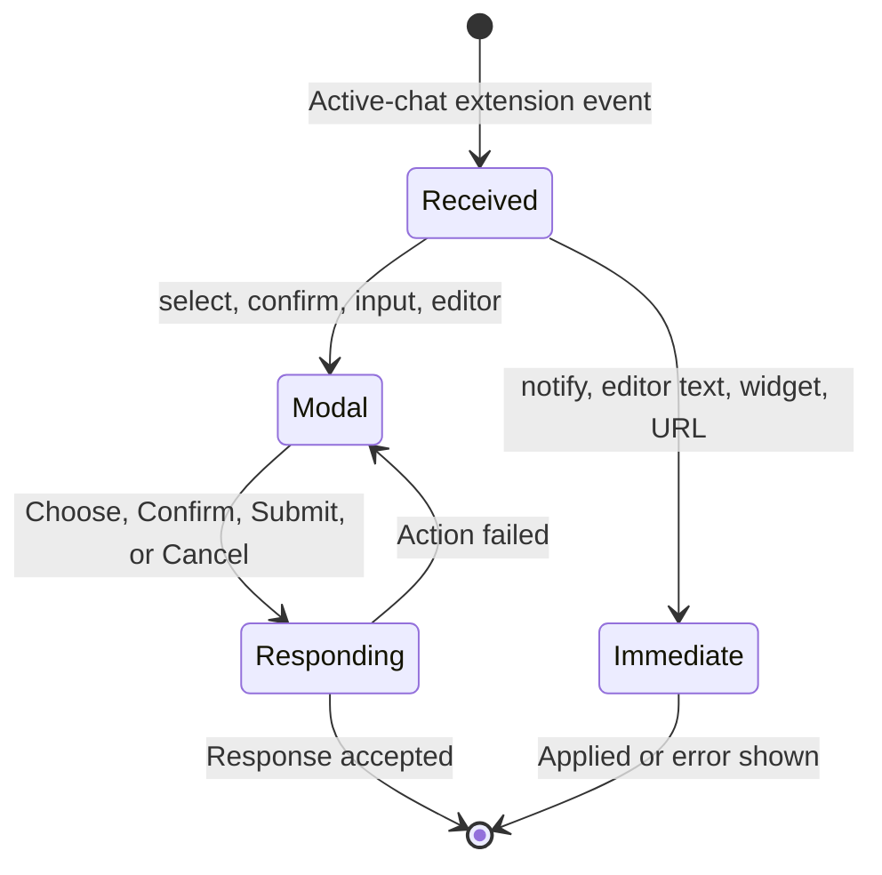

# Extension requests and notifications

## Summary

**Status: drafted.** OMP extensions can ask the user to select, confirm, enter, or edit a value in an ephemeral modal, or can issue immediate requests that open an external URL, replace composer text, set a composer widget, or show an in-app notification. These requests belong to the active chat session and are not transcript approvals or durable conversation transcript entries. The current surface has important cancellation, focus, inactive-chat ownership, and restart-durability limitations.

## The simple case

While OMP is working in the selected chat, an **OMP extension** modal appears with the extension's title and message. A select request offers option buttons; a confirm request offers **Cancel** and **Confirm**; input and editor requests offer **Cancel** and **Submit**. Sensitive input is password-masked. Choosing or submitting once sends the response to the owning OMP session and closes the modal after acceptance. An extension notification instead appears as a manually dismissible in-app toast. Neither the modal request nor the toast is added to the conversation transcript.

## The interaction, event by event

### Starting

An extension event is considered only after OMP Chat has matched it to the currently active chat session. For `select`, `confirm`, `input`, or `editor`, the renderer captures the request identifier, method, title, message, options, placeholder, sensitivity, and prefilled value and opens a modal labelled **OMP extension**. For `notify`, `set_editor_text`, `setWidget`, `setStatus`, `setTitle`, and `open_url`, handling starts immediately without presenting the response modal.

### Ending at once

Several methods end locally in one step. `notify` creates a toast. `set_editor_text` replaces the current composer draft. `setWidget` displays the supplied lines as a status block in the composer. `open_url` attempts to open the URL through the desktop's safe external-link path and then reports the extension interaction as cancelled because control moved outside OMP Chat. `setStatus` and `setTitle` are accepted into renderer state, but no visible use is established. A backend `cancel` event closes the matching pending request.

### Becoming extended

A select, confirm, input, or editor request becomes extended while the modal waits for one explicit response. Select sends the chosen option as its value. Confirm sends `confirmed: false` from **Cancel** or `confirmed: true` from **Confirm**. Input and editor keep the entered value in the pending request and send it with **Submit**; their **Cancel** sends an explicit cancellation. A sensitive input uses a password field with a **Sensitive input** accessible label.

### While extended

The modal stays above OMP Chat and blocks ordinary interaction with the underlying chat. It does not expose a response-busy state, and its `select` variant does not provide a Cancel control. Extension modals are not configured to close from Escape or a backdrop click. No mounted Electron journey has established initial focus, tab containment, focus return, or double-submission prevention. If sending a response fails, **Action failed** appears as an alert and the request remains pending.

### Finishing

After the desktop accepts a modal response, the pending request clears and OMP can continue. An in-app notification remains until the user activates **Dismiss notification** or a later notification replaces the singleton notice state; there is no automatic timeout or notification center. A failed external URL or response action surfaces **Action failed** rather than silently completing. Pending modal state, toast state, and composer widget state have no established relaunch durability.

## Modifiers

| Modifier | Effect at start | Effect when changed mid-interaction |
| --- | --- | --- |
| Request method | `select`, `confirm`, `input`, and `editor` open a modal; immediate methods update another surface or open an external URL. | The method is captured with the pending request and is not user-changeable. A later backend `cancel` can close the matching request. |
| Sensitive input | A sensitive `input` uses a password field and does not visibly echo characters. | Sensitivity is not changeable by the user while the modal is open; a replacement request would establish a new input surface. |
| Prefill and placeholder | Input/editor begins with the extension-provided prefill and guidance. | Typing updates the value that **Submit** sends. The placeholder remains guidance and is not submitted as a value. |
| Active chat session | Only an event owned by the selected chat reaches extension routing. The response is sent using the current chat identity. | Switching chats can strand or mis-own a pending interaction; no supported handoff or replay is established. See [`CHAT-001`](../bug-triage.md#chat-001--an-extension-request-can-be-lost-after-switching-chats). |
| Notification tone | `info` uses status semantics; `warning` and `error` use alert semantics. | A later notice replaces the current singleton notice rather than updating a durable notification record. |
| Widget placement | Widget lines are joined into a composer status block. The contract can request placement above or below the editor. | The renderer exposes one widget state; a later widget replaces its text. Placement-specific rendering was not established in the inspected surface. |
| Composer state | `set_editor_text` replaces the current draft immediately. | Later typing edits that replacement normally; no confirmation or undo snapshot is created. |

## Cancel and interrupt

| Interrupt | Outcome and visible consequence |
| --- | --- |
| explicit abort | Confirm has **Cancel**, which answers false; input/editor **Cancel** sends `cancelled: true`. Select has no Cancel control. Escape and backdrop click are not established cancel paths. |
| doing something else mid-way | A chat switch changes the active owner. A request arriving for an inactive chat is dropped before modal routing, and a visible pending request has no documented transfer rule. This can strand OMP; see [`CHAT-001`](../bug-triage.md#chat-001--an-extension-request-can-be-lost-after-switching-chats). |
| clean-completion event | Selecting an option, confirming, submitting, or explicitly cancelling sends one response; acceptance clears the modal. Dismissing a toast clears only that notification. |
| environment failure | A rejected response or unsafe/failed external URL shows **Action failed**. A modal response failure leaves the request pending; there is no offline response queue. |
| page/process exit | Pending modal, toast, widget, status, and title state are renderer-local and have no established replay after reload or process exit. The runtime may remain waiting for a response. |
| target changed elsewhere | A matching backend `cancel` closes the pending request. A nonmatching cancel does not dismiss another request. A later modal request replaces the single pending modal state. |
| input-channel change | Keyboard and pointer share the modal controls, but focus trapping, initial focus, Escape, assistive-technology behavior, and double activation are not runtime-verified. There is no second-device response path. |

## Interactions with other systems

| Concern | Consequence |
| --- | --- |
| permissions | The modal is OMP-provided interaction, not an Electron permission grant. External URLs pass the desktop safe-URL boundary. Sensitive input is visually masked, but the response still goes to the local OMP runtime. |
| history or undo | Extension requests and notifications are ephemeral and do not enter the conversation transcript. There is no approval history, notification history, or undo for `set_editor_text`/widget changes. |
| containers or parents | A request belongs to one chat session and can block that session's OMP work. The active-session guard currently prevents inactive-chat requests from reaching a visible modal. |
| locked or read-only state | No read-only workspace modifier is established for extension requests. Advisor/read-only Agent Hub rules are unrelated. Whether a runtime-issued request is appropriate is decided by OMP, not a desktop lock state. |
| offline behavior | There is no offline queue. Existing modals can remain visible after a response failure, but reload/reconnect recovery is unestablished. Notifications are local in-app state only. |
| collaboration or multi-device behavior | No remote-human or multi-device response delivery exists. Extension requests are local to this Electron renderer and selected chat. |
| notifications | `notify` produces one manually dismissible in-app toast. Info uses `role=status`; warning/error use `role=alert`. There is no automatic dismissal, sound, operating-system delivery, queue, center, or history. |
| configuration and preferences | No notification or extension-modal preference is exposed. Application reduced-motion and theme styles apply generally, but no method-specific preference changes response behavior. |

> Technical note: The desktop main process remembers only the outstanding extension request identifier and method for response validation; the chat snapshot does not include a pending-request replay. This is why a renderer reload or inactive-chat delivery cannot currently be described as recoverable.

## Edge cases

- A `select` request with no options presents an empty option area and no user-visible Cancel action.
- Empty input/editor text can be submitted as an empty value; no desktop validation rule is established.
- Sensitive input uses `autocomplete="current-password"`; whether that is appropriate for every secret or one-time extension value is an open accessibility/privacy question.
- A response can be activated again while its first request is in flight because the modal has no response-busy control state.
- A failed response keeps the modal open and shows a separate **Action failed** toast, allowing a retry but also leaving double-response behavior unverified.
- A later notice replaces the prior notification. Error feedback uses a separate singleton error toast, so notice and error can coexist.
- `setStatus` and `setTitle` update state that has no located visible rendering; `setWidget` is the established composer-visible status block.
- `open_url` reports cancellation even after successfully opening the external target; this means “cancelled” describes the extension interaction, not a failed browser launch.
- An extension event for an inactive chat is not replayed on return. This suspected high-severity defect is tracked in [`CHAT-001`](../bug-triage.md#chat-001--an-extension-request-can-be-lost-after-switching-chats).

## Open questions and verification

### Source revision

- Working tree anchored at `c125341133ff90a29fe266e1b166bac0183338c8`.
- Evidence date: 2026-08-25.
- Boundary: relevant desktop sources and tests may be modified or untracked, so this describes the working tree anchored at that commit, not a clean checkout.

### Runtime evidence

**Observed:** `packages/desktop/e2e/desktop.spec.ts` passed 24/24 on macOS arm64. The journey **“renders semantic transcript messages”** observed a warning in-app toast and dismissed it. No passing mounted Electron journey opened a `select`, `confirm`, `input`, or `editor` extension modal, tested its response, switched chats with a pending request, or reloaded with one pending. Missing modal and inactive-chat verification remains linked to [`CHAT-001`](../bug-triage.md#chat-001--an-extension-request-can-be-lost-after-switching-chats).

### Test evidence

**Tested:** `packages/desktop/e2e/desktop.spec.ts:1748-1822`, **“renders semantic transcript messages,”** passed as part of the 24-test Electron run and established visible warning-toast alert and dismissal behavior. No direct approval/select/confirm/input/editor behavioral test was found. Unit-only assertions are test-specified rather than passing evidence because `bun run test` did not complete.

### Code evidence

**Code-established:** request response and failure retention are established by `packages/desktop/src/renderer/ui/pages/OmpChat.svelte:2207-2212`; active-session filtering and method routing by `packages/desktop/src/renderer/ui/pages/OmpChat.svelte:2294-2433`; widget and toast rendering by `packages/desktop/src/renderer/ui/pages/OmpChat.svelte:2476-2483,2679,3148-3151`; modal cancellation limits by `packages/desktop/src/renderer/ui/molecules/ModalShell.svelte:39-65`; toast roles and dismissal by `packages/desktop/src/renderer/ui/molecules/Toast.svelte:1-29`; and outstanding-response validation plus in-memory request tracking by `packages/desktop/src/main/desktop-host.ts:900-925,1504-1538`.

### Open questions

- **Open question:** Initial focus, focus containment, focus return, screen-reader announcement, and double-submission behavior for every extension modal remain unverified. This missing mounted-modal evidence is recorded with the stranded-request risk in [`CHAT-001`](../bug-triage.md#chat-001--an-extension-request-can-be-lost-after-switching-chats).
- **Open question:** Should select requests expose Cancel, and should Escape or backdrop click answer cancellation rather than doing nothing?
- **Open question:** Should pending requests replay after chat switch, renderer reload, OMP reconnect, or app relaunch, and where should recovery be visible?
- **Open question:** Should `setStatus` and `setTitle` render, or should unsupported methods be rejected explicitly?
- **Open question:** Should `set_editor_text` preserve or confirm replacement of an existing draft?
- **Inference:** Because notification, modal, widget, title, and status are renderer-local and absent from persisted chat snapshots, they are lost on renderer recreation; this has not been runtime-observed.
