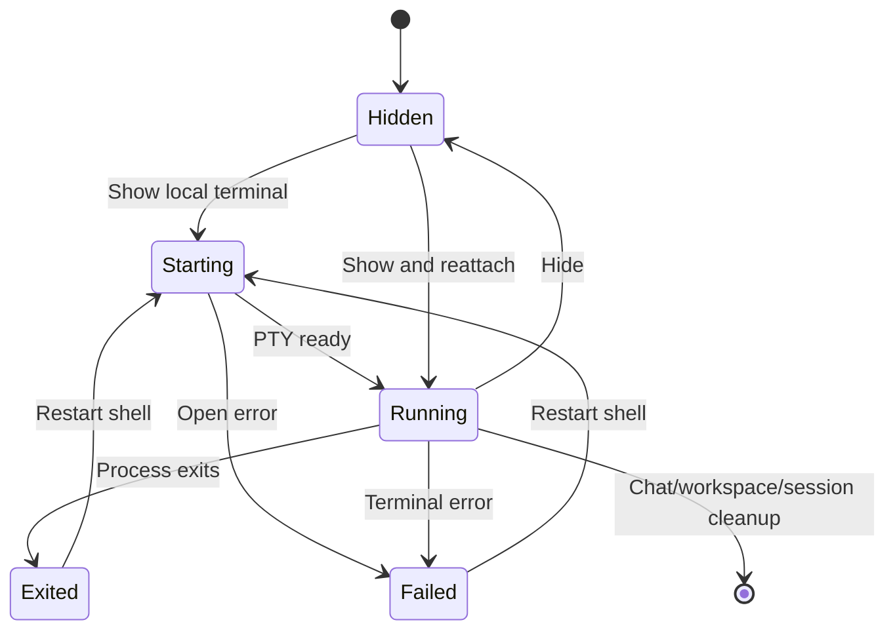

# Local terminal drawer

## Summary

**Status: drafted.** The **Local terminal drawer** is a chat-local bottom section opened from the transcript header. The product model distinguishes a bounded, read-only **Agent activity** projection from an independent **Shell**, but the tested working-tree surface currently renders one **Local terminal** shell with no Agent activity/Shell mode buttons. Shell input and output stay outside OMP context and the conversation transcript. The shell starts in the selected chat session's workspace, survives hide/show and presentation reattachment, and is cleaned up at chat, workspace, session-runtime, or explicit-close boundaries without affecting durable workspace terminals.

## The simple case

The user selects **Show local terminal** in a ready chat. The drawer opens below the transcript, reports `starting` and then `running`, focuses the local shell, and starts a PTY in that chat session's workspace folder. Commands typed there behave like commands in an ordinary local shell. They are not sent as OMP requests and do not add rows to the conversation transcript. Selecting **Hide local terminal** removes the drawer from view without ending its shell; showing it again reattaches from the last bounded output offset. If the shell exits or fails, the drawer shows the state, exposes any error, and offers **Restart shell**.

## The interaction, event by event

### Starting

The transcript-header control begins as **Show local terminal**, with `aria-expanded="false"`. Activating it changes the control to **Hide local terminal**, reveals the divided bottom drawer, creates or reattaches the chat shell, sizes it to the available drawer, and focuses it. The shell is rooted at the selected chat session's exact local workspace path, even when a different authority workspace is active. Its executable comes from the application Terminal setting when a new PTY is created.

The conceptual **Agent activity** channel is read only and intentionally excludes arbitrary arguments, raw output, cwd, environment values, runtime tokens, and session IDs. The current tested renderer does not expose Agent activity as a selectable drawer mode; it exposes only the **Local terminal** shell. Agent/tool activity remains in the bounded conversation presentation rather than becoming shell input.

### Ending at once

Hiding the drawer immediately makes it unavailable for input but does not close the PTY or reset its output offset. Reopening it can therefore continue the same process. If creation cannot resolve a chat workspace or cannot reach the workspace runtime, the drawer ends in `failed`, shows the error as an alert, and offers **Restart shell** instead of claiming that a shell is running.

### Becoming extended

The interaction becomes extended when the PTY remains open, produces more output than is currently rendered, is resized, or must reattach after renderer presentation loss or workspace-runtime client replacement. Output is tracked with monotonic byte offsets. The presentation requests replay from its last retained offset and ignores older duplicate frames. If earlier output is no longer retained, the drawer says **Earlier shell output was evicted; showing the available replay.**

> Technical note: the chat terminal is a detached, ephemeral PTY recorded by the workspace authority while its presentation is owned by the selected chat workspace. Recreating the renderer presentation can rebind the same workspace PTY from a retained byte offset; this is why hide/show or renderer reload need not replay output into OMP or create a conversation event.

### While extended

Input is serialized to the PTY, output is rendered locally, and drawer resize updates terminal columns and rows. Theme, font size, font family, cursor blink, cursor style, and scrollback changes apply to an open renderer terminal; shell executable changes affect newly opened PTYs. Resizing or changing appearance does not intentionally restart the process. A workspace-runtime reconnect resubscribes from the retained byte offset so already consumed output is not deliberately duplicated.

Switching to another chat closes the visible drawer. When the destination chat belongs to a different workspace path, the previous chat shell is closed before a shell is opened for the new workspace. Shell activity never changes the selected runtime, active turn, transcript contents, or durable browser/terminal panes.

### Finishing

Typing `exit` or otherwise ending the process changes the state to `exited` and reveals **Restart shell**. Restart closes the old PTY, clears its presentation replay offset, and creates a new shell using current new-terminal settings. Explicit terminal close, session/workspace switching, session-runtime restart, renderer component destruction, and application shutdown clean up the ephemeral chat PTY. Hiding alone is not completion. Durable workspace terminals are a separate container and are not closed by Local terminal cleanup.

## Modifiers

| Modifier | Effect at start | Effect when changed mid-interaction |
| --- | --- | --- |
| Selected chat session | Supplies the local workspace path and owns the drawer presentation. | Switching chat sessions hides and destroys the current presentation; a different workspace path closes the previous ephemeral PTY before another can open. |
| Agent activity versus Shell | Agent activity is a bounded, read-only projection; Shell is an interactive PTY whose input/output stays outside OMP context. The tested UI starts directly in the single Local terminal shell and shows no mode buttons. | No working-tree mode switch is exposed. Agent activity arriving during shell use remains conversation/agent presentation, not shell data. |
| Visibility | Hidden means no active shell canvas input; showing creates or reattaches the shell and focuses it. | Hide preserves the PTY and replay offset; show reattaches and resizes without intentionally changing chat state. |
| Drawer size | Initial dimensions determine PTY columns and rows within bounded limits. | Resize updates the renderer and PTY dimensions; failures to report resize are ignored, so the shell remains usable at its last accepted dimensions. |
| Theme and terminal appearance | Current application theme, font, cursor, and scrollback settings configure the terminal renderer. | Appearance changes apply live and refit the open terminal without restarting its process. |
| Shell executable | The application Terminal shell is used when the PTY is created. | Changing Shell does not replace the running PTY; it applies after restart or a newly opened terminal. |
| Replay availability | Reattachment begins at the retained monotonic byte offset. | New frames advance the offset; duplicate older frames are ignored, and lost earlier output produces a truncation status. |
| Workspace-runtime connection | A connected workspace runtime and a resolvable chat workspace are required to start. | Reconnection resubscribes from the retained offset; failure changes the drawer to `failed` and surfaces an error. |

## Cancel and interrupt

| Interrupt | Outcome and visible consequence |
| --- | --- |
| explicit abort | **Hide local terminal** ends only the visible interaction; the shell remains running. `exit` ends the PTY and reveals **Restart shell**. There is no separate Ctrl+C interception: Ctrl+C is ordinary shell input for the foreground process. |
| doing something else mid-way | Switching chats closes the visible drawer and its presentation. Switching to another workspace closes the prior workspace's ephemeral chat PTY; Shell output remains outside both chat transcripts. |
| clean-completion event | A normal process exit changes status to `exited`; **Restart shell** starts a fresh PTY. Hiding is not clean completion because the process and replay offset remain. |
| environment failure | Workspace-runtime disconnection, PTY creation failure, write failure, or terminal error leaves the drawer visible when possible, changes status to `failed` or shows an alert, and offers restart. There is no offline command queue. |
| page/process exit | Renderer presentation loss disposes its canvas and asks to close the known presentation; source and reconnect tests establish offset-aware reattachment paths, but exact renderer-reload survival was not exercised. Application shutdown closes ephemeral chat terminals; a hard process loss may leave authority state requiring recovery. |
| target changed elsewhere | If the authority terminal disappears or closes, the drawer becomes `exited`; if the selected chat/workspace changes, the old presentation no longer owns the visible drawer. Durable workspace-terminal changes do not become Local terminal output. |
| input-channel change | Keyboard and paste accepted by the terminal canvas become PTY input; pointer use only focuses or selects in the renderer. There is no second-device input, OMP steering conversion, or transcript mirroring. |

## Interactions with other systems

| Concern | Consequence |
| --- | --- |
| permissions | The shell uses the local workspace runtime rather than an embedded-site permission prompt. Its OS/filesystem permissions are those of the local PTY process; a read-only or inaccessible path can fail through ordinary shell/tool errors. |
| history or undo | Shell scrollback and offset replay are local terminal history, not conversation history or undo. Commands have no application-level undo; shell-native history depends on the configured shell. |
| containers or parents | The Local terminal drawer belongs to the selected chat session and its workspace path. Its ephemeral PTY is separate from durable workspace terminal panes and from OMP's conversation runtime. |
| locked or read-only state | No dedicated read-only terminal mode exists. A read-only workspace may allow the shell to open while later filesystem mutations fail. OAuth account routing lock and Agent Hub read-only state do not lock the shell. |
| offline behavior | The shell does not require a provider or internet connection, but it does require the local workspace runtime. Commands that need the network fail in their own output; there is no offline queue or custom offline state. |
| collaboration or multi-device behavior | Shell input/output is local and is not broadcast to remote users or other devices. Local OMP agents do not receive it unless a user separately includes its result in a request. |
| notifications | Starting, running, exited, failed, truncation, and error states appear inside the drawer. There is no operating-system notification, sound, or terminal notification history. |
| configuration and preferences | Application settings control terminal shell, font family, font size, cursor style/blink, scrollback, and theme. Shell changes apply to newly opened PTYs; renderer appearance changes apply live. The **Default root directory** setting does not override a chat shell's session workspace, and its mismatched workspace copy is tracked in [`CHAT-008`](../bug-triage.md#chat-008--default-root-directory-does-not-set-the-new-workspace-default). |

## Edge cases

- The current Electron journey confirms that **Agent activity** and **Shell** are not rendered as mode buttons; the only drawer title is **Local terminal**. This differs from the two-channel product model and remains an open presentation question.
- Showing the drawer before a chat workspace can be resolved returns **Session workspace is unavailable** as a failed state.
- A disconnected workspace runtime returns a failed shell state instead of creating an unowned local process.
- Dimensions are bounded to 2–500 columns and rows; a zero-sized hidden element is not sent as a resize.
- Output that arrives before the canvas mounts is buffered and then written in offset order.
- Output frames older than the retained replay offset are ignored to avoid visible duplication.
- Hide/show retains the shell and output offset. Restart intentionally clears both presentation output and replay offset for the new PTY.
- The chat shell always uses the chat session cwd. The application **Default root directory** is consumed by a different durable-terminal fallback, not by Local terminal creation.
- `omp` can run in the shell only when it is available on the inherited `PATH`; doing so is a separate local process and does not turn the drawer into the active OMP Chat runtime.

## Open questions and verification

### Source revision

- Working tree anchored at `c125341133ff90a29fe266e1b166bac0183338c8`.
- Evidence date: 2026-08-25.
- Boundary: relevant desktop sources and tests may be modified or untracked, so this describes the working tree anchored at that commit, not a clean checkout.

### Runtime evidence

**Observed:** `packages/desktop/e2e/desktop.spec.ts` passed 24/24 on macOS arm64. Its journey **“opens the current chat local terminal drawer without changing chat state”** showed the drawer, ran shell input, observed advancing output offsets, exited and restarted the shell, hid and reopened it, and confirmed the conversation timeline did not change. The fixture-backed journey did not use a real provider or authenticate an external account.

### Test evidence

**Tested:** `packages/desktop/e2e/desktop.spec.ts:1608-1700`, **“opens the current chat local terminal drawer without changing chat state,”** passed in the executed Electron run. It establishes current Show/Hide accessibility state, the absence of Agent activity/Shell mode buttons, running/exited/restart transitions, hide/show offset continuity, and transcript isolation. `packages/desktop/test/workspace-host-reconnect.test.ts:89-144`, **“retains terminal byte offset across replaceClient and resubscribes from that offset,”** is test-specified/unit-level support only because the overall unit suite did not pass and this assertion was not part of the executed Electron journey.

### Code evidence

**Code-established:** drawer activation, live appearance, serialized writes, resize, monotonic replay, truncation/error feedback, restart, and presentation cleanup are established by `packages/desktop/src/renderer/ui/organisms/ChatTerminalDrawer.svelte:11-220`. Chat ownership and toggle behavior are established by `packages/desktop/src/renderer/ui/pages/OmpChat.svelte:647-709,2574-2607`. Workspace-rooted detached PTY creation, reuse, replacement, shell selection, and cleanup are established by `packages/desktop/src/main/workspace-host.ts:1368-1515`. The two-channel intent and separation from OMP context are stated in `packages/desktop/README.md:19-35`.

### Open questions

- **Open question:** Should the Local terminal drawer visibly expose separate **Agent activity** and **Shell** modes, or is the tested single-shell surface the intended clean cutover?
- **Open question:** Renderer reload, drawer resizing while a process emits output, workspace-runtime reconnect, and session switching have not been exercised end to end in Electron.
- **Open question:** Exact cleanup after a hard Electron crash is not established; the source-backed presentation map is memory-owned and may not close a durable detached PTY after abrupt loss.
- **Open question:** Failed shell executable, inaccessible workspace, evicted replay, very large scrollback, clipboard behavior, and alternate shells remain runtime-verification gaps.
- **Open question:** The user-facing scope of **Default root directory** remains unresolved in [`CHAT-008`](../bug-triage.md#chat-008--default-root-directory-does-not-set-the-new-workspace-default).
