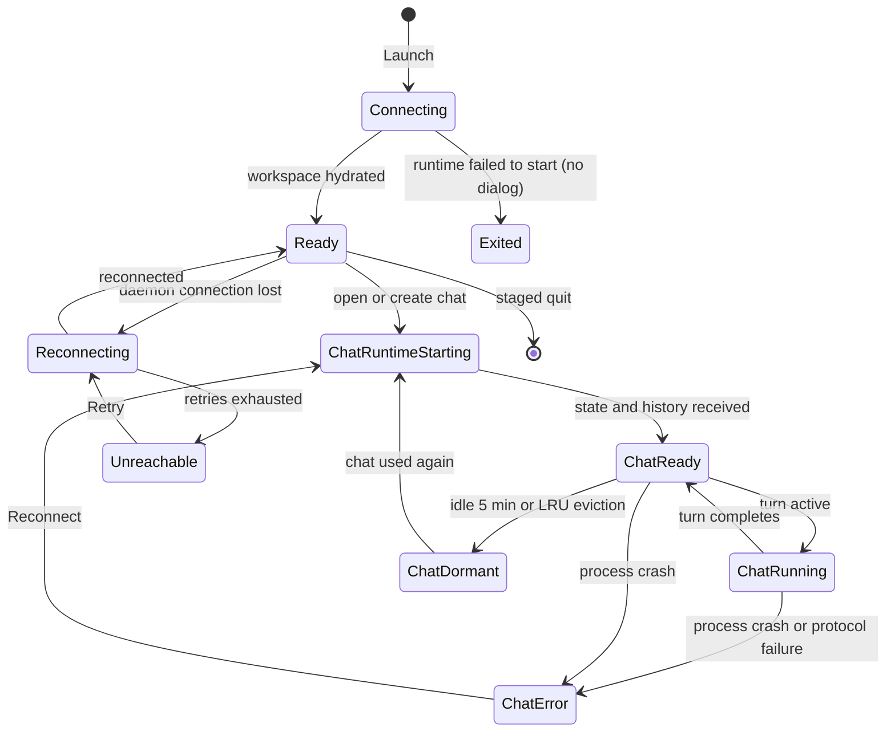

# OMP runtime connection

## Summary

**Status: drafted.** Gradivus is a desktop shell around **OMP**, the local coding-agent runtime that owns models, providers, tool execution, and conversation history. The connection is invisible when healthy: the app launches, a status region says **Connecting to the workspace runtime…**, and chats become usable. Behind that, Gradivus starts one workspace runtime daemon, starts one OMP chat process per chat session on demand, keeps at most three of them resident, transparently stops idle ones, and resumes them from their saved history when used again. The user-visible connection states are few: the launch overlay, per-chat running/idle/error status, the **Runtime stopped unexpectedly** error card with **Reconnect**, workspace-runtime reconnect toasts, and the settings/account surfaces that run on a separate short-lived OMP process. When the runtime cannot start at all, the app currently exits without a dialog.

## The simple case

The user launches Gradivus. The app starts its local workspace runtime, opens the window, and shows **Connecting to the workspace runtime…** until the workspace is ready. The user creates or opens a chat; that chat's OMP process starts (it is not started by the first message), loads its saved history, and becomes ready. The user submits turns, watches activity stream, and quits when done. Reopening a chat that went idle or was evicted resumes its OMP process from the saved conversation — the transcript returns without the user doing anything.

## The interaction, event by event

### Starting

Launching the app starts the connection sequence. Gradivus loads its local settings and chat registry, starts the workspace runtime daemon from the bundled OMP executable (packaged builds use the copy inside the app; development builds require the compiled binary at a known path), creates the default workspace, and only then opens the window. If the daemon cannot start, the app exits — there is no dialog; on a packaged build a second launch just focuses the existing window.

The renderer shows the full-stage **Connecting to the workspace runtime…** status until the first workspace document arrives. A chat's OMP process is started when the chat is created or opened, not when the first message is sent: the process starts, reports its state, and streams its saved history into the chat. Startup problems — a process that exits early, does not become ready within its startup budget, or speaks an incompatible protocol — surface as that chat's error state, with the process's recent error output appended to the message.

> Technical note: each chat's OMP process is launched as `omp --mode rpc` in the chat's workspace folder with a loopback gRPC connection on an ephemeral port. The first message on the connection must be a protocol handshake; a mismatch fails the chat with an explicit message. Gradivus performs no version check before spawn — the handshake is the only gate.

### Ending at once

The interaction can end immediately by quitting before opening any chat. Nothing chat-related has started; only the daemon and the app's own settings and registry files exist. Quitting is staged: chats' OMP processes are stopped, the workspace is stopped, the daemon client closes, and transient processes are torn down before the process exits.

### Becoming extended

The connection becomes extended as chats are used. Each chat maps to one OMP process, but at most three run at once: opening a fourth chat silently stops the least-recently-used idle one, and any chat idle for five minutes has its process stopped. Evicted or timed-out chats are not closed — their records and history remain, and the next interaction with them restarts their process from the saved session file. In the session rail, live status is shown per chat (idle, running, error), and a dormant chat simply resumes on open.

Settings changes that need OMP — provider sign-in, account management, and settings reads when no chat is live — run on a separate short-lived headless OMP process that exists only while those operations are in flight.

### While extended

While extended, per-chat failures surface through the chat: a crashed OMP process mid-turn rolls back the optimistic turn and shows **Runtime stopped unexpectedly** with **Resume to reconnect and recover the saved transcript.** and a **Reconnect** action. Calls made while a chat's process is starting or stopping fail with an action error toast (**OMP is not ready**); there is no queueing of actions across a restart.

Separately, the workspace daemon connection can drop. The shell toasts **Reconnecting to the workspace runtime…**, retries with increasing delay, and either recovers silently or ends at the persistent **Workspace runtime unreachable** error with **Retry**. Terminal and browser services follow the daemon's lifecycle; chat transcripts follow their own per-chat runtime.

### Finishing

Quitting the app finishes the connection. All chat runtimes are stopped with a bounded abort-and-terminate sequence, the workspace stops, and durable state is already on disk: the chat registry (`sessions-v1.json`), application settings (`settings.json`), and the workspace document (tabs, panes, terminals) in the app's user-data directory. OMP's own conversation history lives in OMP's storage; Gradivus persists only the path to each chat's session file and resumes through it on the next launch.

## Modifiers

| Modifier | Effect at start | Effect when changed mid-interaction |
| --- | --- | --- |
| Installed versus development build | Packaged builds spawn the bundled OMP executable and enforce single-instance; development builds require the compiled binary at a known path and exit with a path-listing error when missing. | Not user-changeable at runtime. |
| Chat opened count | Opening a chat starts its OMP process on demand. | The fourth concurrent chat evicts the least-recently-used idle one; the evicted chat resumes transparently on next use. |
| Idle time | Idle chats stay resident. | After five minutes idle, a chat's process stops; the chat shows as idle and resumes on next use. |
| Settings and account operations | With a live chat, they use that chat's runtime. | With no chat live, a separate short-lived headless OMP process serves them and exits after. |
| Fixture mode | Tests can substitute a deterministic fake OMP process. | Test-only; not reachable in normal use. |

## Cancel and interrupt

| Interrupt | Outcome and visible consequence |
| --- | --- |
| explicit abort | **Stop** interrupts a running turn (with confirmation while a turn is active) and stops that chat's OMP process within a bounded abort sequence. **Reconnect** is the recovery action after a failure. Quitting stops everything. |
| doing something else mid-way | Switching chats does not stop their runtimes (until caps/idle apply); background completion stays attached to the originating chat. Opening Settings does not stop chat runtimes. |
| clean-completion event | A turn completing returns the chat to ready; the process stays resident for future turns. |
| environment failure | A crashed OMP process rolls back its pending turn and shows the **Runtime stopped unexpectedly** card with **Reconnect**; daemon loss shows the reconnect/unreachable toast ladder; a resume with no saved session file fails with **No resumable OMP session file exists**. |
| page or process exit | App quit is staged and stops chat runtimes first. A hard crash may leave OMP processes orphaned; they are not reused by the next launch, which resumes from saved history instead. |
| target changed elsewhere | The chat registry is machine-local; another Gradivus instance cannot edit it (single-instance lock when packaged). OMP's history files are owned by OMP and are not edited by Gradivus. |
| input-channel change | The renderer is the only input channel to OMP through a validated bridge; there is no direct user channel into the gRPC protocol. |

## Interactions with other systems

| Concern | Consequence |
| --- | --- |
| permissions | OMP runs with the user's own account permissions in the chat's workspace folder; the renderer cannot reach it directly. Provider credentials stay inside OMP's storage, never in the renderer. |
| history or undo | OMP owns conversation history (JSONL session files); Gradivus owns chat metadata and the pointer to each session file. Nothing about the connection itself is undoable. |
| containers or parents | One workspace daemon per app; one OMP process per chat, capped at three resident; one transient auth process. The chat terminal drawer's shell deliberately does not start its chat's OMP process. |
| locked or read-only state | A chat in error state gates runtime settings changes behind **Resume this session before changing runtime settings.** OAuth account routing lock is unrelated. |
| offline behavior | Everything local works without network; provider requests need their providers. The app performs no version check or update check against a remote OMP. |
| collaboration or multi-device behavior | Single local user. No remote runtimes, no shared sessions, no multi-device sync of chats or settings. |
| notifications | Connection lifecycle feedback is in-app only: the launch overlay, per-chat rail status, the error card, and toasts. No OS notifications. |
| configuration and preferences | Gradivus supplies each OMP process a fixed runtime configuration (image generation and provider allowances); chat-level model, thinking, and mode settings travel over the runtime's own settings surface. |

## Edge cases

- If the workspace daemon cannot start, the app exits without any dialog — on Windows the window may never appear at all. Filed as [`CHAT-014`](../bug-triage.md#chat-014--gradivus-exits-silently-when-the-workspace-runtime-cannot-start).
- Gradivus performs no PATH lookup or version check when spawning OMP; the only compatibility gate is the startup handshake, whose failure wording (**OMP advertised unsupported gRPC limits**, **OMP gRPC stream closed**) is technical.
- OMP starts when a chat is created or opened, so merely scrolling the rail does not spawn processes, but opening four chats evicts one silently.
- A chat idle for five minutes loses its process without any visible notice; the next message pays a restart cost and the transcript is replayed from history.
- OMP startup failures append the child's last error output to the chat error card, which can be long.
- History paging is bounded; a session whose history exceeds the paging safety bound fails to start rather than loading forever.
- Running `omp` manually inside the chat terminal drawer starts a *separate* OMP instance that attaches itself back to the workspace as an agent; it is not the chat's runtime and does not make the drawer's shell the active chat runtime.
- A corrupt chat registry is preserved beside the new one and surfaces a recovery-warning toast; duplicate records are discarded with a warning.
- A corrupt settings file silently resets to defaults with no repair prompt.

## Open questions and verification

### Source revision

- Working tree anchored at `ac5f533bb245ef7f911dfc165c7c39356a2ac639` with the cross-platform terminal-renderer cutover applied.
- Evidence date: 2026-08-28.
- Boundary: relevant desktop sources and tests may be modified or untracked, so this describes the working tree anchored at that commit, not a clean checkout.

### Runtime evidence

**Observed:** the fixture-backed Electron journeys establish the healthy path end to end — launch, hydration, chat creation, prompt admission, streaming, completion, and relaunch — with a deterministic fake OMP process. `GRADIVUS_REAL_OMP=1 bunx playwright test --config playwright.real.config.ts` passed 1/1 on Windows x64 in this pass, establishing that the compiled real OMP runtime boots through the Electron chat path and answers `/context`. No journey severs the daemon or crashes a real chat child.

### Test evidence

**Test-specified:** `packages/desktop/test/rpc-process.test.ts` (startup rejection, restart with newest session file, bounded abort), `test/rpc-client.test.ts` (handshake, prompt-ack correlation), `test/runtime-supervisor.test.ts` (resident cap, LRU eviction, idle timeout), `test/desktop-host.test.ts` (restored sessions not started, extension replay), `test/runtime-reconnect.test.ts` (backoff and exhaustion events), and `test/backend-path.test.ts` (binary resolution and missing-binary wording) were not run as a unit suite in this pass.

### Code evidence

**Code-established:** the startup sequence, silent-exit path, and staged shutdown are established by `packages/desktop/src/main/main.ts` and `packages/desktop/src/main/shutdown.ts`. Binary resolution is established by `packages/desktop/src/main/backend-path.ts`. The per-chat supervisor model (three resident, five-minute idle, LRU eviction) is established by `packages/desktop/src/main/runtime-supervisor.ts` and `packages/desktop/src/main/desktop-host.ts`. The spawn contract and error formatting are established by `packages/desktop/src/main/rpc-process.ts`; the handshake by `packages/desktop/src/main/rpc-client.ts`. Daemon reconnection is established by `packages/desktop/src/main/runtime-reconnect.ts`. Registry recovery is established by `packages/desktop/src/main/session-registry.ts`. The terminal attach protocol (an OMP instance launched inside a workspace terminal attaching back as `agent.attach`) is established by `packages/coding-agent/src/desktop-terminal/runtime-attach.ts` and `packages/workspace-runtime/src/server.ts`.

### Open questions

- **Open question:** Should a daemon startup failure show a dialog or a recovery window instead of exiting? Filed as [`CHAT-014`](../bug-triage.md#chat-014--gradivus-exits-silently-when-the-workspace-runtime-cannot-start).
- **Open question:** Should eviction and idle-stop be surfaced (for example, a rail hint that a chat will resume slowly), or is transparency the intended model?
- **Open question:** Is the three-resident cap the right product default for the supported workstation class?
- **Open question:** No mounted journey crashes a real OMP child mid-turn or severs the daemon; the error-card and unreachable paths remain unit-backed only.
- **Open question:** The auth process's extension requests drive the sign-in UI; whether sign-in can race a chat runtime starting has not been observed.
