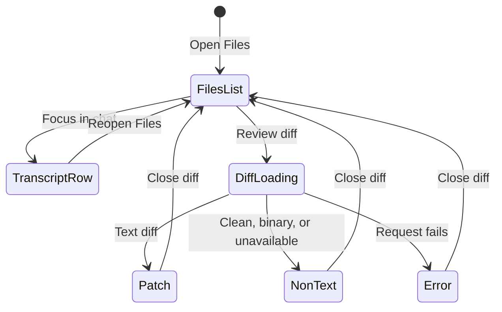

# Reviewing changed files

## Summary

**Status: drafted.** OMP Chat exposes file work in two connected places: changed-file buttons on successful tool entries and the chat-scoped **Files** inspector. The inspector combines recent read and Agent Hub activity with a successful-only inventory of completed writes and edits, bounded previews, **Open file**, **Review diff**, and **Focus in chat**. Diff review always requests the file's **current working-tree diff** when opened; it is not a historical snapshot of what the tool changed at the time its transcript entry completed. The modal reports current status, complete addition/deletion counts, bounded patch text, and explicit loading, empty, binary, unavailable, and error states.

## The simple case

A tool writes or edits a file and completes successfully. Its transcript row exposes the affected path and enables **View diff**. The same successful change appears in **Files**, deduplicated by path with the newest occurrence first. The user can review a bounded activity preview, activate **Focus in chat** to return to the originating tool row, activate **Open file** to hand the path to the workspace editor, or activate **Review diff** to open the Git diff modal. The modal identifies the path, status, total additions and deletions, and current patch. Closing it returns focus to the composer.

A read activity also appears in **Files**, including path, optional range/count, a three-line preview, and up to twelve bounded lines after expansion. Agent Hub operations can appear in the same recent-activity list but have no file actions. Failed reads remain visible as failed activity; failed or still-running writes/edits do not enter the changed-file inventory.

## The interaction, event by event

### Starting

File review starts from either a transcript tool row or the **Files** header control. Write/edit paths can be attached to the tool row while the operation is running, but **View diff** is disabled until that tool row completes successfully. Opening **Files** projects the active chat's recent tool activity into a newest-first list capped at 100 entries. Successful write/edit paths are deduplicated so repeated changes to one path show only the newest successful change.

Starting **Review diff** records the active chat and path, opens a modal for that path, and shows **Loading current working-tree diff…**. Starting **Open file** asks the desktop shell to open the selected workspace target. Starting **Focus in chat** initiates a smooth, programmatic scroll that centers the originating transcript row.

### Ending at once

Opening **Files** can end immediately in **No file activity yet** when the chat has no projected read, successful write/edit, or Agent Hub activity. A successful activity with no text preview says **No text preview is available** rather than displaying an empty code block. Closing **Files** leaves the conversation and transcript unchanged.

A diff request can finish with no patch text. The modal then shows **No Git changes** for `clean`, **Binary change** for `binary`, or **No text preview** for another non-text state, with the current status and message. A missing/unavailable path surfaces `unavailable`; a request or validation failure shows **Diff unavailable** as an alert.

### Becoming extended

Review becomes extended when a read preview is expanded, the user inspects a long write/edit preview, the desktop waits for a file to open, or the current diff request is in flight. The Files panel bounds work before rendering: at most 100 recent activities, 12 lines for expanded reads and writes, 40 patch-input lines for edits, 320 characters per preview line, and 180 characters per displayed path/label. A read starts with three lines and offers **Show N more lines** when its expanded preview contains more.

The diff modal renders line-by-line Git metadata, hunk headers, context, additions, and removals. Patch text is capped at 2,000 lines or 256 KiB. If capped, the modal explicitly says that the preview is capped while its addition/deletion counts cover the complete patch.

### While extended

The Files list is a projection of the active chat's current timeline. New tool activity can update the header count and list. Read and Agent Hub entries can display `In progress`, `Complete`, or `Failed`. Write/edit entries are admitted only after a successful complete tool entry and remain labelled `Complete`.

**Focus in chat** centers the activity's stable transcript row without treating that programmatic motion as user-paused timeline follow. In the executed Electron journey, the jump-to-latest control remained hidden after focus, and a subsequent streamed turn still followed to the bottom.

The diff modal represents the file's current Git state at request time. A file changed again after the tool completed can therefore show a larger, smaller, different, clean, deleted, renamed, binary, or unavailable diff than the transcript activity implies. Addition and deletion counts describe that current complete patch, not the bounded preview and not the historical tool invocation.

### Finishing

A successful **Open file** hands the resolved path to the operating system's workspace editor behavior. The Files inspector stays available for further review. A successful **Review diff** settles on one of `modified`, `added`, `deleted`, `renamed`, `clean`, `binary`, or `unavailable`. The modal's **Open file** action is disabled for `deleted` and `unavailable`; it remains available for the other returned states.

Closing the diff clears the selected path, loading state, result, and error, then returns focus to the composer. Closing the Files inspector only removes the side inspector; it does not clear the chat's tool transcript or undo file work.

## Modifiers

| Modifier | Effect at start | Effect when changed mid-interaction |
| --- | --- | --- |
| Tool operation | Read shows path/range/count and preview; write/edit can become changed-file entries; Hub shows operation and target without file actions. | A running read/Hub entry can become complete or failed in place. A write/edit is withheld from the successful inventory until completion. |
| Tool status | Running and failed write/edit rows can expose paths in the transcript, but **View diff** is disabled and they do not enter the successful changed-file inventory. | Successful completion enables the transcript diff button and admits the change. Error keeps the button disabled and the change excluded. |
| Repeated path | The newest successful write/edit for each path is selected; older duplicates are omitted from the Files inventory. | A later successful change moves that path to the newest position. A later failed change does not replace the prior successful inventory entry. |
| Activity kind | Read and Hub activities may show running, complete, or failed status. Successful write/edit activities are complete-only. | A projected status update changes the read/Hub badge. Write/edit admission occurs only on successful completion. |
| Preview size | Small previews render entirely within their operation limit. Oversized lines and lists are bounded before display. | Expansion reveals only the bounded expanded read preview; it does not fetch an unlimited file. The diff modal separately discloses when its patch cap is reached. |
| Current working-tree state | Diff opens with the file's current `modified`, `added`, `deleted`, `renamed`, `clean`, `binary`, or `unavailable` state. | A later open can return a different state or patch because the modal is not tied to the tool's completion-time snapshot. |
| Work or Code session | Changed-file buttons, Files activity, previews, and current diff are available independently of raw tool argument projection. | Selecting another chat replaces the list and diff owner with that chat; an in-flight result is ignored if it no longer matches the active chat/request. |

## Cancel and interrupt

| Interrupt | Outcome and visible consequence |
| --- | --- |
| explicit abort | Closing the diff clears its request state and returns focus to the composer. Closing Files hides the inspector. Neither action cancels the underlying tool or rolls back a file change. |
| doing something else mid-way | Switching chats resets the selected diff and changes Files to the destination chat. Focusing a transcript row keeps timeline follow active. Starting another diff supersedes the earlier request; a late stale result is ignored. |
| clean-completion event | A successful tool completion admits its write/edit to the inventory and enables its transcript diff action. A successful diff request commits the current status/counts/preview to the modal; a successful open-file request delegates to the workspace editor. |
| environment failure | A diff request failure shows **Diff unavailable**. An open-file failure surfaces an OMP Chat action error. Existing activity remains reviewable; there is no offline diff or open-file queue. |
| page/process exit | Files and diff selection are renderer-local and disappear with the process. File changes remain on disk, and successful tool history can be projected again when the OMP transcript is restored. |
| target changed elsewhere | The next diff request reflects the new on-disk/current Git state rather than preserving the tool-time patch. The result may become clean, deleted, renamed, binary, or unavailable; open-file is disabled for deleted/unavailable. |
| input-channel change | Pointer and keyboard activation use the same Files, focus, open, and diff controls. No multi-device review state or shared modal state is established. |

## Interactions with other systems

| Concern | Consequence |
| --- | --- |
| permissions | Reviewing activity and diff needs no site permission prompt. Opening a path depends on desktop filesystem and operating-system handler authority; rejection is surfaced as an action error. |
| history or undo | Files is derived from transcript history, but it is not undo history. Diff review shows current Git state and cannot reconstruct or revert the exact tool operation. No undo, restore, stage, commit, or discard action is exposed in the modal. |
| containers or parents | Activity, successful-change inventory, diff requests, and focus targets belong to one chat session and its workspace. Switching chats replaces the parent context and resets the open diff. |
| locked or read-only state | The review surfaces have no dedicated lock state. Reads and existing diffs can remain reviewable when composition is unavailable; an attempted file open or runtime request can fail. The modal does not make files writable. |
| offline behavior | Existing projected previews may remain visible, but loading a current diff and opening a workspace path require the local OMP/runtime-desktop path. No offline cache guarantee is made. |
| collaboration or multi-device behavior | A collaborator, another tool, editor, or Git process can change the target after the recorded activity. The next current diff reflects that shared working tree; there is no attribution, conflict resolution, or synchronized review cursor. |
| notifications | Diff/open failures use OMP Chat error feedback. Files has count/status badges but no operating-system notification and no separate file-review notification history. |
| configuration and preferences | **Show tool details** can hide transcript activity summaries and argument badges, but it does not hide changed-file buttons, the Files inspector, or diff review. Theme, density, and reduced motion affect presentation; no diff-context or preview-size preference is exposed. |

> Technical note: **Review diff** and **View diff** call the current workspace-diff path when activated. OMP Chat does not store a per-tool patch snapshot for this inspector. Treat the transcript file entry as a navigation link to current state, not as evidence of exactly what that historical tool call changed.

## Edge cases

- The Files header count is based on timeline items carrying tool activity, while successful write/edit inventory rows are filtered and deduplicated. The badge can therefore differ from the number of visible changed-file entries.
- The Files list can include reads and Agent Hub operations; “successful-only” applies specifically to changed write/edit entries, not to every activity row.
- A failed write/edit can remain visible as a transcript tool row with its file path, but its diff button stays disabled and it does not displace an older successful change for that path.
- One edit tool activity can name several successful paths. Each unique path becomes its own newest-first activity entry with the same bounded edit preview and transcript focus target.
- A file path or activity label longer than 180 characters is visibly ellipsized; a preview line longer than 320 characters is ellipsized.
- A read exposes three lines initially and at most twelve after expansion. A write exposes at most twelve lines; an edit preview exposes at most forty lines.
- A text patch over 2,000 lines or 256 KiB shows a truncation note. Addition/deletion counts still cover the complete current patch.
- `clean` and `binary` are valid non-error outcomes without text patch content. `unavailable` is a returned state; request failure is a separate alert state.
- **Open file** is disabled for `deleted` and `unavailable`, but may remain available for `clean` and `binary` results.
- Focus can fail silently if the projected activity points to a transcript row that is not currently mounted, such as an older row outside the loaded page. No automatic older-page load is established for focus.

## Open questions and verification

### Source revision

- Working tree anchored at `c125341133ff90a29fe266e1b166bac0183338c8`.
- Evidence date: 2026-08-25.
- Boundary: relevant desktop renderer, main-process, test, and E2E files may be modified or untracked, so this describes the working tree anchored at that commit, not a clean checkout.

### Runtime evidence

**Observed:** `packages/desktop/e2e/desktop.spec.ts` passed 24/24 on macOS arm64. The executed Files journey opened/closed the inspector, rendered recent activity for `activity.txt` and `result.txt`, focused a read in the conversation transcript, retained follow for a later streamed turn, opened the current diff for `result.txt`, saw `Fixture result`, and closed the diff. The executed history journey also rendered bounded read/write/edit summaries. It did not mutate a file after tool completion or exercise every diff state.

### Test evidence

**Tested:** `packages/desktop/e2e/desktop.spec.ts:1459-1511`, **“keeps timeline activity paused while reading history and renders bounded file summaries,”** and `:1513-1607`, **“opens Agent Hub and Files inspectors with fixture lifecycle and activity controls,”** passed in the 24-test Electron run. Repository assertions in `packages/desktop/test/transcript-projection.test.ts:430-495` specify successful changed-file projection and Work/Code filtering but were not executed; `bun run test` failed and is not passing evidence.

### Code evidence

**Code-established:** transcript changed-file buttons and successful-completion enablement are established by `packages/desktop/src/renderer/ui/organisms/TimelineEntry.svelte:178-201`. Files inventory filtering, deduplication, bounds, actions, and focus controls are established by `packages/desktop/src/renderer/ui/organisms/FileActivityPanel.svelte:1-252`; successful changed-file ordering is also established by `packages/desktop/src/shared/projection.ts:16-25`. Diff request guarding, focus-to-transcript, open-file routing, and inspector ownership are established by `packages/desktop/src/renderer/ui/pages/OmpChat.svelte:734-766,2186-2205,2737-2770`. Modal states and limits are established by `packages/desktop/src/renderer/ui/organisms/FileDiffInspector.svelte:1-62`; current diff loading/opening and accepted statuses are established by `packages/desktop/src/main/desktop-host.ts:994-1023,1878-1918`.

### Open questions

- **Open question:** An executed journey has not changed a file after tool completion and then proved that a reopened modal shows the newer current working-tree diff rather than the historical tool-time patch.
- **Open question:** `added`, `deleted`, `renamed`, `clean`, `binary`, `unavailable`, request-error, and truncated-patch modal states remain code-established but not runtime-observed in the executed Electron suite.
- **Open question:** **Open file** was not activated in the executed journey, so operating-system editor selection, reveal-only directories, focus behavior, and errors remain unobserved.
- **Open question:** Focus-to-transcript does not load an older hidden page when its target row is absent. The intended user feedback for that case is not established.
