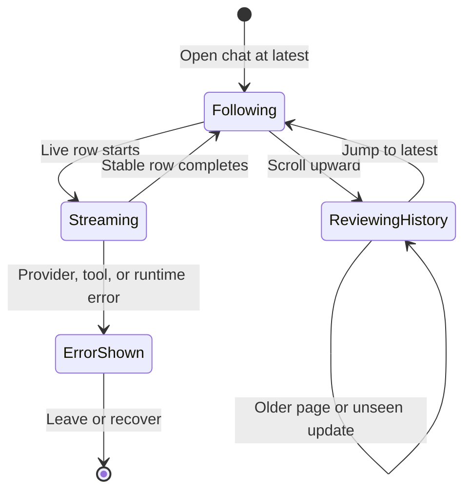

# Reviewing the conversation transcript

## Summary

**Status: verified.** The **conversation transcript** is the ordered, chat-scoped history at the center of OMP Chat. It presents six base entry kinds—user, assistant, reasoning, tool, special, and raw—then gives recognized runtime/system events one of eight semantic presentation families. Live reasoning, assistant, and tool activity update stable rows rather than producing duplicate progress records. Users can page backward, pause timeline follow while reading, return with **Jump to latest**, and expand bounded detail. Work sessions intentionally project less technical detail than Code sessions. A known limit remains: opening a large **Reasoning** record can still show a truncated preview; this is filed as [CHAT-004](../bug-triage.md#chat-004--full-large-reasoning-remains-truncated).

## The simple case

A user submits a primary message and sees one `YOU` entry. OMP's work appears in place: a `THINK` reasoning entry can stream, `TOOL` entries can move from running to complete or error, and an `OMP` assistant entry can stream until its cursor disappears. Recognized notices, background work, collaboration messages, context transitions, execution records, and provider outcomes appear as semantic cards rather than raw protocol payloads. When the user remains at the bottom, the conversation transcript follows the newest update. Scrolling upward pauses that chat's follow intent; incoming entries increase its unseen count until the user activates **Jump to latest** or scrolls back to the bottom.

The base entry kinds are:

| Base kind | Usual gutter | User-facing presentation |
| --- | --- | --- |
| User | `YOU` | The user's Markdown-rendered primary message. The optimistic row is replaced by the canonical history row after acknowledgement, so a normal submission remains one user entry. |
| Assistant | `OMP` | Markdown-rendered response text. A running row has a blinking cursor; completion updates the same row and removes the cursor. |
| Reasoning | `THINK` | A **Reasoning** disclosure with an estimated token count and running, complete, or error presentation. |
| Tool | `TOOL` | A stable tool-call row with running, complete, or error state, bounded activity, optional changed-file buttons or images, and session-dependent detail. |
| Special | Depends on presentation | A recognized runtime/system event rendered through one of the eight semantic families below. |
| Raw | `LOG` | An **Unhandled event** fallback for an unrecognized event. Code sessions may disclose its payload detail; Work sessions do not. |

## The interaction, event by event

### Starting

Opening a chat loads its authoritative OMP history and projects the newest portion into the conversation transcript. A newly submitted primary message immediately creates an optimistic user entry and an optimistic running reasoning entry while admission is pending. Existing history starts in chronological order, with the transcript following its end unless that chat previously had paused follow intent in the current renderer session.

Disclosure controls start collapsed unless their presentation says otherwise. A reasoning disclosure can show a history placeholder whose full text has not yet been requested. Recognized control-only and hidden internal events do not create visible raw rows.

### Ending at once

Review can end immediately by leaving the transcript at the bottom, closing a disclosure, or switching chats without changing history. A local command may produce a status entry and finish without an agent turn. If prompt admission fails before work starts, the optimistic user and reasoning entries roll back, the draft and staged attachments are restored, and **Prompt could not start** plus an **Action failed** notification explain the failure.

### Becoming extended

The interaction becomes extended when a turn streams, a tool remains active, older history is requested, or a bounded disclosure requests more content. Reasoning, assistant, and tool updates are matched to their existing identifiers. The user therefore watches one row evolve instead of receiving one row for every delta. **Load 100 older entries** prepends history while preserving the current viewport. Opening unloaded reasoning requests that item before updating the disclosure.

### While extended

Streaming assistant text grows inside one `OMP` row and carries a blinking cursor until completion. Reasoning shows `thinking…` while running and `error` on failure; completed reasoning has no status pill. Tool rows show a running radar and status, then `✓` on success or `!` on failure. Tool partial output and final output update the same row.

The eight semantic presentation families are:

| Family | Typical marker and visible behavior |
| --- | --- |
| Status | `SYS`; notice, slash-command output, model/reasoning setting changes, retry fallback, compaction outcome, or cleared todos. Up to four entries are inline; **Show status details** reveals the remainder supplied to the renderer. |
| Activity | `JOB`, `SYS`, or `FILE`; background work, dispatch, process completion, late diagnostics, or mentioned files. Up to four entries are inline; **Show activity details** reveals more. |
| IRC | `IRC`; incoming, autoreply, or relay routing with a three-line preview and **Show full IRC message**. |
| Advisor | `ADV`; total and blocker count, severity labels, the first three notes, and **Show remaining advisor notes**. |
| Custom | `EXT`; system, collaboration, skill, extension, or hook content with attribution and a bounded preview. Large, omitted, or explicitly collapsed content uses **Show full {variant} message**. |
| Context | `CTX`; compaction, branch, or handoff summary with optional counts, warning, two-line preview, and **Show full {transition} summary**. |
| Execution | `RUN`; bash or Python input, three-line output preview, context-exclusion marker, state, exit code, and **Show full output**. A successful truncated execution is labelled `truncated`, not `complete`. |
| Assistant outcome | `OMP`; a subdued **Recovered retry** or an error-toned **Provider error**. Provider errors can expose **Show full provider error**. |

If the user scrolls more than the bottom threshold, that chat stops following. New item identifiers are counted as unseen while the viewport stays in place. **Jump to latest** clears the unseen set, moves to the end, and resumes follow. Follow and unseen state are maintained per chat during the renderer session, so reviewing history in one chat does not force another chat to stop following.

### Finishing

On normal completion, running reasoning, tool, and assistant entries become complete in place, the temporary reasoning placeholder is removed, and the transcript remains at the bottom only if follow is active. A provider-completed error is retained as a **Provider error** outcome rather than treated as a prompt-admission failure. A recovered retry remains visible as a **Recovered retry** outcome.

Stopping a turn keeps the submitted user entry, removes the optimistic reasoning placeholder, restores staged attachments, and shows **Turn stopped** as a notification. Empty aborted assistant entries are hidden. Ordinary assistant and tool entries do not have a user-visible `cancelled` state, so partial assistant text or a tool lacking its terminal event may not be explicitly labelled as interrupted. Historical bash/Python execution presentations are the exception and can say `cancelled`.

## Modifiers

| Modifier | Effect at start | Effect when changed mid-interaction |
| --- | --- | --- |
| Work or Code session | Work is the default projection and omits raw tool arguments/results and most technical detail. Code retains those values and can expose **Technical details** and raw-event payload detail. | Session kind belongs to the chat record; selecting another chat applies that chat's projection. No in-renderer Work/Code switch is exposed. |
| Timeline follow | Active follow opens or remains at the newest entry. Paused follow preserves the reading position and shows unseen state. | User scrolling away from the bottom pauses follow; reaching the bottom or activating **Jump to latest** resumes it and clears unseen entries. |
| Entry status | Running reasoning, assistant, and tool entries show progress treatment. Complete/error history opens in its terminal presentation. | Updates replace the stable row by identifier. Completion removes the assistant cursor; tool/reasoning state changes in place. |
| Disclosure state | Semantic details are collapsed according to their family; reasoning opens only when the user activates it. | Expansion is renderer-local. Reasoning expansion resets when a chat is selected; other component disclosures are not persisted across reload or process exit. |
| Reasoning hydration | A fully loaded record can render immediately; a dehydrated record starts as a load-on-open disclosure. | Opening requests the item. Records over 64 KiB are still rendered as a 16 KiB preview after loading and include **[Preview truncated for responsiveness]**. |
| Show tool details preference | When enabled, tool activity summaries and argument badges are visible. When disabled, those two details are hidden. | The current application setting reprojects the visible tool rows. Changed-file buttons, generated images, and Code-session **Technical details** are not hidden by this preference. |
| Known, hidden, or unknown event | Known semantic events use a semantic presentation; known control/hidden events do not render; unknown events use the raw fallback. | Later replay or live projection applies the same classification. Changing session projection can reveal Code-only raw detail but does not turn known hidden controls into rows. |

## Cancel and interrupt

| Interrupt | Outcome and visible consequence |
| --- | --- |
| explicit abort | **Stop** aborts the active turn, keeps the user entry, removes optimistic reasoning, restores staged attachments, and shows **Turn stopped**. Empty aborted assistant entries are hidden; ordinary partial assistant/tool rows are not guaranteed a `cancelled` label. |
| doing something else mid-way | Scrolling upward pauses follow without stopping the turn. Switching chats leaves work attached to its originating chat; returning opens that chat's authoritative transcript. Closing a disclosure only changes local presentation state. |
| clean-completion event | A terminal assistant/tool/reasoning update completes the existing row in place. **Jump to latest** completes history review by clearing unseen entries and resuming follow; it does not complete or cancel the active turn. |
| environment failure | Prompt-admission failure rolls back optimistic entries and restores the draft/attachments with a recovery card. A provider-completed error remains in the transcript. Runtime failure shows **Runtime stopped unexpectedly** and **Reconnect**. |
| page/process exit | OMP-returned conversation history can be reconstructed after reopening, but renderer-local follow, unseen, disclosure, notification, and live-only state is not established as durable. An actual restart journey has not verified the exact boundary. |
| target changed elsewhere | New authoritative history or a pushed update replaces the matching stable item by identifier. Another chat's completion remains owned by that chat. On-disk workspace changes do not rewrite historical transcript text. |
| input-channel change | Keyboard, pointer, and programmatic live events share the same transcript projection. No second-device transcript synchronization contract is established; alternate-device or simultaneous-renderer behavior remains an open question. |

## Interactions with other systems

| Concern | Consequence |
| --- | --- |
| permissions | Transcript review itself requests no Electron permission. Tool contents may describe operations whose execution required runtime or filesystem authority, but the transcript is not an approval surface. |
| history or undo | OMP history is the durable source for replayed conversation entries. Paging prepends older entries. There is no transcript undo or entry-deletion action in this surface; disclosure, follow, and unseen state are renderer-local. |
| containers or parents | Every transcript, page cursor, follow intent, unseen set, disclosure set, and live update is scoped to one chat session inside a rail workspace. Agent Hub retained transcripts are separate and should not be read as main-transcript history. |
| locked or read-only state | The transcript remains reviewable when the composer cannot send or the runtime is errored. There is no transcript-specific locked state; read-only Agent Hub history is a different surface. |
| offline behavior | Already projected entries can remain visible, but history hydration, older pages, unloaded reasoning, and authoritative live updates require the local OMP runtime. Runtime loss surfaces recovery rather than an offline queue. |
| collaboration or multi-device behavior | IRC and collaboration events can appear semantically in the transcript. This does not establish shared cursors, remote editing, multi-device follow synchronization, or a shared disclosure state. |
| notifications | Durable-looking notice events render as status entries. Separate manually dismissible notifications cover recovery warnings, confirmations, stop, and action errors and are not transcript history. |
| configuration and preferences | **Show tool details** controls activity summaries and argument badges. Work/Code projection changes technical disclosure. Theme, density, and reduced motion change presentation but not entry ordering or ownership. |

> Technical note: reasoning history is requested lazily, but the current renderer caps text over 64 KiB to the first 16 KiB even after that request. The **Reasoning** disclosure must therefore be understood as a bounded review surface, not a guarantee of the full stored record. This mismatch is tracked in [CHAT-004](../bug-triage.md#chat-004--full-large-reasoning-remains-truncated).

## Edge cases

- An empty, ready transcript shows the OMP Chat empty-state prompt suggestions rather than a blank region.
- Initial/open snapshots contain the latest 200 projected items; **Load 100 older entries** repeats until no hidden count remains. The host accepts pages up to 200, but the visible control asks for 100.
- Duplicate live updates for the same reasoning, assistant, or tool identifier update one stable row. Tool results are not separate transcript entries.
- A tool result can add generated images and changed-file actions to its row. These remain visible even when **Show tool details** is disabled.
- A raw unknown event is labelled **Unhandled event**; known control events and designated internal replay/developer/custom/hook content can be suppressed entirely.
- Custom, status, activity, advisor, context, execution, and provider-error presentations intentionally omit or bound detail. Their “show” controls reveal only the material delivered to the renderer, not necessarily an unlimited upstream record.
- A successful execution whose output was truncated is labelled `truncated`; an execution excluded from context says so explicitly.
- Per-chat unseen counting deduplicates item identifiers, so repeated updates to one stable row should not repeatedly increase the count.
- Reasoning token counts are estimates, and the card and active-turn banner use different estimation formulas; exact parity is not promised.
- Reasoning expansion is added to a local open set but is not removed there on collapse. Whether a later rerender reopens a user-collapsed reasoning card remains unobserved.

## Open questions and verification

### Source revision

- Working tree anchored at `c125341133ff90a29fe266e1b166bac0183338c8`.
- Evidence date: 2026-08-25.
- Boundary: relevant desktop renderer, main-process, test, and E2E files may be modified or untracked, so this describes the working tree anchored at that commit, not a clean checkout.

### Runtime evidence

**Observed:** `packages/desktop/e2e/desktop.spec.ts` passed 24/24 on macOS arm64. Executed journeys covered a normal streaming turn, rollback and recovery after a delayed prompt failure, hidden internal content, history paging, paused follow and **Jump to latest**, bounded read/write/edit summaries, semantic transcript families and disclosures, provider error, background-chat completion ownership, responsive overflow, and mounted accessibility checks. No real provider was used.

### Test evidence

**Tested:** `packages/desktop/e2e/desktop.spec.ts:179-227`, **“runs current OMP Chat feedback, recovery, local command, folder creation, settings, and Axe journeys”;** `:1459-1511`, **“keeps timeline activity paused while reading history and renders bounded file summaries”;** `:1702-1705`, **“keeps background completion attached to its originating chat”;** and `:1748-1822`, **“renders semantic transcript messages,”** all passed in the 24-test Electron run. Repository assertions in `packages/desktop/test/transcript-projection.test.ts:6-656` and `packages/desktop/test/e2e-chat-progress.test.ts:452-677` specify stable streaming, projection, ordering, and outcome behavior but were not executed; `bun run test` failed and is not passing evidence.

### Code evidence

**Code-established:** base row rendering, tool details, changed-file actions, reasoning disclosure, raw fallback, assistant cursor, and Work/Code technical detail are established by `packages/desktop/src/renderer/ui/organisms/TimelineEntry.svelte:1-242`. The eight semantic families and their disclosure limits are established by `packages/desktop/src/renderer/ui/organisms/TimelinePresentation.svelte:1-212` and `packages/desktop/src/main/transcript-presentation.ts:1-772`. Paging, per-chat follow/unseen state, stable live replacement, and reasoning hydration are established by `packages/desktop/src/renderer/ui/pages/OmpChat.svelte:473-523,654-705,769-837,2276-2290,2388-2417,2587-2594`. Replay and stable tool/reasoning/assistant storage are established by `packages/desktop/src/main/transcript-store.ts:5-594`; the projection contract is defined in `packages/desktop/src/shared/contracts.ts:156-319,607-672`.

### Open questions

- **Open question:** The exact restart/reconnect durability of live-only status entries, follow/unseen intent, disclosure state, partial aborted assistant text, and pending tool rows has not been runtime-observed.
- **Open question:** Ordinary assistant and tool rows have no `cancelled` status. A targeted mounted journey should establish what partial assistant text and a tool without a terminal event look like after **Stop**.
- **Open question:** Work/Code differences are code- and repository-test-established but were not compared in an executed Electron journey.
- **Open question:** A large reasoning record still truncates after expansion. This is an acknowledged product defect, not an unrecorded verification gap; see [CHAT-004](../bug-triage.md#chat-004--full-large-reasoning-remains-truncated).
