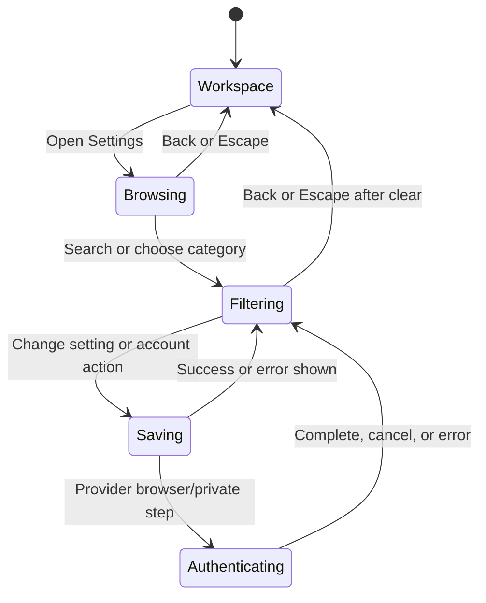

# Settings and provider accounts

## Summary

**Status: drafted.** **Settings** is a routed workspace surface for four distinct scopes: the active chat session's **Runtime**, runtime-reported **OMP defaults**, **Accounts** under Access, and machine-local **Application** preferences. Search spans those scopes, category navigation moves focus into the selected section, and leaving Settings restores the invoking workspace control when possible. Application changes are serialized, persisted locally, and applied as soon as their save succeeds; active Runtime changes affect only the current running chat; OMP defaults declare either immediate or next-session timing; Accounts reports provider and local OAuth account state from OMP. Provider sign-in can open an official browser flow and request private follow-up input, but no real provider/auth journey was executed and the desktop exposes no API-key entry form.

## The simple case

The user selects **Settings** from OMP Chat. The routed **Settings** page opens with **Search settings** focused. Categories are grouped under **Session**, **OMP defaults**, **Access**, and **Application**. The user chooses a category or searches by setting, changes one value, waits for its visible saving/success state, and selects **Back to workspace**. Application appearance changes such as theme or interface density apply to the desktop as soon as the persisted response returns. A running chat's Runtime controls update only that active session. OMP defaults come from the local OMP runtime and label values that start with the next session. In Accounts, the user sees only provider availability, connection state, and account identity—not tokens—and starts supported sign-in through the provider's browser flow.

## The interaction, event by event

### Starting

Opening Settings records the invoking control for later focus return, routes away from the workspace surface, detaches any active native browser view without changing its selected tab, clears the prior Settings query, and focuses **Search settings**. The default OMP Chat entry opens **Session → Runtime**; the application title entry opens **Application → Appearance**. A refresh loads provider access, OAuth account details, OMP defaults, and active Runtime data when the current chat is running. A stopped or errored chat can be resumed from Runtime before its session controls are changed.

Search indexes visible labels, descriptions, keywords, category names, and scope names. Typing filters settings and category counts, disables categories with no matches, automatically routes to a category with matches when needed, and announces the count through a polite live region. Choosing a category moves keyboard focus to its heading. A query with no match shows **No settings match …** and a **Clear search** action.

### Ending at once

The user can select **Back to workspace** without changing anything. Pressing Escape with a nonempty query clears the query and returns focus to Search; pressing Escape again closes Settings. Closing restores the invoking Settings control if it still exists and is focusable, otherwise the title Settings control or active workspace tab. Closing does not roll back a value already submitted and does not cancel an in-flight refresh or serialized application write.

A canceled account-removal confirmation leaves the OAuth account unchanged. Canceling a private sign-in step sends an empty response to OMP and closes the prompt; OMP owns the final cancellation message. Settings does not provide an API-key form, so there is no local key-entry interaction to cancel.

### Becoming extended

The interaction becomes extended while Settings refreshes, an application value is saving, an active Runtime or OMP default mutation waits for OMP, or provider authentication is in progress. The relevant control is disabled and a visible pending label appears. Application writes are serialized so a later value cannot overtake an earlier disk write; Reset is unavailable while another application mutation is pending. Settings refresh can continue after the route closes, and reopening shows its still-pending state until it settles.

Provider sign-in is globally single-flight. Selecting **Sign in** for an available provider sets a waiting state and asks local OMP to begin authentication. OMP may open the provider's official external browser and then show a **Private sign-in step** password/one-time-code input. All provider actions are disabled while a sign-in is active. No renderer-visible token value is returned.

> Technical note: when no ready chat session can serve OMP settings or authentication, the desktop starts a short-lived local OMP RPC client, performs the request, and stops it when no caller remains. This is why credential-free OMP defaults and provider access can load without opening a persistent chat runtime, but they still depend on the local OMP installation rather than a desktop-owned provider schema.

### While extended

Application theme, density, and reduce-motion state update the desktop after a successful persisted response. Theme also updates native, browser, inspector, and Local terminal surfaces; terminal font, size, cursor, and scrollback apply to an open Local terminal renderer; a changed shell applies only to newly opened terminals. Browser homepage affects new/split browser tabs, and the search template affects later plain-text navigation. **Show tool details** changes transcript previews and argument badges. **Confirm before closing tabs** applies to browser tabs, not chat sessions or app-window close.

Runtime controls remain scoped to the active, running chat: model, thinking level, fast mode, steering delivery, follow-up delivery, interrupt behavior, automatic compaction, and automatic retry. Switching or stopping the chat invalidates stale Settings responses. OMP defaults are grouped as Appearance, Model, Interaction, Context, Files, Shell, Tools, and Tasks; unsupported/unreported settings do not receive invented desktop controls. Each successful response replaces the displayed value. A **Next session** badge and **Starts with the next session** confirmation mean the value is persisted but does not change the current OMP runtime.

Accounts shows every provider reported by OMP as **Connected**, **Available**, or **Unavailable**. Connected providers expose **Sign out**. OAuth account detail lists a local identity such as email, organization, account ID, or credential ID, plus active/available and lock state. **OAuth account routing lock** pins one provider to one local account; **Clear lock** removes that pin. **Allow account failover** is a global runtime setting that permits another stored OAuth account to be selected when appropriate. **Remove** requires native confirmation and deletes the selected locally stored OAuth account from OMP. None of these actions has undo.

### Finishing

A successful application change replaces the local settings snapshot, applies its observable effect, and reports **… updated.** A failure retains the previous snapshot and shows an error. Reset is a new persisted default snapshot, not undo. A successful active Runtime update appears in the current chat's runtime state. A successful OMP default update reports whether it applies now or with the next session. Successful provider sign-in refreshes provider state and reports completion; sign-out refreshes the provider list; lock, failover, and removal replace the OAuth account snapshot returned by OMP.

Selecting **Back to workspace** closes the route, restores the browser view or OMP Chat surface, and restores focus. The setting remains committed; reopening Settings reads the current machine-local and OMP-owned values rather than a per-visit draft.

## Modifiers

| Modifier | Effect at start | Effect when changed mid-interaction |
| --- | --- | --- |
| Settings scope | **Session → Runtime** targets the active chat; **OMP defaults** target OMP-owned defaults; **Access → Accounts** targets provider/account state; **Application** targets machine-local desktop preferences. | Changing category changes the visible parent and moves focus to its heading; it does not copy a value between scopes. |
| Active chat state | A ready/running chat exposes Runtime controls and can serve Settings requests. Stopped/error shows a Resume requirement; no chat shows an empty state. | Switching, stopping, or resuming a chat changes the Runtime target. Response-generation guards keep older session results from replacing the new target. |
| OMP apply timing | `immediate` has no badge; `next-session` shows **Next session**. | A successful immediate value is current according to OMP; a next-session change reports **Starts with the next session** and waits for a new or reconnected runtime. |
| Search query | Empty query shows every category and setting. A query filters entries and adds category counts. | As text changes, categories with zero matches disable, a matching category can become active, counts are announced, and Escape clears the query before closing Settings. |
| Application write state | An idle control can submit one persisted update; Reset is available only when no write is pending. | The changed control remains disabled until its serialized write settles. Closing/reopening Settings does not cancel or duplicate it. |
| Theme | Dark or Light explicitly selects a palette; System follows the operating-system scheme. | A successful change updates renderer and native surfaces immediately; System continues responding to OS scheme changes. |
| Interface density and motion | Comfortable/Compact controls spacing; Reduce motion adds app-level reduction to the OS preference. | Successful changes apply to the open desktop. Motion reduction does not establish propagation into arbitrary embedded page content. |
| Terminal settings | Current font, size, cursor, scrollback, and shell seed terminal behavior. | Appearance changes update an open Local terminal; Shell applies to the next PTY rather than replacing the running shell. |
| Browser settings | Homepage seeds new browser tabs; the search template formats future plain-text navigation. | Existing loaded pages remain at their current URL. Later new/split tabs and searches consume the changed values. |
| Provider availability and sign-in | OMP reports providers as Available, Connected, or Unavailable. Only available signed-out providers can start sign-in. | Sign-in globally disables provider actions until completion/error. Returned provider status replaces the display. |
| OAuth account routing | Identity, availability, active state, routing lock, and failover come from OMP. | Lock/Clear lock, failover, or confirmed removal waits for OMP and then replaces the account snapshot; precedence when a locked account is unavailable is not established. |

## Cancel and interrupt

| Interrupt | Outcome and visible consequence |
| --- | --- |
| explicit abort | Escape clears a nonempty Settings search first; the next Escape closes Settings and restores focus. **Back to workspace** closes directly. **Cancel** on a private sign-in step sends an empty response. Canceling account-removal confirmation leaves the account unchanged. Saved settings are not rolled back. |
| doing something else mid-way | Changing category or query preserves committed values and redirects the visible results. Closing and reopening while Refresh is pending preserves the pending refresh state. Switching chats changes the Runtime target and guards against stale responses. |
| clean-completion event | A successful setting response updates the visible value and status. Provider sign-in/sign-out, lock, failover, and removal complete by replacing OMP's returned status or account snapshot. Back to workspace completes navigation, not a save transaction. |
| environment failure | Application-save, OMP settings, provider discovery, browser-auth, or account-action failure shows a status/error where implemented and leaves prior committed state. There is no offline queue. Auth discovery can incorrectly fall back to an apparently available provider; see [`CHAT-009`](../bug-triage.md#chat-009--auth-discovery-failure-can-look-like-an-available-provider). |
| page/process exit | Application settings already persisted to the machine-local file survive relaunch; unsent field edits that have not fired a change event are not documented as durable. Active auth prompts and in-flight route state are ephemeral. Exact quit-during-write/auth recovery was not exercised. |
| target changed elsewhere | OMP/runtime events or a refresh can replace Runtime, default, provider, and OAuth account snapshots. Machine-local settings have serialized writes but no cross-process watcher; a second process/device is not merged. |
| input-channel change | Keyboard and pointer operate the same routed controls. Search and category focus are managed locally; private sign-in input is a password/one-time-code field. No autofill, second-device approval, or handoff behavior is established. |

## Interactions with other systems

| Concern | Consequence |
| --- | --- |
| permissions | Settings itself requests no Electron site permission. Provider authentication opens only allowed external HTTPS, mailto, or loopback HTTP URLs. Private input is sent to local OMP. No desktop API-key form or site-permission grant manager is present. |
| history or undo | Application settings, Runtime changes, OMP defaults, sign-out, routing lock, failover, and account removal have no undo/redo history. Reset writes defaults as a new committed snapshot; confirmed OAuth removal is destructive. |
| containers or parents | Scope is load-bearing: Runtime belongs to the active chat, OMP defaults belong to OMP, Accounts belongs to provider access on the local runtime, and Application belongs to the local desktop installation. Settings route temporarily replaces the workspace view without changing the selected browser tab or chat. |
| locked or read-only state | **OAuth account routing lock** pins routing; it is not encryption or read-only state. Application controls disable only while their own write is pending. Stopped/error chats make Runtime controls unavailable until Resume. |
| offline behavior | Machine-local application settings can be read without a provider, but OMP defaults and Accounts need the local OMP RPC path; provider sign-in additionally needs its external flow. There is no offline queue. Auth discovery failure can masquerade as availability under [`CHAT-009`](../bug-triage.md#chat-009--auth-discovery-failure-can-look-like-an-available-provider). |
| collaboration or multi-device behavior | Settings and account identities are local to this desktop/OMP runtime. No cloud settings sync, remote-human collaboration, device list, or multi-device account handoff is established. |
| notifications | Settings uses inline saving/status text and in-app error/status toasts. It has no notification history, operating-system notification, sound, or provider-auth push notification. |
| configuration and preferences | Application exposes theme, density, reduce motion, tool details, browser-tab close confirmation, terminal appearance/shell/scrollback, browser homepage/search template, and **Default root directory**. OMP defaults expose only runtime-reported credential-free entries. The default-root label does not match its identified consumer; see [`CHAT-008`](../bug-triage.md#chat-008--default-root-directory-does-not-set-the-new-workspace-default). |

> Technical note: access and refresh tokens remain in the local OMP runtime. The renderer receives provider status and account identity only. This boundary means a visible **Connected** identity is evidence of OMP's reported state, not evidence that Gradivus stored or can display the token.

## Edge cases

- Search results can span scopes with the same category label, such as Appearance under OMP defaults and Application; the sidebar scope label disambiguates them.
- A matching query can automatically move the route to the first category with results when the current category has none.
- Refresh is disabled and marked busy while active; closing Settings does not terminate it, and reopening can show it still pending.
- Application strings are trimmed/nonempty at persistence, while terminal font size and scrollback are clamped. URL-template validity, executable existence, and directory existence are not comprehensively validated at save time, so later use can fail.
- **Default root directory** is described as a new-workspace root, but source establishes only a durable-terminal cwd fallback. New chat creation still opens a directory picker without consuming it; [`CHAT-008`](../bug-triage.md#chat-008--default-root-directory-does-not-set-the-new-workspace-default) tracks the mismatch.
- Provider discovery failure currently returns a synthetic available, signed-out ChatGPT Plus/Pro provider; [`CHAT-009`](../bug-triage.md#chat-009--auth-discovery-failure-can-look-like-an-available-provider) tracks the misleading fallback.
- Only one provider sign-in runs at once. Attempting another sign-in returns the existing global login operation and all provider actions remain disabled.
- Auth and account details may differ: provider access can report sign-in availability while the OAuth account request separately fails and shows an error.
- A private sign-in prompt's backdrop is not a documented cancellation path; use its explicit **Cancel** or **Submit** action.
- Lock means provider-to-account routing. The interaction between a lock and failover when the locked credential is unavailable is owned by OMP and unverified.
- The desktop exposes no API-key form. Whether API-key setup is intentionally runtime/CLI-only is an open product decision, not a hidden Settings workflow.
- Application settings survive renderer route changes and are designed to survive relaunch; provider authentication and pending private prompts are not documented as resumable.

## Open questions and verification

### Source revision

- Working tree anchored at `c125341133ff90a29fe266e1b166bac0183338c8`.
- Evidence date: 2026-08-25.
- Boundary: relevant desktop sources and tests may be modified or untracked, so this describes the working tree anchored at that commit, not a clean checkout.

### Runtime evidence

**Observed:** `packages/desktop/e2e/desktop.spec.ts` passed 24/24 on macOS arm64. The mounted Electron journeys opened routed Settings with Search focused, navigated to Application Appearance, applied Compact density immediately, opened Accounts and rendered the fixture-reported provider, returned to OMP Chat, preserved a delayed refresh across close/reopen, detached and restored the same native browser view around Settings, and exercised dark/light/system palette changes. No real provider discovery, browser authentication, private input, sign-out, routing lock, failover, or account removal was executed.

### Test evidence

**Tested:** `packages/desktop/e2e/desktop.spec.ts:179-225`, **“runs current OMP Chat feedback, recovery, local command, folder creation, settings, and Axe journeys,”** passed in the 24-test Electron run and establishes Settings route entry, Search autofocus, category navigation, immediate Compact density, fixture Accounts visibility, return to workspace, and the post-return serious/critical Axe check. `packages/desktop/e2e/desktop.spec.ts:1384-1407`, **“reopens settings after a delayed refresh closes,”** and `:1409-1456`, **“detaches the active browser view while routed settings are open,”** passed. `packages/desktop/e2e/desktop.spec.ts:1823-2130`, **“applies AAA neutral palettes in dark and light modes,”** passed and establishes mounted theme propagation. Unit-only app-settings, search, and OMP bridge assertions are test-specified rather than passing evidence because `bun run test` failed.

### Code evidence

**Code-established:** scope grouping, Search filtering/counts/live announcements, autofocus, category focus, and no-results behavior are established by `packages/desktop/src/renderer/ui/organisms/SettingsShell.svelte:17-215`; Escape and focus restoration by `packages/desktop/src/renderer/ui/pages/App.svelte:464-493,620-634`; serialized application save/reset and live application of theme/density/motion by `packages/desktop/src/renderer/ui/pages/App.svelte:161-271`; application controls and copy by `packages/desktop/src/renderer/ui/organisms/ApplicationSettingsPanel.svelte:11-216`; defaults, validation, and local persistence by `packages/desktop/src/main/app-settings.ts:13-174`. Runtime, OMP-default timing, provider, private prompt, account identity, lock/failover/removal, and token-boundary presentation are established by `packages/desktop/src/renderer/ui/pages/OmpChat.svelte:80-104,1642-1735,1837-1903,2206-2274,2827-3148` and `packages/desktop/src/main/desktop-host.ts:226-319,1215-1341`. The absence of API-key entry is code-established across these settings surfaces, not runtime-observed.

### Open questions

- **Open question:** Rendered Search filtering, category counts, no-results recovery, Escape sequencing, and category-heading focus were not exercised in the executed Electron journeys beyond initial Search autofocus and direct category navigation.
- **Open question:** Real provider discovery, browser sign-in, private prompt submit/cancel, sign-out, identity refresh, routing lock, failover, and removal remain unverified; no claim here implies successful external authentication.
- **Open question:** The intended behavior when an OAuth account routing lock becomes unavailable while account failover is enabled is not established by desktop evidence.
- **Open question:** Whether API-key setup is intentionally excluded from desktop Settings requires a product decision.
- **Open question:** Application relaunch persistence, Reset, invalid URL/template/path/shell handling, and quit during a serialized write were not exercised in Electron.
- **Open question:** The new-workspace meaning of **Default root directory** remains unresolved in [`CHAT-008`](../bug-triage.md#chat-008--default-root-directory-does-not-set-the-new-workspace-default).
- **Open question:** Provider status must distinguish discovery failure from availability; the current fallback remains unresolved in [`CHAT-009`](../bug-triage.md#chat-009--auth-discovery-failure-can-look-like-an-available-provider).
