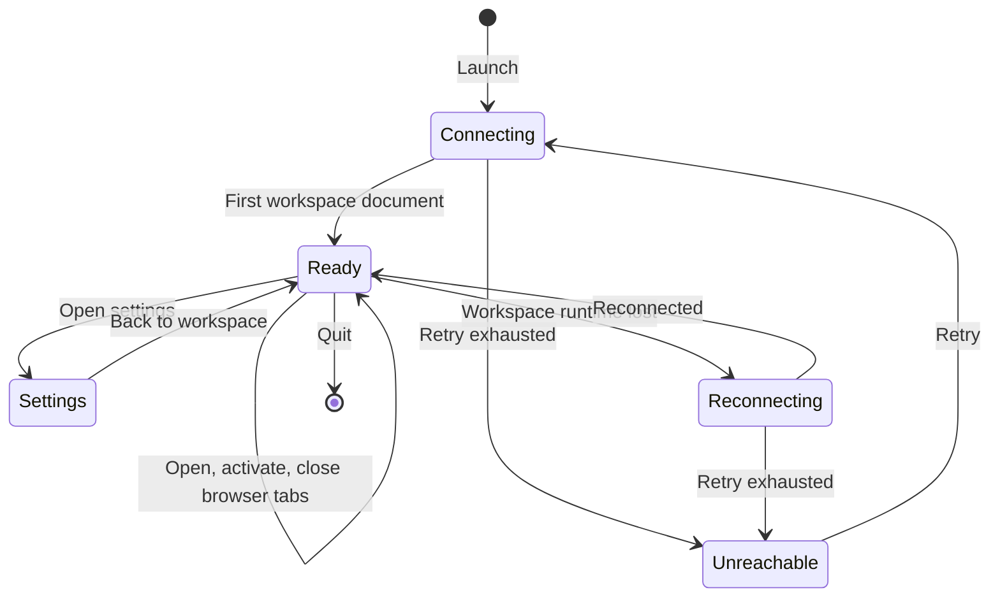

# Workspace shell and tab navigation

## Summary

**Status: drafted.** The **workspace shell** is the Gradivus window itself: a frameless window with a custom title bar, a tab strip, a stage area, and window controls. It is the surface a user lands on at launch and the container for everything else in this documentation set. The shell owns the launch connection state (**Connecting to the workspace runtime…**), one fixed chat tab labeled **Gradivus** that cannot be closed, any number of browser tabs, the global keyboard shortcuts, the Settings route, and the shell-level theme. Tab titles, connection feedback, and window geometry each follow their own rules, several of which are surprising and documented below.

## The simple case

The user launches Gradivus. A frameless window opens with the Gradivus mark and window controls in the title bar, the fixed **Gradivus** chat tab selected, and a full-stage loading status **Connecting to the workspace runtime…** while the local workspace runtime starts. Once connected, the loading overlay clears, the composer in the chat tab becomes usable, and the **Open browser tab** control enables. The user can stay in the chat tab, open browser tabs with **Open browser tab** or Ctrl+T, switch between tabs in the strip, and open Settings from the rail. Closing the last browser tab returns to the chat tab, which is always present. Quitting closes the window; the next launch starts at the default size with the same tabs restored from the workspace runtime.

## The interaction, event by event

### Starting

Launching the app starts the shell. The window is frameless with a custom title bar: the Gradivus mark on the left, and **Minimize**, **Maximize**/**Restore**, and **Close** controls on the right. The entire title bar is a drag region except the controls. The tab strip shows the fixed chat tab — labeled **Gradivus** with a small uppercase **native** pill — and any browser tabs restored from the workspace runtime. Until the first workspace document arrives, a full-stage overlay with a spinner and the status **Connecting to the workspace runtime…** covers everything, and **Open browser tab** is disabled.

If the workspace runtime cannot be reached at launch, the shell surfaces the failure as a persistent error toast, **Workspace runtime unreachable**, with a **Retry** action and a dismiss control; it does not exit.

### Ending at once

The interaction can end immediately if the user closes the window without doing anything else. Nothing about the shell session is committed except what the workspace runtime has already persisted: browser tabs and panes are durable records, while window size, maximized state, active tab, and any transient toasts are not restored.

### Becoming extended

The shell becomes extended once the workspace hydrates. The loading overlay clears, and the user can:

- open browser tabs (**Open browser tab** button or Ctrl+T), which are named **Browser**, **Browser 2**, and so on by the workspace runtime;
- activate any tab in the strip, including the fixed chat tab;
- toggle element selection on the active browser pane with Ctrl+Shift+C;
- open Settings from the rail, which replaces the workspace with the Settings surface and detaches all browser views;
- switch the theme from the rail toggle.

Each browser tab is a separate stage in the same window. The chat stage stays mounted while browser tabs are visited, so chat state and drafts survive tab switches. Inactive browser stages are inert.

### While extended

While the shell is running, connection state changes surface as toasts in the bottom-right corner: **Reconnecting to the workspace runtime…** during a reconnect attempt, **Workspace runtime disconnected** after an unexpected disconnect, and the persistent **Workspace runtime unreachable** error with **Retry** if reconnect attempts are exhausted. Theme changes apply immediately across the shell, chat, browser, and native surfaces, following the OS color scheme when the theme preference is System.

Global keyboard shortcuts are active while no modal dialog is open: Ctrl+T opens a browser tab, Ctrl+W closes the active browser tab, Ctrl+Shift+C toggles element selection, and Escape cancels element selection or closes Settings (clearing the settings search first). While any modal dialog is open, all of these shortcuts are inert.

### Finishing

Quitting the app — **Close** on the window, or the OS quit affordance — ends the shell session. The workspace runtime persists durable browser and terminal records before shutdown; the shell does not persist window geometry. On a packaged install, launching a second instance does not create a second window: the existing window is restored and focused instead.

## Modifiers

| Modifier | Effect at start | Effect when changed mid-interaction |
| --- | --- | --- |
| Active tab | The fixed chat tab is selected at launch. | Clicking a tab, pressing Enter/Space on a focused browser tab, or focusing a browser pane activates that tab. If the active tab's record disappears, selection falls back to the chat tab. |
| Browser-tab close confirmation | With the default setting on, closing a browser tab asks **Close tab “<title>”?** first. | Changing the confirmation setting changes only future closes. |
| Theme | The resolved theme sets the window background, title bar, and every surface at launch. Dark is the default. | Dark/light changes apply immediately everywhere; System follows the OS color-scheme change live. The rail toggle flips between dark and light. |
| Interface density | Comfortable is the default; compact tightens spacing across surfaces. | Changes apply immediately. |
| Reduce motion | Off by default; the OS reduced-motion preference still applies. | Toggling applies immediately through the shell and chat surfaces. |
| Hydration state | **Open browser tab** is disabled and the loading overlay covers the stage. | Once hydrated, the overlay clears and the button enables. |
| Modal dialogs | No effect at start. | While any modal dialog is open, global shortcuts are inert; e2e covers Ctrl+T being suppressed with an Agent Hub modal open. |
| Platform | Windows, macOS, and Linux all use the frameless shell; macOS recreates the window on dock activation. | Not user-changeable. |

## Cancel and interrupt

| Interrupt | Outcome and visible consequence |
| --- | --- |
| explicit abort | **Close** ends the window and the session; there is no shell-level cancel-abort. Escape has no shell-level action outside Settings, selection mode, menus, and dialogs. |
| doing something else mid-way | Switching tabs, opening Settings, or using the chat are all normal shell activity, not interruptions. The chat stage survives browser-tab visits; browser panes detach while Settings is open and reattach when it closes. |
| clean-completion event | Closing the last browser tab cleanly returns the shell to the fixed chat tab. There is no empty-tabs state. |
| environment failure | Workspace-runtime disconnects surface as toasts; retry exhaustion surfaces the persistent **Workspace runtime unreachable** error with **Retry**. The shell stays alive rather than exiting. |
| page/process exit | Quitting or crashing the window ends the shell. Durable workspace records survive; window geometry, active tab, and toasts do not. A hard crash may require the workspace runtime's own recovery on next launch. |
| target changed elsewhere | A browser tab closed by the runtime (for example by an agent) disappears from the strip, and selection falls back to the chat tab if it was active. Terminal-kind tabs created by agents never appear in the strip at all. |
| input-channel change | Keyboard focus can rest in the chat composer, a browser pane, or Settings; shortcuts route by focus and dialog state, not by device. There is no second-device or remote input. |

## Interactions with other systems

| Concern | Consequence |
| --- | --- |
| permissions | The shell grants no web permissions itself; browser panes deny permission requests by default and the renderer is sandboxed with a restrictive CSP served over the app's own protocol. |
| history or undo | Tab and pane layout is durable workspace history; window geometry is not. Closing a tab is a confirmable action, not an undoable one. |
| containers or parents | The shell is the parent container of the chat tab, browser tabs, and the Settings route. The fixed chat tab cannot be closed or reordered away. |
| locked or read-only state | No shell-level read-only mode exists. Settings queuing and reset guards are the closest analogue, and they block resets while mutations are pending. |
| offline behavior | The shell launches and connects to a local runtime without internet. Browser tabs need network for remote pages; the chat needs a provider only when a turn is submitted. |
| collaboration or multi-device behavior | One local user per window; the single-instance lock means a second launch focuses the existing window rather than opening a second session. |
| notifications | Shell feedback is in-app toasts only: transient notices, 7-second action errors, and the persistent runtime-unreachable error. No OS notifications or sounds. |
| configuration and preferences | Application settings cover theme, density, reduced motion, browser defaults (home page, search, close confirmation), terminal appearance, and workspace defaults. They persist machine-locally and apply immediately unless a feature documents otherwise. |

## Edge cases

- The window title while the chat tab is active reads **Gradivus · Gradivus**, because the tab is labeled **Gradivus** and the product is Gradivus.
- Browser tab titles are static durable names (**Browser**, **Browser 2**, …). Page titles never update the tab strip or the window title; a page's title is visible only in its pane.
- The browser-tab close glyph is mouse-only; keyboard users close tabs with Ctrl+W.
- The **Maximize**/**Restore** control's label tracks its own toggled state and can desync after an OS-level maximize or restore performed outside the app.
- Window size and maximized state do not persist across relaunch; every launch is the default size.
- Before hydration, Ctrl+T still fires and produces the **Workspace is still loading** toast, even though the **Open browser tab** button is disabled.
- Popups and `window.open` from browser pages are denied at the page level and converted into new shell browser tabs.
- A second launch of a packaged install focuses the existing window instead of creating a new one.
- The **native** pill on the chat tab is hidden on narrow viewports (≤980 px).
- Terminal-kind tabs created by the runtime or agents are filtered out of the tab strip; only browser-kind tabs appear.

## Open questions and verification

### Source revision

- Working tree anchored at `ac5f533bb245ef7f911dfc165c7c39356a2ac639` with the cross-platform terminal-renderer cutover applied.
- Evidence date: 2026-08-28.
- Boundary: relevant desktop sources and tests are modified or untracked, so this describes the working tree anchored at that commit, not a clean checkout.

### Runtime evidence

**Observed:** the fixture-backed Electron journeys in `packages/desktop/e2e/desktop.spec.ts` assert the Gradivus mark in the title bar, the selected chat tab, settings open/search/close with focus restore, browser tab creation and activation, the exact **Browser** tab name, Ctrl+T suppression while a modal dialog is open, and the theme-toggle geometry. The runtime evidence table in [`../foundations/scope-and-evidence.md`](../foundations/scope-and-evidence.md) records the executed runs.

### Code evidence

**Code-established:** window creation, frameless chrome, the `gradivus://` protocol with CSP, and the single-instance lock are established by `packages/desktop/src/main/main.ts`. The title bar, tab strip, fixed chat tab, new-tab control, and window controls are established by `packages/desktop/src/renderer/ui/templates/WorkspaceShell.svelte`, `packages/desktop/src/renderer/ui/molecules/WorkspaceTab.svelte`, and `packages/desktop/src/renderer/ui/molecules/WindowControls.svelte`. Tab lifecycle, stage routing, global shortcuts, connection toasts, loading overlay, and theme application are established by `packages/desktop/src/renderer/ui/pages/App.svelte`. Durable browser tab naming is established by `packages/workspace-runtime/src/reducer.ts`. Settings routing and focus restore are established by `packages/desktop/src/renderer/ui/organisms/SettingsShell.svelte` and `App.svelte`.

### Open questions

- **Open question:** No e2e journey drives the window controls (Minimize, Maximize/Restore, Close) or verifies the maximize-label desync; they are code-established only.
- **Open question:** The **Workspace runtime unreachable** retry path and the reconnect toasts have unit-level evidence (`test/runtime-reconnect.test.ts`) but no mounted Electron journey that severs the runtime connection.
- **Open question:** Whether window geometry should persist is a product decision, not a defect; the current behavior is documented as-is.
- **Open question:** The fixed chat tab's visible label (**Gradivus**) versus this set's canonical term (OMP Chat) is a naming decision to revisit if the tab label changes again.
