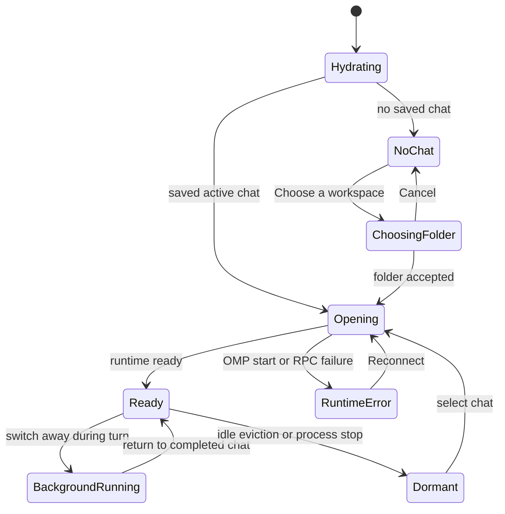

# Workspaces and chat sessions

## Summary

**Status: drafted.** OMP Chat keeps a local list of chat sessions, groups sessions with the same exact folder path into a rail workspace, and restores a saved active chat on launch. Choosing a folder creates a new Work session; the `+` action on an existing rail workspace creates another chat for that folder without reopening the picker. A turn can continue when its chat is not selected, with running, error, and unseen-completion state projected into the rail. Chat records and OMP history are durable, while resident runtimes are deliberately bounded and can become dormant. Mounted Electron evidence establishes creation, picker cancellation, same-folder chats, switching during a turn, and origin-owned completion. Relaunch, rename, dormant-runtime reopening, rail error/unseen indicators, turn cancellation, and **Reconnect** remain code-established or test-specified rather than runtime-verified.

## The simple case

On a fresh installation, the workspace shell first shows **Connecting to the workspace runtime…** while it hydrates. With no saved chat session, OMP Chat shows **Choose a workspace** and an empty rail. Choosing a local folder creates a new Work session, starts OMP for that folder, selects the new chat, and enables the composer when startup finishes. Cancelling the native folder picker leaves the current surface unchanged.

The rail groups chats by exact folder path. The group header's `+` action creates another chat using that same path, so multiple conversations can share one rail workspace without sharing a transcript or active turn. On a later launch, the desktop loads saved chat records as dormant runtimes, prefers the saved active Work session, and opens it; opening starts or resumes OMP from the saved OMP session file and reconstructs its conversation transcript.

A chat can continue working while the user selects another chat. The originating row remains running, completion stays with that chat, and an unseen-completion marker can appear until the user returns. The destination chat is selected immediately, but its composer remains unavailable until its own snapshot is ready.

## The interaction, event by event

### Starting

The interaction starts in one of three ways: initial launch selects a saved chat, **Choose a workspace** opens the native directory picker, or the user selects or creates a chat in the rail. Launch selection prefers the saved active Work session, then the saved active Code session, then the first saved record (`packages/desktop/src/renderer/ui/pages/OmpChat.svelte:626-635`). A global create captures the accepted folder path; a rail-workspace `+` reuses that group's exact path (`OmpChat.svelte:306-319,840-872`; `packages/desktop/src/main/desktop-host.ts:322-358`).

The selected chat identity changes immediately. OMP Chat resets chat-scoped disclosures and inspectors, closes the prior chat's Local terminal drawer, releases visible staged attachments from the prior chat, restores the destination's transcript-follow intent, and requests the destination snapshot (`OmpChat.svelte:647-710`). A monotonically increasing selection token rejects late results from an older rapid selection.

### Ending at once

Cancelling the folder picker returns no chat and causes no navigation or registry change (`desktop-host.ts:325-329`). In the executed Electron journey, cancellation also left the current staged attachment visible; accepting the folder then created and selected a new rail workspace and cleared that prior chat's staged attachment (`packages/desktop/e2e/desktop.spec.ts:1343-1382`, test **“isolates attachments across successful workspace creation”**).

An accepted folder can also end quickly with an error before a usable chat exists. A supplied path must exist and be a directory, but creation does not establish that it is writable (`desktop-host.ts:331-357`). The renderer reports creation/opening failures as an in-app error and keeps the prior chat when one exists.

### Becoming extended

The interaction becomes extended while a chat runtime starts or resumes. The destination row is selected, but OMP Chat remains in a loading boundary until the snapshot returns. A new chat starts a fresh OMP session; a saved chat with a session file starts OMP with that file, loads OMP state and conversation history, and refreshes available commands and runtime configuration (`desktop-host.ts:360-383,1094-1150`).

A conversation turn is independently extended. Selecting another chat does not stop that turn. The originating chat retains its pending-turn ownership, its rail workspace can show a running radar, and its chat row can show running state (`OmpChat.svelte:268-305,2295-2347`; `packages/desktop/src/renderer/ui/organisms/SessionRail.svelte:50-104`).

### While extended

The rail orders chats in each rail workspace by most recently opened time, places the current folder group first, and otherwise orders groups by folder name (`OmpChat.svelte:280-305`). Selecting another chat updates the active pointer and last-opened time after opening succeeds (`desktop-host.ts:360-370`). The previous chat's turn continues, and live state events continue updating its rail status even though transcript events render only for the active chat.

When an inactive running chat completes, code marks it as having an unseen completion; selecting it clears that marker (`OmpChat.svelte:268-279,647-652`). The executed Electron test **“keeps background completion attached to its originating chat”** starts delayed work in chat A, completes work in chat B, returns to A, and finds A's result in A (`desktop.spec.ts:1702-1705`). That journey establishes ownership of completion, but it does not assert the rail's unseen marker.

Chat titles can change in two ways. **Rename session** lets the user save a trimmed name; the shared guard accepts 1–160 Unicode code points (`OmpChat.svelte:1339-1365,2531-2543`; `packages/desktop/src/main/desktop-host.ts:476-490`; `packages/desktop/src/main/guards.ts:29-35`). When the displayed title still looks like a default, the first submitted prompt can produce a cleaned title of at most 38 characters, and OMP can later push a session-title update that is persisted (`OmpChat.svelte:1155-1168`; `desktop-host.ts:1436-1452`). Manual and automatic title changes were not exercised in the passing Electron journeys.

The desktop keeps at most three resident runtimes and stops a ready runtime after five idle minutes. Under pressure it chooses the least-recently-used idle runtime, never a leased or actively running runtime. The saved chat session remains in the rail as a dormant runtime and starts or resumes when opened again (`desktop-host.ts:190-197`; `packages/desktop/src/main/runtime-supervisor.ts:320-335,498-545`). These policies are code-established and test-specified, not mounted-runtime observations in this pass.

> Technical note: a **rail workspace** is only an exact-`cwd` presentation group. It is not a **workspace authority**, and a chat session is not a workspace session. Workspace authority separately owns browser tabs, panes, terminal records, revisions, and capability state. Automatic workspace-runtime reconnect therefore has a different owner and recovery path from the chat-level **Reconnect** action.

### Finishing

Creation or selection finishes when the destination snapshot is current and its runtime is ready. The transcript, title, folder, runtime controls, and composer then belong to that selected chat. A background turn finishes in its origin chat; returning to it reveals the completed transcript and clears its unseen state.

An unexpected OMP child-process or RPC failure moves the chat to error state. The transcript area shows **Runtime stopped unexpectedly** with **Reconnect**; **Reconnect** requires a saved OMP session file and attempts to start OMP from that file (`OmpChat.svelte:874-889,2316-2325,2594-2595`; `desktop-host.ts:372-383`). No passing mounted Electron journey forced this path, so visible timing, failure recovery, and transcript convergence remain unverified.

The visible active-turn **Stop generation** action aborts the current turn and is intended to leave the chat runtime available; its handler reports **Turn stopped** after abort (`OmpChat.svelte:1226-1239`). A separate session-stop handler can stop the OMP process, and asks **Stop the OMP session and interrupt this turn?** when the chat is running (`OmpChat.svelte:891-906`; `desktop-host.ts:470-473`). No renderer control wired to that session-stop handler was identified in the current markup, while the executed active-turn journey asserted exactly one visible **Stop generation** control. Neither stop outcome was activated in a passing mounted journey.

On app shutdown, resident OMP runtimes stop, while chat metadata and OMP session files remain. Relaunch loads every record as dormant and opens the preferred saved active chat. There is no chat-deletion action in the rail, header, renderer API, or main-process session lifecycle; browser and terminal close actions do not delete a chat (`packages/desktop/src/shared/contracts.ts:671-757`; `SessionRail.svelte:43-125`). This explicit absence is tracked in [`../bug-triage.md`](../bug-triage.md#chat-011--conversation-deletion-has-no-product-path).

## Modifiers

| Modifier | Effect at start | Effect when changed mid-interaction |
| --- | --- | --- |
| No saved chat | Launch ends at the empty rail and **Choose a workspace** card. | Accepting a folder creates and selects the first Work session; cancelling leaves the empty state. |
| Saved active Work or Code session | Work is preferred, then Code, then the first record. | A successful selection updates the active pointer for that chat's kind; no Work/Code switch is exposed in the renderer. |
| Same exact folder path | Sessions appear in one rail workspace and the group `+` reuses the path. | A chat whose stored path differs, including an unresolved alias or symlink spelling, forms another group; path canonicalization is not established. |
| Active turn | The chat and its rail workspace show running state. | Switching chats leaves the turn running in its origin; completion can set unseen state until the origin is selected. |
| Resident runtime | Opening can reuse the live OMP child process. | Five ready idle minutes or pressure above three residents can make it dormant; a running or leased runtime is not selected for eviction. |
| Dormant runtime | The record remains selectable without a live OMP process. | Selecting it starts or resumes OMP from its saved session file and reloads history. |
| Runtime error | The selected chat shows **Runtime stopped unexpectedly** and **Reconnect**. | Reconnect changes the chat to opening; success returns it to ready, while another failure remains an error. Mounted behavior is unverified. |
| Default or explicit title | A missing/default-looking title displays a fallback based on chat/folder identity. | A first prompt can auto-title; **Rename session** saves an explicit trimmed title; later OMP title events can update it again. Conflict ordering is not established. |

## Cancel and interrupt

| Interruption | Outcome and user-visible consequence |
| --- | --- |
| explicit abort | Cancelling the folder picker is a clean no-op. **Stop generation** targets the active turn, not chat retention. The separate session-stop code path would make the runtime dormant, but no current visible trigger was identified. |
| doing something else mid-way | Selecting another chat changes the rail selection immediately and does not stop the origin turn. Browser-tab navigation leaves the mounted OMP Chat stage alive. Switching chats closes the prior Local terminal drawer and clears its visible staged attachments; draft ownership is unresolved. |
| clean-completion event | Accepting a folder completes creation when the new chat snapshot is ready. A turn completion updates its origin chat and may set unseen state. Saving a rename commits its title; there is no undo. |
| environment failure | Folder or registry failures surface an in-app error. An OMP process/RPC failure shows **Reconnect** in the selected chat. Workspace-runtime failure is separate and automatically retries; visible retry exhaustion is tracked in [`../bug-triage.md`](../bug-triage.md#chat-002--workspace-reconnect-and-outer-shell-errors-are-not-rendered). |
| page/process exit | Renderer teardown releases visible staged attachments and listeners. App shutdown stops resident OMP runtimes but retains saved chat records and OMP history. Relaunch recovery is code-established but not mounted-verified; pending dialogs and drafts are not established as durable. |
| target changed elsewhere | OMP can push a title update while a chat exists. Inactive-chat event handling can delay visible metadata refresh until reopen; concurrent manual and automatic rename ordering is not verified. The desktop exposes no remote chat deletion or revision-conflict model. |
| input-channel change | Pointer and keyboard selection reach the same rail buttons; the folder choice is owned by the native picker. There is no multi-device input or synchronization contract. Rapid in-app selections use a token to ignore stale open responses. |

## Interactions with other systems

### Permissions

Folder creation uses the operating system's native directory picker. A supplied folder must exist and be a directory; the create path does not preflight workspace writability. Later OMP tools or terminals can still fail at filesystem or provider boundaries. Browser and renderer sandbox rules do not turn a rail workspace into a broader filesystem grant.

### History or undo

Chat metadata persists in the desktop session registry, while conversation history persists in the OMP session file and reloads on resume. There is no undo for create, selection, rename, or stop. There is also no supported deletion path, so users cannot remove obsolete or sensitive conversations through OMP Chat.

### Containers or parents

A chat session owns one transcript, pending turn, OMP session, title, and chat-scoped inspectors. A rail workspace groups chat sessions only by exact local folder path. The workspace shell contains OMP Chat and browser tabs. Workspace authority is a separate durable browser/terminal domain and must not be inferred from the rail hierarchy.

### Locked or read-only state

No dedicated locked or read-only workspace mode is exposed. Session metadata can still be stored under desktop user data even when project-file writes later fail. The workspace authority's internal ownership lock and OAuth account routing lock are not user-visible read-only modes.

### Offline behavior

There is no offline queue or offline badge. Saved local metadata and OMP history can remain on disk, but starting/resuming OMP and provider-backed work depend on their local process and selected provider. **Reconnect** is for an errored OMP chat; automatic workspace-runtime reconnect is a distinct shell lifecycle.

### Collaboration or multi-device behavior

Chat sessions are local to one desktop user-data directory. Local OMP agents can continue work, but there is no remote-human collaboration, multi-device session sync, or conflict-resolution surface for chat metadata.

### Notifications

The rail can show running, error, and unseen-completion indicators. The active surface uses in-app notice/error toasts and error cards. There are no operating-system notifications, sounds, notification center, or multi-device alerts for a background completion.

### Configuration and preferences

New chats default to Work sessions; the renderer exposes no Work/Code creation switch. Runtime residency limits, launch-selection precedence, rail grouping, and deletion absence are not configurable. **Default root directory** is not consumed by workspace creation in the inspected code; that copy/behavior mismatch is tracked in [`../bug-triage.md`](../bug-triage.md#chat-008--default-root-directory-does-not-set-the-new-workspace-default).

## Edge cases

- A cancelled picker retains the current chat and, in the executed attachment journey, its staged attachment.
- Multiple chats with the same exact `cwd` share one rail workspace but never share a conversation transcript or pending turn.
- A rapid selection changes the highlighted row before the destination snapshot arrives. Old transcript content can remain briefly under the new selection while the composer is disabled; late older responses are ignored.
- Switching away releases staged attachments, but the renderer currently carries one draft variable across chat selection. The split ownership is a product decision under [`CHAT-006`](../bug-triage.md#chat-006--draft-and-attachment-ownership-diverge-on-chat-switches).
- A completed inactive turn belongs to its origin. The executed journey proves transcript ownership, not the visibility or accessibility of the unseen marker.
- More than three recently used chats do not imply more than three resident OMP processes. Idle eviction leaves the chat record and history available.
- A saved chat without a non-empty OMP session file cannot use **Reconnect**. The user-visible recovery for that case is not established.
- Invalid or corrupt registry content is preserved under a recovery filename and the registry starts empty in source/tests, but the mounted warning and recovery journey were not executed (`packages/desktop/src/main/session-registry.ts:30-70`; `packages/desktop/test/session-registry.test.ts:29-44`).
- A manual rename can race an automatic or OMP-pushed title. The expected winner and rollback behavior after a persistence failure are open.
- Browser-tab close, terminal close, and app shutdown are not chat deletion. No row menu or header action removes a chat.

## Open questions and verification

### Source revision

- Revision anchor: `c125341133ff90a29fe266e1b166bac0183338c8`
- Evidence date: 2026-08-25
- Boundary: this documents the working tree anchored at that commit; relevant desktop renderer, main-process, test, and E2E files may be modified or untracked.

### Runtime evidence

- **Observed:** `bun run test:e2e:browser` from `packages/desktop` completed 24/24 Electron journeys on macOS arm64.
- **Observed/Tested:** **“runs current OMP Chat feedback, recovery, local command, folder creation, settings, and Axe journeys”** created a second same-folder chat and kept its composer visible (`packages/desktop/e2e/desktop.spec.ts:179-227`).
- **Observed/Tested:** **“isolates attachments across successful workspace creation”** cancelled and then accepted the native folder chooser, preserving the current attachment on cancel and creating a clean destination on success (`desktop.spec.ts:1343-1382`).
- **Observed/Tested:** **“keeps background completion attached to its originating chat”** switched during a delayed turn and found completion only in its origin after returning (`desktop.spec.ts:1702-1705`).
- **Observed/Tested:** **“routes Enter to steering while a turn is active”** asserted exactly one enabled **Stop generation** control during an active turn, but did not activate it (`desktop.spec.ts:1707-1746`).
- The 8/8 browser-selection journeys and 1/1 compiled-runtime `/context` journey also passed in this evidence pass, but they do not verify workspace/chat-session lifecycle claims.

### Test evidence

- **Tested through executed Electron:** the four named `desktop.spec.ts` journeys above.
- **Test-specified, not passing evidence:** **“registers restored sessions without starting their processes”** and **“emits state-only runtime reports and includes the report in snapshots”** (`packages/desktop/test/desktop-host.test.ts:272-301`).
- **Test-specified, not passing evidence:** **“evicts the least-recently-used idle runtime under pressure”**, **“does not evict a runtime while leased or while its process is running”**, and **“evicts after idle timeout and touch resets the deadline”** (`packages/desktop/test/runtime-supervisor.test.ts:130-192`).
- **Test-specified, not passing evidence:** registry corruption, serialized writes, duplicate repair, and active-pointer repair (`packages/desktop/test/session-registry.test.ts:29-138`).
- `bun run test` did not complete; these unit-only assertions are not classified as passing. See [`../bug-triage.md`](../bug-triage.md#chat-010--the-desktop-unit-test-command-does-not-complete).

### Code evidence

- **Code-established:** rail grouping, ordering, initial selection, rapid-switch guarding, per-chat live status, rename/auto-title, and runtime-error presentation (`packages/desktop/src/renderer/ui/pages/OmpChat.svelte:249-313,621-710,837-906,1155-1168,1339-1365,2295-2405,2504-2605`).
- **Code-established:** visible running/error/unseen row indicators and create actions, with no delete action (`packages/desktop/src/renderer/ui/organisms/SessionRail.svelte:43-125`).
- **Code-established:** durable registry load/save and active pointers (`packages/desktop/src/main/session-registry.ts:1-115,153-177`).
- **Code-established:** create/open/resume/rename/stop, history hydration, and title-event persistence (`packages/desktop/src/main/desktop-host.ts:217-228,322-383,470-490,1045-1150,1436-1452`).
- **Code-established:** three-runtime residency cap, least-recently-used idle eviction, and five-minute idle stop (`desktop-host.ts:190-197`; `packages/desktop/src/main/runtime-supervisor.ts:320-335,498-545`).
- **Code-established:** the renderer API exposes create, open, resume, stop, rename, prompt, abort, browser close, and terminal close, but no chat deletion (`packages/desktop/src/shared/contracts.ts:671-757`).

### Open questions

1. What does a user see when an unmounted or background chat's OMP process fails, and does selecting it reliably reveal one **Reconnect** action without losing transcript or pending-request state?
2. What happens when **Reconnect** is attempted with a missing, moved, corrupt, or permission-denied OMP session file, and can the user start fresh without creating an unrelated chat?
3. Should permanent chat deletion remain absent? If deletion is added, which metadata, OMP history, attachments, resident runtime, active pointer, and next selection are removed atomically? See [`CHAT-011`](../bug-triage.md#chat-011--conversation-deletion-has-no-product-path).
4. Should a draft be per chat, move with the global composer, or require confirmation on switch? Current code carries text while releasing attachments. See [`CHAT-006`](../bug-triage.md#chat-006--draft-and-attachment-ownership-diverge-on-chat-switches).
5. Is the separate session-stop behavior intentionally not reachable in the current UI, and how should it be distinguished from **Stop generation** if exposed?
6. Do relaunch and dormant-runtime resume preserve the full transcript, active selection, unseen state, and a completed background turn in the mounted product?
7. Should running, error, and unseen rail indicators have explicit accessible text rather than relying on hidden glyphs and row styling?
8. Which title wins when user rename, first-prompt auto-title, and an OMP title update overlap or persistence fails?
