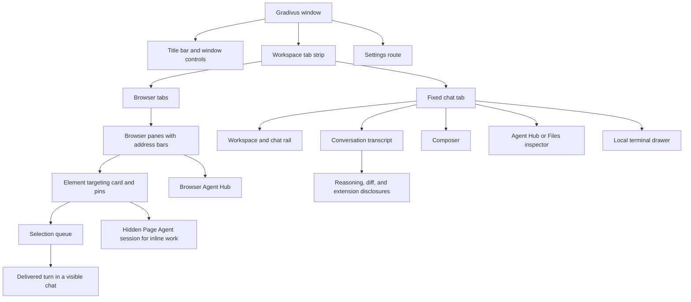

# Experience model

## Summary

Gradivus is a multi-surface Electron workspace. The workspace shell owns the window, the tab strip, and the Settings route; the browser workspace holds sandboxed browser tabs and panes; and OMP Chat is a persistent chat stage where the user selects a local folder, works in one of its chat sessions, submits one turn at a time, and reviews a transcript that mixes human messages with OMP reasoning, tool activity, system context, and delegated work. Secondary surfaces remain attached to the selected chat: Agent Hub, Files, and the Local terminal drawer. Element targeting connects the browser workspace to OMP work through a hidden Page Agent session.

The central product invariant is ownership: a submitted turn, its live activity, changed-file evidence, unread state, staged input, delegated agents, and browser-delivered work must remain associated with the chat session or pane where they originated.

## Visible hierarchy

The chat stage stays mounted while the user visits browser tabs, and browser panes of background tabs stay alive while detached. Settings makes the underlying workspace inert and returns focus to the invoking control when closed. The shell shows a blocking **Connecting to the workspace runtime…** overlay until initial workspace hydration completes, and a persistent **Workspace runtime unreachable** error with **Retry** if reconnect attempts are exhausted.

## Top-level user-visible states

```mermaid
stateDiagram-v2
    [*] --> Connecting
    Connecting --> NoChat: workspace runtime hydrated; no saved chat
    Connecting --> OpeningChat: saved active chat found
    NoChat --> ChoosingFolder: Choose a workspace
    ChoosingFolder --> NoChat: picker cancelled
    ChoosingFolder --> OpeningChat: folder accepted
    OpeningChat --> Ready: OMP started or resumed
    Ready --> ActiveTurn: Send
    ActiveTurn --> Ready: completion or local command
    ActiveTurn --> Recovery: prompt cannot start
    ActiveTurn --> Ready: Stop completes
    Ready --> RuntimeError: OMP process or RPC fails
    ActiveTurn --> RuntimeError: OMP process or RPC fails
    RuntimeError --> OpeningChat: Reconnect
    Recovery --> ActiveTurn: Retry
    Ready --> OpeningChat: switch chat
```

These states are a documentation lens. The implementation uses additional process, pending-turn, workspace, and modal states.

## Container and ownership model

| Object | User-visible owner | Persistence boundary | Observable consequence |
| --- | --- | --- | --- |
| Application settings | Local installation | Machine-local settings file | Theme, density, motion, browser defaults, and terminal presentation survive relaunch. |
| Rail workspace | Exact local folder path | Recomputed from saved chat records | Chats with the same exact path appear under one folder group. |
| Chat session | One rail row | Desktop session registry | Title, folder, timestamps, active pointer, and OMP resume information survive relaunch. |
| OMP session | One chat session | OMP JSONL history | The conversation transcript can be resumed and paged. |
| Resident runtime | One chat session | Process lifetime; at most three resident, five-minute idle stop, LRU eviction | A running or recently used chat responds immediately; dormant or evicted chats restart on open and resume their transcript. |
| Draft text | Renderer | Renderer lifetime | Unsubmitted text is not durable across app exit. Current code carries one draft across chat selection; that ownership is under triage. |
| Staged attachments | Current chat session | Temporary attachment store | Chips belong to the selected chat; session boundaries release visible staged files. |
| Pending turn | Originating chat session | Renderer plus OMP request correlation | Background completion and rail status remain attached to the original chat. |
| Conversation transcript | OMP session | OMP history plus live projection | Canonical history reconstructs after resume; live-only dialogs and toasts may not. |
| Timeline follow | Chat session in renderer | Renderer lifetime | Scrolling one chat up does not pause another chat's follow intent. |
| Agent Hub | Chat session and OMP process | Retained agent state while available | Roster, unread state, transcript, and lifecycle actions change with selected chat. |
| Files inspector | Chat session transcript | Derived from successful tool entries | Inventory is chat-scoped; **View diff** reads current workspace state. |
| Local terminal drawer | Selected chat session | Workspace runtime PTY lifecycle | Hide/show and renderer reload can preserve the shell; switching workspace, restart, or explicit close ends its ephemeral PTY. |
| Browser tab and panes | Browser tab in the tab strip | Durable workspace-authority record | Tab names, layout, and current URLs survive relaunch; history, titles, and scroll do not. |
| Page Agent | Browser workspace | Hidden OMP session while live | Inline and queued element work run outside every visible chat; only Send to Chat reaches a visible chat, resolved by workspace path. |
| Selection queue | One browser pane | Host-owned in-memory state | Queued picks survive navigation and tab switches, die with the pane and on relaunch, and remain in rows until completion/error is acknowledged. |

> Technical note: the rail's “workspace” and “session” vocabulary does not match the workspace runtime's authority objects. Product prose uses **rail workspace**, **chat session**, **workspace authority**, and **workspace session** to keep those domains distinct.

## Commitment model

### Immediate local changes

These changes happen before the backend confirms the final outcome:

- a primary submission clears the composer and attachment chips;
- an optimistic user entry and running placeholder enter the transcript;
- the session and rail show running state;
- the active-turn banner, timer, Stop action, and Steer action appear;
- application-setting controls show a saving state;
- removing an attachment hides its chip optimistically; and
- selecting another chat changes the active view immediately while a selection token rejects late responses.

### Pending changes

These changes need an authoritative response:

- prompt acknowledgement and correlated prompt result;
- canonical transcript replacement and streaming entry updates;
- Steer or queued-follow-up admission;
- Stop completion;
- account sign-in, sign-out, lock, failover, or removal;
- application setting persistence;
- extension request response;
- agent lifecycle actions; and
- browser-selection delivery.

### Durable changes

These survive the relevant process boundary:

- application settings after successful persistence;
- chat session records and active pointers;
- OMP transcript history and session files;
- workspace-authority browser and terminal records;
- successful workspace-runtime commands persisted before broadcast; and
- browser navigation and tab/pane state owned by the workspace runtime.

Live toasts, open disclosures, a draft, pending extension dialogs, and renderer-local follow state are not established as durable.

## Conversation-turn phases

### Starting

The user supplies text, attachments, or both. The composer captures current provider, model, thinking level, plan mode, chat identity, draft, and staged attachment identifiers at admission time. Empty Enter has no product action. Shift+Enter inserts a line break.

### Ending at once

A local command can complete without invoking the agent. A prompt can also fail before agent work begins. In the failure branch, optimistic transcript entries roll back, the prior input is restored, and the user receives a recovery card and error feedback.

### Becoming extended

A prompt acknowledgement or running state makes the interaction visibly active. **Send** becomes **Steer**, **Queue for next turn** becomes available through More actions, and the live banner exposes elapsed time, optional throughput, current activity, and Stop.

### While extended

Stable transcript entries update by identifier. Tool and reasoning activity outrank generic generation copy in the live banner. The user can prepare a new draft, steer the active turn, queue a later turn, review another chat, scroll history, open an inspector, or use the Local terminal without automatically stopping the turn.

### Finishing

Completion removes live controls and leaves canonical transcript entries. A failed start restores input. Stop retains the submitted user entry, removes the optimistic assistant placeholder, restores pending attachments, and announces the stop when abort succeeds. Runtime failure shows a reconnect path.

## Transcript presentation model

The conversation transcript has six base entry kinds:

1. user;
2. assistant;
3. reasoning;
4. tool;
5. semantic special; and
6. raw fallback.

Semantic entries then present status, activity, IRC, advisor findings, custom/extension content, context transitions, command execution, or assistant outcomes. Content is bounded by default and expands on demand where supported. Tool results update the original tool row rather than creating a separate result row.

The Files inspector includes only successful completed write/edit activity and deduplicates paths newest first. A diff request reads the current working tree; it is review of present state, not an immutable audit snapshot.

## Feedback and interruption taxonomy

| Feedback | Surface | Persistence | User expectation |
| --- | --- | --- | --- |
| Running state | Session rail and active-turn banner | Live | Work is active in this chat, even if another chat is selected. |
| Transcript status/activity | Conversation transcript | History-dependent | Reviewable event or outcome associated with the chat. |
| Prompt recovery | Above composer | Until resolved/state changes | Input was not admitted; Retry or account repair is available. |
| Notice toast | OMP Chat overlay | Ephemeral singleton | Action feedback; later notice can replace it; manual dismissal available. |
| Error toast | OMP Chat overlay | Ephemeral singleton | The requested action failed; manual dismissal available. |
| Runtime error card | Transcript area | Current chat state | OMP stopped unexpectedly; Reconnect attempts resume. |
| Extension request | Modal | Ephemeral outstanding request | OMP is blocked on user input; response is not a transcript entry. |
| Settings status | Settings surface | Ephemeral around durable mutation | A setting is saving, applied, reset, or failed. |
| Browser selection card | Browser pane | Until acknowledgement | Selection delivery or inline work remains reviewable where it started. |
| Shell notice/error toast | Workspace shell overlay | 5–7 s, or persistent with Retry | Reconnecting/disconnected workspace-runtime state and outer-shell action failures. |
| Launch overlay | Workspace shell | Until first workspace document | The app is connecting to the workspace runtime. |

## Cross-system boundaries

- **Permissions:** Electron renderer and browser views are sandboxed; permission requests are denied by default. External links and workspace files pass main-process allowlists.
- **History:** OMP owns conversation history. The desktop owns session metadata. The workspace runtime owns browser/terminal workspace history.
- **Read-only:** Advisors and aborted agents can be reviewed but not messaged. OAuth routing lock is not a read-only state.
- **Offline:** There is no offline queue or badge. Local history/settings remain local, while provider work and browser navigation need their respective services.
- **Collaboration:** Current collaboration means local OMP agents, advisors, and IRC signals—not remote human co-editing or multi-device sync.
- **Notifications:** OMP Chat uses in-app toasts and transcript entries, not native notifications.
- **Preferences:** Application settings are machine-wide; active-runtime settings are chat-scoped; OMP defaults can apply now or to a future session.

## Established product gaps

The state model leaves several user-visible decisions unresolved: conversation deletion (resolved — deletion shipped); draft ownership across chats (resolved — per-chat drafts); inactive-chat extension requests (resolved — replay-on-activation); visible workspace-runtime reconnect feedback (resolved — toast ladder with Retry); complete large-reasoning disclosure (resolved — bounded-preview honesty); the composer one-surface contract at narrow widths (CHAT-012); the browser pane context menu (CHAT-013); the silent launch exit (CHAT-014); whether queued captures should survive navigation; and whether inline Page Agent work needs a reviewable history beyond the browser card. These are recorded with reproduction and decision criteria in [`../bug-triage.md`](../bug-triage.md).

## Verification boundary

This foundation is based on the working tree anchored at `ac5f533bb245ef7f911dfc165c7c39356a2ac639` with the cross-platform terminal-renderer cutover and the composer footer fix applied. On 2026-08-28, all 36 fixture-backed Electron journeys and 1 compiled-runtime journey passed on Windows x64, plus 14 unit assertions for terminal-engine routing and palette. The package unit suite was not re-run end to end in this pass. The 2026-08-25 macOS arm64 evidence predates the Gradivus identity and Page Agent cutovers.
